<!--
  SEO Keywords: AI Engineer, Machine Learning, Healthcare AI, Mental Health Technology,
  Python Developer, Go Developer, Microservices Architecture, HIPAA Compliant,
  Multi-Agent AI, RAG Pipeline, Crisis Detection, NLP, LLM, PyTorch, Transformers
-->

# Lilo Engine

## AI-Powered Mental Health Platform | Healthcare AI | Production-Grade Microservices

**Multi-Agent Therapeutic AI** · **Real-Time Crisis Detection** · **HIPAA Compliant**

*Python · Go · PyTorch · Transformers · RAG · LLM · Microservices · PostgreSQL · Redis*

 

### A complete AI system I designed and built from scratch — 17 microservices, 7 therapeutic agents, 100% crisis detection recall

 

[**View Demo**](docs/DEMO_SHOWCASE.md) · [**Technical Deep Dive**](docs/TECHNICAL_PORTFOLIO.md) · [**Architecture**](#architecture)

---

## The Problem I Solved

**Every 11 minutes**, a senior in assisted living experiences a mental health crisis. Most go unnoticed for 15-30 minutes — or longer.

I built **Lilo Engine** to ensure **none go unnoticed**. It's a production-ready AI platform that provides:

- **24/7 therapeutic companion** with evidence-based interventions
- **Real-time crisis detection** in under 1 second (regulatory requirement: 30s)
- **Instant care team alerts** with severity-based escalation
- **Full HIPAA compliance** for healthcare deployment

---

## Key Achievements

<table>
<tr>
<td align="center" width="20%">
<h1>100%</h1>
<b>Crisis Recall</b> 
Zero false negatives on 871 test scenarios
</td>
<td align="center" width="20%">
<h1>~200ms</h1>
<b>P50 Latency</b> 
Full request-to-response (P95: ~450ms)
</td>
<td align="center" width="20%">
<h1>17</h1>
<b>Microservices</b> 
Go + Python distributed architecture
</td>
<td align="center" width="20%">
<h1>303</h1>
<b>Intent Prototypes</b> 
10 therapeutic categories via FAISS ANN
</td>
<td align="center" width="20%">
<h1>7</h1>
<b>AI Agents</b> 
Evidence-based therapeutic interventions
</td>
</tr>
</table>

---

## Quick Navigation

| You Are | Start Here | Then Explore |
|---------|------------|--------------|
| **Recruiter / Hiring Manager** | [Technical Portfolio](docs/TECHNICAL_PORTFOLIO.md) | [Code Samples](docs/CODE_SAMPLES.md) |
| **Investor / Partner** | [Executive Summary](EXECUTIVE_SUMMARY.md) | [Investor Overview](docs/INVESTOR_OVERVIEW.md) |
| **Engineer** | [Process Flow](docs/PROCESS_FLOW.md) | [Technical Portfolio](docs/TECHNICAL_PORTFOLIO.md) |
| **Healthcare Professional** | [Demo Showcase](docs/DEMO_SHOWCASE.md) | [FAQ](FAQ.md) |

---

## What I Built

<table>
<tr>
<td width="50%" valign="top">

### AI/ML Engineering
- **Multi-agent orchestration** — 303 intent prototypes across 10 therapeutic categories
- **RAG pipeline** — 6 parallel retrieval streams with asyncio.gather() (~2x speedup)
- **4-layer caching** — Bloom Filter → Classification → Embedding → FAISS (60-70% hit rate)
- **Custom crisis detection** — BGE embeddings + 5-message trajectory analysis
- **LLM inference** — Qwen 2.5-7B on Apple Silicon (Metal GPU, 45-50 tok/s)
- **Voice pipeline** — Whisper STT + Piper TTS

</td>
<td width="50%" valign="top">

### Backend & Infrastructure
- **17 microservices** — Go (Gin) + Python (FastAPI)
- **Real-time communication** — WebSocket + Redis Pub/Sub
- **Vector search** — PostgreSQL + pgvector
- **Containerized deployment** — Docker orchestration
- **HIPAA compliance** — Full §164.312 technical safeguards

</td>
</tr>
</table>

---

## Business Opportunity

| Metric | Value |
|--------|-------|
| **Total Addressable Market** | $3T+ (Elderly Care + Mental Health) |
| **Target Market** | 30,600 US Assisted Living Facilities |
| **Revenue Potential** | $720M-2.16B ARR at scale |
| **Unit Economics** | $50-150/resident/month |
| **Facility ROI** | $50K-150K annual savings per 100 beds |

[Full Market Analysis](docs/INVESTOR_OVERVIEW.md) | [Partnership Models](docs/PARTNERSHIP_OPPORTUNITIES.md)

---

## Development Stage

| Milestone | Status |
|-----------|--------|
| Platform Architecture (17 services) | Complete |
| HIPAA Compliance (§164.312) | Complete |
| Crisis Detection (100% recall) | Validated |
| Clinical Pilot Planning | In Progress |
| First Enterprise Customers | Q2 2026 |

---

## Architecture

```mermaid
flowchart LR
    Client[Clients] --> Gateway[API Gateway<br/>NGINX + Auth]
    Gateway --> AI[AI Router<br/>Intent + Crisis]
    AI --> Processing[Core Processing<br/>Safety · Agents · RAG]
    Processing --> LLM[Generation<br/>Qwen 2.5-7B]
    LLM --> Data[(Data Layer<br/>PostgreSQL + Redis)]

    style AI fill:#ff6b6b,color:#fff
    style Processing fill:#4ecdc4,color:#fff
    style LLM fill:#96ceb4,color:#fff
```

<b>View Full Architecture Diagram</b>

*Complete 12-layer architecture showing all 17 microservices, data flows, and integration points*

---

## Tech Stack

<table>
<tr>
<td valign="top" width="33%">

**AI/ML**
- PyTorch 2.8
- Transformers 4.48
- Sentence-Transformers
- FAISS, scikit-learn
- llama.cpp (Metal)

</td>
<td valign="top" width="33%">

**Backend**
- Python (FastAPI)
- Go (Gin)
- PostgreSQL 16 + pgvector
- Redis 7
- Docker

</td>
<td valign="top" width="33%">

**AI Models**
- Qwen 2.5-7B (LLM)
- BGE-base-en-v1.5 (Embeddings)
- Whisper large-v3 (STT)
- Piper (TTS)

</td>
</tr>
</table>

---

## Technical Skills Demonstrated

| Category | Technologies | Evidence |
|----------|--------------|----------|
| **AI/ML** | PyTorch, Transformers, RAG, FAISS, Embeddings | [Crisis Detection](docs/TECHNICAL_PORTFOLIO.md#crisis-detection-system) |
| **Backend** | Python (FastAPI), Go (Gin), WebSockets | [Code Samples](docs/CODE_SAMPLES.md) |
| **Data** | PostgreSQL, pgvector, Redis, Vector Search | [Process Flow](docs/PROCESS_FLOW.md) |
| **Infrastructure** | Docker, Microservices, HIPAA Compliance | [Architecture](#architecture) |
| **LLM Engineering** | Prompt Engineering, Context Management, Caching | [Technical Portfolio](docs/TECHNICAL_PORTFOLIO.md) |

---

## Crisis Detection System

The safety-first architecture processes every message through the crisis detection pipeline **before** any other operation:

| Detection Layer | Method | Performance |
|-----------------|--------|-------------|
| **Semantic Matching** | BGE embeddings against 871 crisis patterns | <50ms |
| **Clinical Context** | PHQ-9, GAD-7, life story risk factors | Integrated |
| **Trajectory Analysis** | 5-message sliding window for deterioration | Real-time |
| **5-Level C-SSRS Stratification** | CRITICAL → HIGH → MODERATE → MILD → NONE | <1s total |

### Risk-Level Response Times (Joint Commission Compliant)

| Risk Level | Confidence | Response Time | Actions |
|------------|------------|---------------|---------|
| 🔴 **CRITICAL** | ≥0.90 | **<10s target** | Emergency protocol, 911 if needed |
| 🟠 **HIGH** | 0.75-0.90 | **<30s (regulatory)** | Immediate staff alert, C-SSRS assessment |
| 🟡 **MODERATE** | 0.60-0.75 | <10s priority | Care team notification, crisis mode |
| 🟢 **MILD** | 0.40-0.60 | Normal | Flag for 24hr review, schedule follow-up |
| ⚪ **NONE** | <0.40 | Normal | Document only |

**Result:** 100% recall (zero missed crises), <5% false positive rate

---

## HIPAA Compliance

Full implementation of HIPAA §164.312 Technical Safeguards:

| Requirement | Implementation |
|-------------|----------------|
| Access Control | JWT + Redis token blacklist, 15-min sessions |
| Audit Controls | Tamper-proof logging with HMAC chains |
| Integrity | End-to-end verification |
| Transmission Security | TLS 1.3 |

---

## Documentation

| Document | Audience | Description |
|----------|----------|-------------|
| [**Demo Showcase**](docs/DEMO_SHOWCASE.md) | Everyone | 33+ screenshots of all dashboards |
| [**Technical Portfolio**](docs/TECHNICAL_PORTFOLIO.md) | Engineers/Recruiters | 12 engineering deep-dives |
| [**Code Samples**](docs/CODE_SAMPLES.md) | Engineers | Production code patterns |
| [**Process Flow**](docs/PROCESS_FLOW.md) | Tech Evaluators | Complete 11-step request flow |
| [**Executive Summary**](EXECUTIVE_SUMMARY.md) | Investors/Partners | 1-page overview |
| [**Investor Overview**](docs/INVESTOR_OVERVIEW.md) | Investors | Market opportunity & roadmap |
| [**FAQ**](FAQ.md) | Everyone | Common questions answered |

---

## About This Repository

This is a **showcase repository** for the Lilo Engine platform. The full source code is proprietary and maintained in a private repository.

**What's demonstrated here:**
- System architecture and design decisions
- Technical capabilities and performance metrics
- Production UI screenshots
- Code patterns and engineering approaches

---

## Let's Connect

I'm open to opportunities in **AI/ML Engineering**, **Healthcare Technology**, and **Backend Systems**.

---

### Next Steps

| Interest | Action |
|----------|--------|
| **Technical Discussion** | [Review Technical Portfolio](docs/TECHNICAL_PORTFOLIO.md) then [connect on LinkedIn](https://www.linkedin.com/in/aejaz-sheriff/) |
| **Investment Inquiry** | [Read Executive Summary](EXECUTIVE_SUMMARY.md) then [schedule a discussion](mailto:aejaz.sheriff@gmail.com?subject=Lilo%20Engine%20Investment%20Discussion) |
| **Partnership Opportunity** | [Explore Partnership Models](docs/PARTNERSHIP_OPPORTUNITIES.md) then [reach out](mailto:aejaz.sheriff@gmail.com?subject=Lilo%20Engine%20Partnership) |

---

**Built by [Aejaz Sheriff](https://www.linkedin.com/in/aejaz-sheriff/)** · AI/ML Engineer · Healthcare AI Specialist

*Python · Go · PyTorch · Transformers · LLM · RAG · Multi-Agent AI · Healthcare AI · HIPAA · Microservices · Crisis Detection · Real-time Systems*

