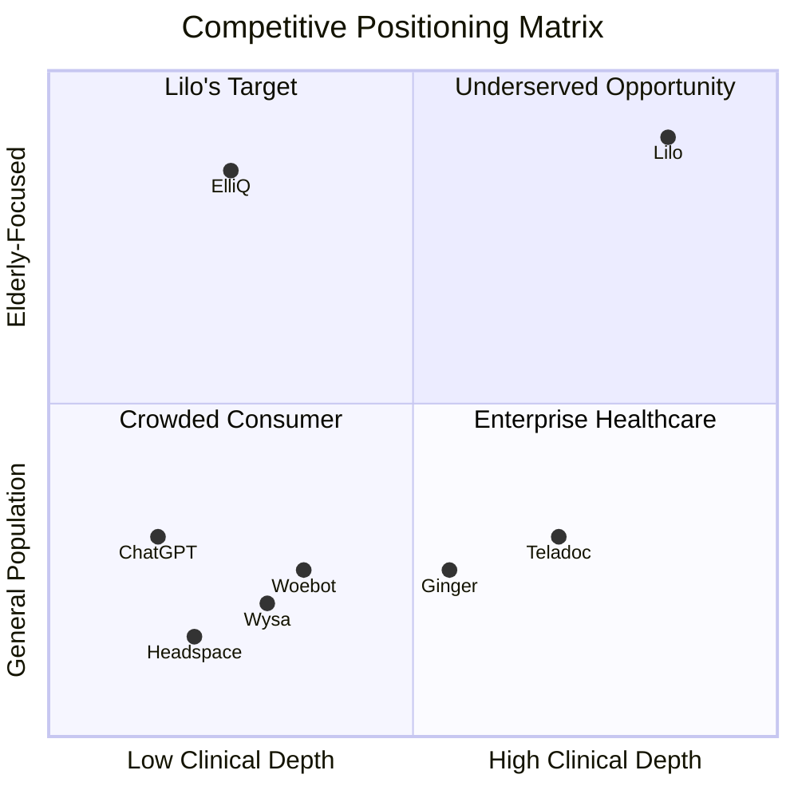
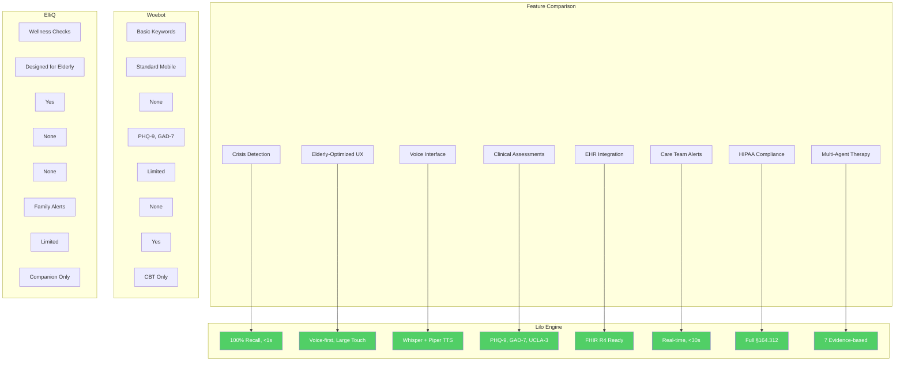
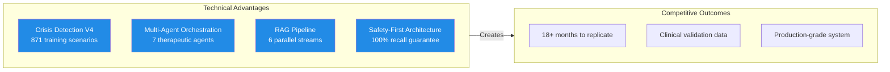
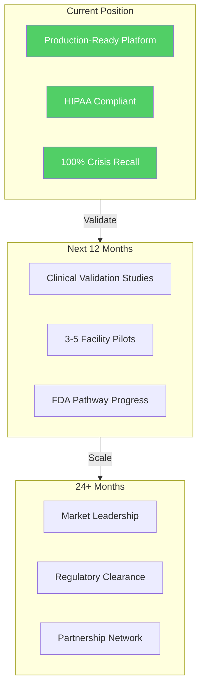

# Competitive Landscape Analysis

### How Lilo Engine Stands Apart in Elderly Mental Health AI

---

---

## Executive Summary

The elderly mental health market is **severely underserved** despite being a $3T+ opportunity. Current solutions fall into three categories—none of which address the complete problem:

| Category | Examples | Gap |
|----------|----------|-----|
| **General AI Chatbots** | ChatGPT, Claude, Gemini | No crisis detection, not clinical-grade |
| **Mental Health Apps** | Woebot, Wysa, Headspace | Consumer-focused, no elderly design |
| **Companion Robots** | ElliQ, Paro | Hardware-dependent, limited therapy |

**Lilo Engine is the only platform** combining elderly-specific design + 100% crisis recall + clinical integration + HIPAA compliance.

---

## Market Landscape

---

## Competitor Deep Dive

### 1. Woebot Health

| Attribute | Woebot | Lilo Engine |
|-----------|--------|-------------|
| **Founded** | 2017 | 2024 |
| **Funding** | $114M+ | Bootstrapped |
| **Approach** | CBT chatbot | Multi-agent therapeutic AI |
| **Target** | General adults, enterprise | Elderly in assisted living |
| **Crisis Detection** | Basic keyword matching | 100% recall, <1s semantic |
| **EHR Integration** | Limited | Full FHIR R4 |
| **Voice Interface** | No | Whisper + Piper TTS |
| **HIPAA** | Yes | Yes |
| **Pricing** | B2B enterprise | Per-resident SaaS |

**Woebot Strengths:**
- Established brand, significant funding
- Clinical validation studies
- Enterprise partnerships (Anthem, Express Scripts)

**Woebot Gaps:**
- Not designed for elderly (complex UX)
- No real-time crisis detection
- No voice interface
- No facility integration

---

### 2. Wysa

| Attribute | Wysa | Lilo Engine |
|-----------|------|-------------|
| **Founded** | 2015 | 2024 |
| **Funding** | $30M+ | Bootstrapped |
| **Approach** | AI + human coaches | Autonomous multi-agent |
| **Target** | Employees, students | Elderly residents |
| **Crisis Detection** | Basic escalation | 100% recall semantic |
| **Clinical Tools** | GAD-7, PHQ-9 | + UCLA-3, WHO-5, LSNS-6 |
| **Voice** | Limited | Full bidirectional |
| **Pricing** | Per-employee | Per-resident |

**Wysa Strengths:**
- Human coach hybrid model
- Strong employee wellness traction
- International presence

**Wysa Gaps:**
- Consumer-focused UX
- No elderly-specific adaptations
- No facility/care team integration
- No real-time staff alerts

---

### 3. ElliQ (Intuition Robotics)

| Attribute | ElliQ | Lilo Engine |
|-----------|-------|-------------|
| **Founded** | 2016 | 2024 |
| **Funding** | $58M+ | Bootstrapped |
| **Approach** | Physical companion robot | Software platform |
| **Target** | Independent elderly | Assisted living residents |
| **Crisis Detection** | Wellness check-ins | Real-time, <1s |
| **Therapeutic Agents** | 1 (companion) | 7 (evidence-based) |
| **Hardware Required** | Yes ($250 + $30/mo) | No |
| **Scalability** | Limited by hardware | Unlimited |

**ElliQ Strengths:**
- Physical presence, proactive engagement
- Strong brand in senior tech
- 10,000+ units deployed
- New York State partnership

**ElliQ Gaps:**
- Hardware cost barrier
- Single companion modality
- No clinical assessment integration
- No crisis detection pipeline
- Limited therapeutic depth

---

### 4. General AI Assistants (ChatGPT, Claude, Gemini)

| Attribute | General AI | Lilo Engine |
|-----------|------------|-------------|
| **Crisis Detection** | None | 100% recall |
| **HIPAA Compliance** | No (standard) | Full |
| **Therapeutic Training** | Generic | 7 evidence-based agents |
| **Clinical Integration** | None | PHQ-9, GAD-7, EHR |
| **Care Team Alerts** | None | Real-time, <30s |
| **Session Continuity** | Limited | Full memory system |
| **Elderly UX** | None | Voice-first, optimized |

**Why General AI Fails for Healthcare:**
- No safety guarantees (hallucination risk)
- No crisis detection or escalation
- No HIPAA compliance by default
- No clinical assessment integration
- No care team coordination

---

### 5. Teladoc / Ginger (Headspace Health)

| Attribute | Teladoc/Ginger | Lilo Engine |
|-----------|----------------|-------------|
| **Founded** | 2002/2011 | 2024 |
| **Model** | Human therapists + AI | AI-first with escalation |
| **Target** | Enterprise employees | Elderly residents |
| **Response Time** | Scheduled appointments | Instant, 24/7 |
| **Cost per Session** | $100-200 | $50-150/month unlimited |
| **Crisis** | Human escalation | Automated detection + alert |
| **Scalability** | Limited by therapists | Unlimited |

**Telehealth Strengths:**
- Human therapist availability
- Insurance reimbursement
- Established credibility

**Telehealth Gaps:**
- Not designed for 24/7 availability
- Cost-prohibitive for facilities
- No ambient monitoring
- Appointment-based, not on-demand

---

## Feature Comparison Matrix

### Detailed Feature Matrix

| Feature | Lilo | Woebot | Wysa | ElliQ | ChatGPT |
|---------|:----:|:------:|:----:|:-----:|:-------:|
| **Crisis Detection (Real-time)** | ✅ | ⚠️ | ⚠️ | ❌ | ❌ |
| **100% Crisis Recall** | ✅ | ❌ | ❌ | ❌ | ❌ |
| **<30s Crisis Response** | ✅ | ❌ | ❌ | ❌ | ❌ |
| **Elderly-Optimized UX** | ✅ | ❌ | ❌ | ✅ | ❌ |
| **Voice-First Interface** | ✅ | ❌ | ⚠️ | ✅ | ⚠️ |
| **Multi-Agent Therapy** | ✅ | ❌ | ❌ | ❌ | ❌ |
| **Clinical Assessments** | ✅ | ✅ | ✅ | ❌ | ❌ |
| **EHR Integration** | ✅ | ⚠️ | ❌ | ❌ | ❌ |
| **Care Team Dashboards** | ✅ | ❌ | ❌ | ❌ | ❌ |
| **Real-time Staff Alerts** | ✅ | ❌ | ❌ | ⚠️ | ❌ |
| **HIPAA Compliance** | ✅ | ✅ | ✅ | ⚠️ | ❌ |
| **On-Premise Deployment** | ✅ | ❌ | ❌ | N/A | ❌ |
| **Family Portal** | ✅ | ❌ | ❌ | ✅ | ❌ |
| **Reminiscence Therapy** | ✅ | ❌ | ❌ | ⚠️ | ❌ |
| **Behavioral Activation** | ✅ | ✅ | ✅ | ❌ | ❌ |
| **Grounding Techniques** | ✅ | ⚠️ | ✅ | ❌ | ❌ |
| **Memory Continuity** | ✅ | ⚠️ | ⚠️ | ✅ | ❌ |

✅ = Full support | ⚠️ = Partial/Limited | ❌ = Not available

---

## Lilo's Competitive Moats

### 1. Technical Moat

**Why This Matters:**
- **Crisis detection** requires specialized training data (871 scenarios) and <1s latency
- **Multi-agent orchestration** requires deep therapeutic understanding
- **Safety-first architecture** is embedded at every layer—can't be retrofitted

### 2. Clinical Moat

| Asset | Value | Replication Difficulty |
|-------|-------|------------------------|
| **Elderly-specific training data** | Life story integration, bereavement patterns | High |
| **Clinical protocol integration** | PHQ-9, GAD-7, UCLA-3, C-SSRS | Medium |
| **Evidence-based agent design** | 7 agents with clinical research backing | High |
| **Therapeutic outcome measurement** | Longitudinal tracking system | Medium |

### 3. Market Moat

| Factor | Advantage |
|--------|-----------|
| **First-mover in niche** | No integrated competitor in elderly therapeutic AI |
| **Facility relationships** | Pilot programs create switching costs |
| **Regulatory pathway** | HIPAA compliance, FDA pathway defined |
| **Clinical validation** | Outcome data creates credibility barrier |

---

## Competitive Response Analysis

### If Woebot Targets Elderly

**What they'd need:**
- Voice interface development (6-12 months)
- Elderly UX redesign (6-12 months)
- Real-time crisis detection (12-18 months)
- Care team integration (6-12 months)
- Facility sales channel (12-24 months)

**Our response:**
- Clinical validation data (in progress)
- Facility partnership network
- Regulatory pathway completion

### If ElliQ Adds Therapy

**What they'd need:**
- Multi-agent therapeutic system (12-18 months)
- Clinical assessment integration (6-12 months)
- Crisis detection pipeline (12-18 months)
- EHR integration (6-12 months)

**Our response:**
- Software-only model (no hardware constraints)
- Faster iteration cycles
- Lower cost per resident

### If General AI (OpenAI/Anthropic) Targets Healthcare

**What they'd need:**
- HIPAA-compliant infrastructure
- Clinical validation studies
- Healthcare sales channel
- Elderly-specific training

**Our response:**
- Already production-ready
- Domain expertise
- Facility relationships
- Regulatory compliance complete

---

## Pricing Comparison

| Solution | Model | Monthly Cost | Per 100 Residents |
|----------|-------|--------------|-------------------|
| **Lilo Essential** | Per-resident SaaS | $50/resident | $5,000/mo |
| **Lilo Professional** | Per-resident SaaS | $100/resident | $10,000/mo |
| **Lilo Enterprise** | Per-resident SaaS | $150/resident | $15,000/mo |
| **Woebot Enterprise** | Per-employee | ~$5-10/user | $500-1,000/mo |
| **ElliQ** | Hardware + subscription | $30/unit + hardware | $3,000/mo + $25K hardware |
| **Teladoc** | Per-session | $100-200/session | Variable |
| **In-house Therapist** | Salary | $80-120K/year | ~$8-10K/mo |

**Lilo ROI Advantage:**
- $50K-150K annual savings per 100-bed facility
- Reduced ER visits (avg $2,500 each)
- Staff efficiency gains (30 min/day vs 2 hrs)
- Liability risk reduction

---

## Market Positioning Strategy

### Go-to-Market Priorities

1. **Beachhead**: Mid-size assisted living facilities (100-500 beds)
2. **Expansion**: Multi-facility operators, healthcare systems
3. **Platform**: Device integrations, ecosystem partnerships

---

## Key Takeaways

| Dimension | Lilo's Position |
|-----------|-----------------|
| **Technical Depth** | Deepest in market (17 microservices, 7 agents) |
| **Elderly Focus** | Only integrated solution |
| **Crisis Safety** | Only 100% recall guarantee |
| **Clinical Integration** | Most comprehensive (PHQ-9, GAD-7, UCLA-3, EHR) |
| **Deployment Flexibility** | Only on-premise option |
| **Price/Value** | Best ROI for facilities |

**Bottom Line:** Lilo Engine occupies a unique position with no direct competitor offering the same combination of elderly-specific design, clinical-grade crisis detection, and facility integration.

---

## Learn More

| Resource | Link |
|----------|------|
| **Technical Portfolio** | [View Engineering Depth](TECHNICAL_PORTFOLIO.md) |
| **Investor Overview** | [Market Opportunity](INVESTOR_OVERVIEW.md) |
| **Partnership Opportunities** | [Collaborate With Us](PARTNERSHIP_OPPORTUNITIES.md) |
| **FAQ** | [Common Questions](../FAQ.md) |

---

---

**© 2025 Aejaz Sheriff / PragmaticLogic AI**

