

# Lilo Engine - Platform Demo Showcase

### Visual Tour of the Multi-Agent Therapeutic AI Platform

---

---

## Platform Overview

Lilo Engine provides **role-based dashboards** for every stakeholder in the senior care ecosystem:

| Role | Purpose | Key Features |
|------|---------|--------------|
| **Resident** | 24/7 therapeutic companion | AI chat, wellness tracking, crisis support |
| **Family** | Stay connected with loved ones | Real-time updates, communication, care coordination |
| **Care Staff** | Efficient resident management | Multi-resident view, crisis alerts, daily reports |
| **Care Provider** | Clinical oversight | Analytics, assessments, treatment tracking |
| **Admin** | System management | User management, analytics, HIPAA compliance |

---

## Authentication

### Login Screen

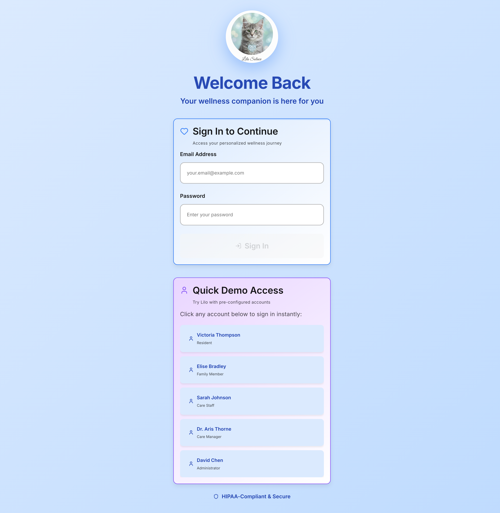

*Clean, accessible login interface with role-based access*

---

## Resident Experience

### Personalized Dashboard

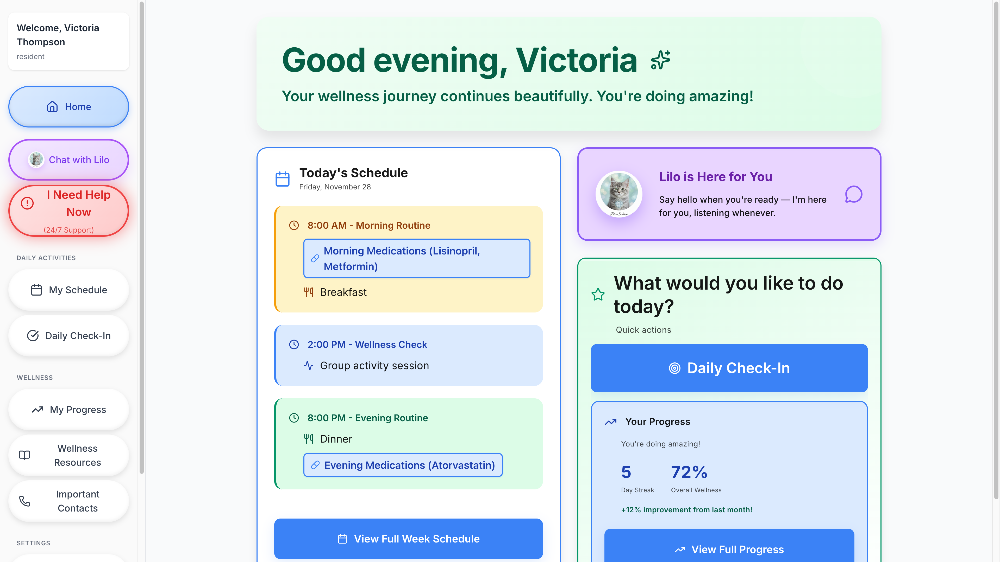

*Elderly-optimized dashboard with large touch targets and clear visual hierarchy*

**Dashboard Features:**
- Daily schedule with medication reminders
- Wellness goals and streak tracking
- Quick access to Lilo AI companion
- Mood tracking visualization
- One-tap emergency contacts

---

### Weekly Schedule

*Activity calendar with appointments, activities, and family visits*

---

### Lilo AI Conversation

The heart of Lilo Engine - a therapeutic AI companion providing 24/7 mental health support:

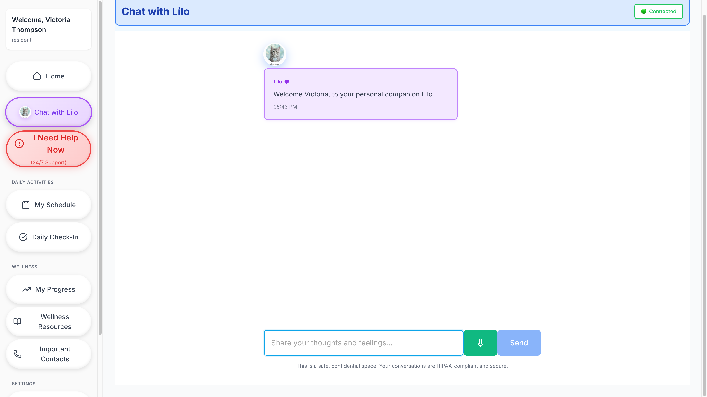

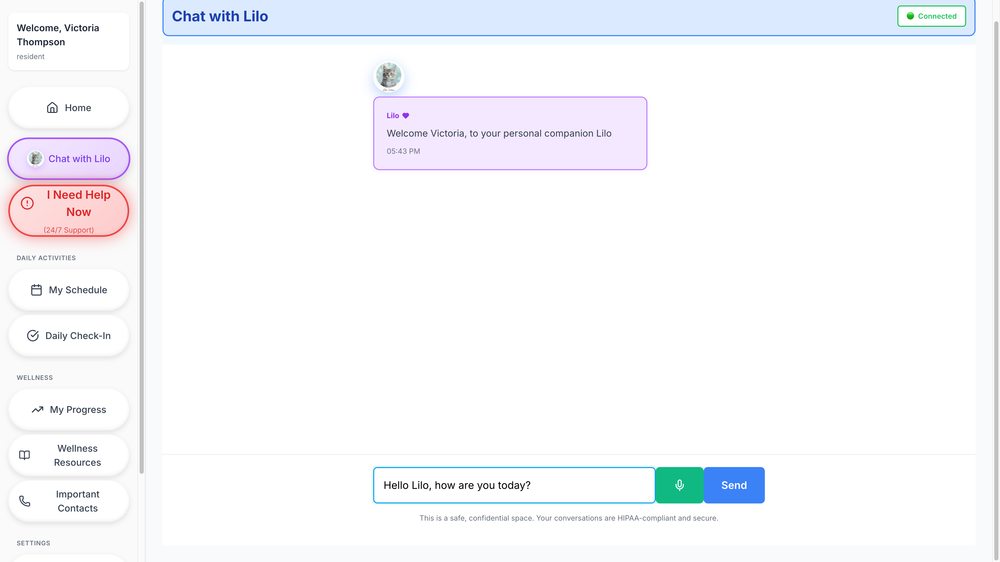

**Conversational AI Features:**
- 7 therapeutic agents with evidence-based interventions
- Memory continuity across sessions
- Real-time crisis detection (<1 second)
- Voice-first design with Whisper STT + Piper TTS

---

### Wellness Assessment

*Clinical assessments with gentle, encouraging language*

**Assessment Tools:**
- **WHO-5**: Well-being Index
- **PHQ-9**: Depression screening
- **GAD-7**: Anxiety assessment
- **UCLA-3**: Loneliness scale

---

### Wellness Tracking

*Progress visualization with trends and goal tracking*

---

### Wellness Resources

*Curated wellness articles, breathing exercises, and relaxation techniques*

---

### Important Contacts

*One-tap access to emergency contacts and care team*

---

### Crisis Support

*Immediate access to crisis resources and care team notification*

---

## Family Experience

### Family Dashboard

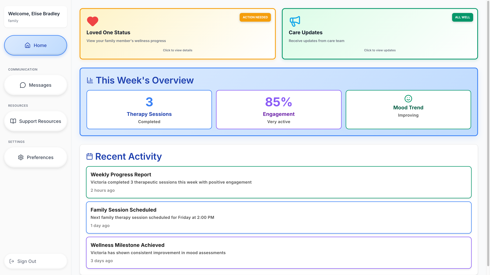

*Stay connected with your loved one's care journey*

**Family Features:**
- Real-time wellness status
- Activity notifications
- Secure messaging with care team
- Weekly/monthly reports

---

### Family Overview

*Comprehensive view of loved one's wellbeing*

---

### Family Communication

*Secure messaging with residents and care staff*

---

### Family Resources

*Educational materials and caregiver support guides*

---

## Care Staff Experience

### Caregiver Dashboard

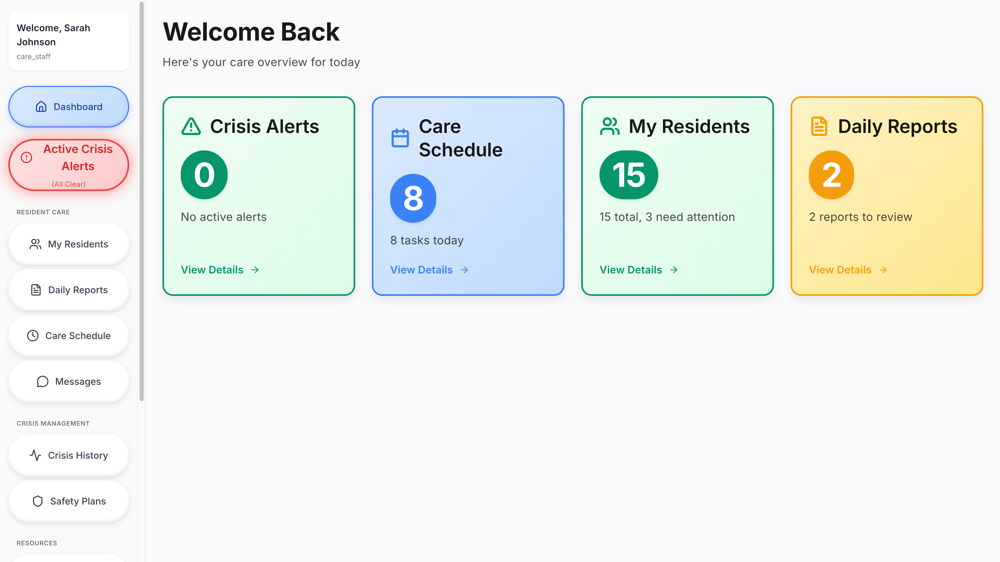

*Multi-resident management with real-time status updates*

---

### Resident Cards

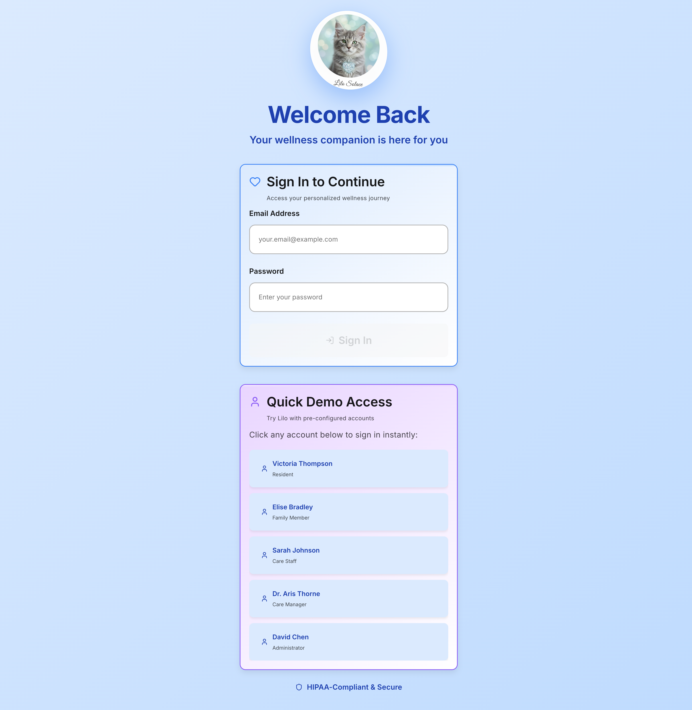

*At-a-glance status cards with color-coded risk levels*

---

### Daily Reports

*Wellness summaries, activity logs, and handoff notes*

---

### Care Schedule

*Shift management, task assignment, and team calendar*

---

### Crisis Alerts

*Real-time crisis notifications with severity levels and action buttons*

**Alert Features:**
- Instant push notifications
- Severity classification (IMMEDIATE, URGENT, ELEVATED, MODERATE)
- One-tap response actions
- Audit trail for compliance

---

## Care Provider Experience

### Provider Dashboard

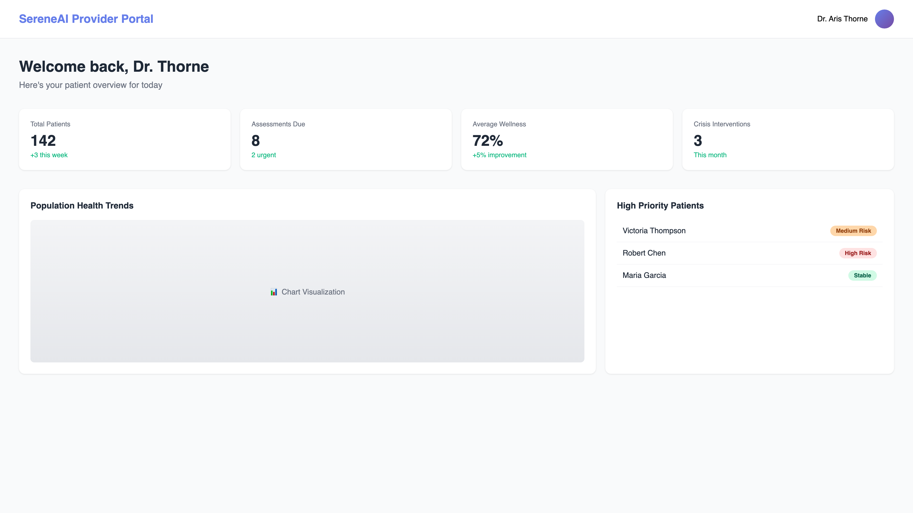

*Clinical oversight with population health metrics*

---

### Provider Analytics

*Comprehensive analytics and outcome tracking*

---

## Admin Experience

### Admin Dashboard

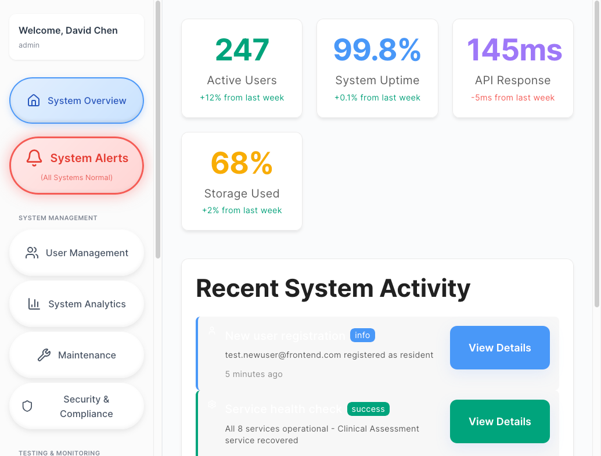

*Comprehensive system management and monitoring*

---

### User Management

*Role-based access control and user administration*

---

### System Analytics

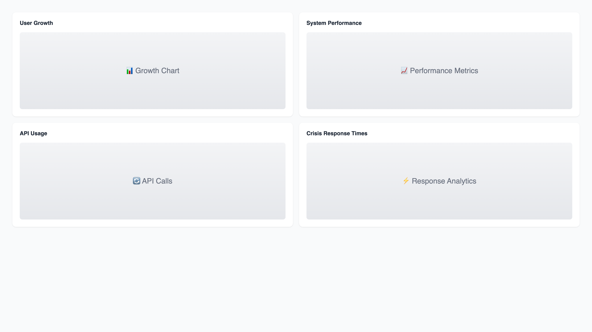

*Usage metrics, feature adoption, and growth trends*

---

### System Overview

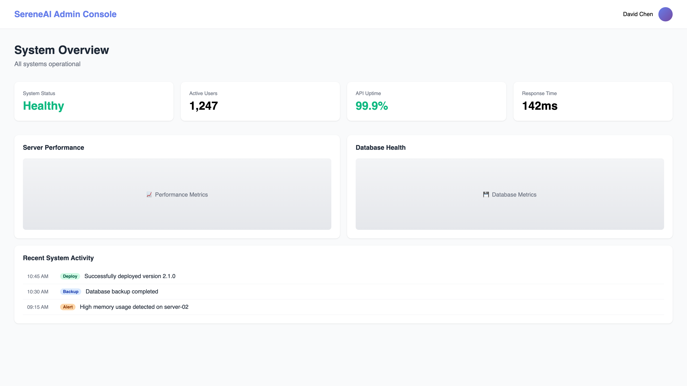

*Platform health and service status monitoring*

---

## Design System

### Architecture

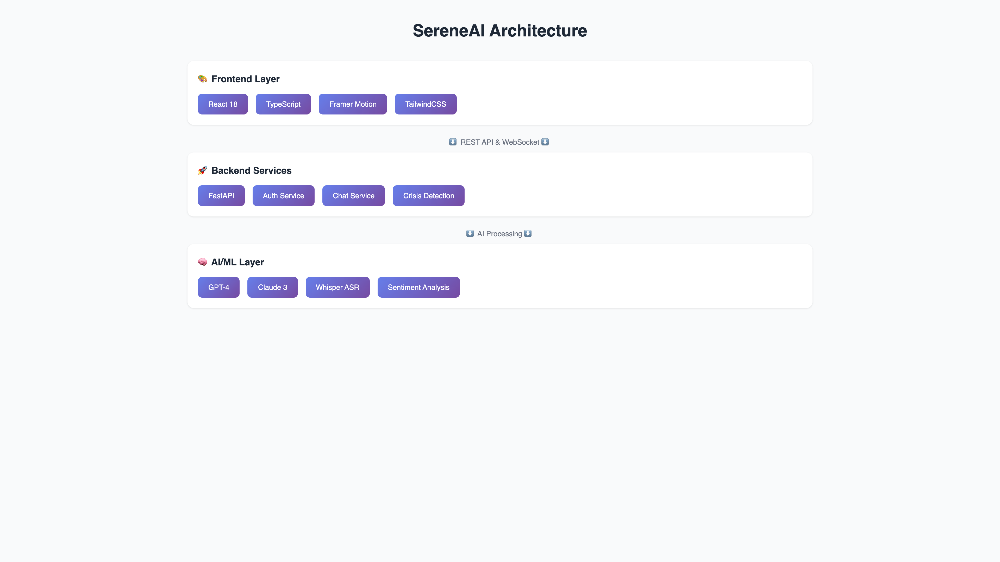

*Complete system architecture overview*

---

### Touch Targets

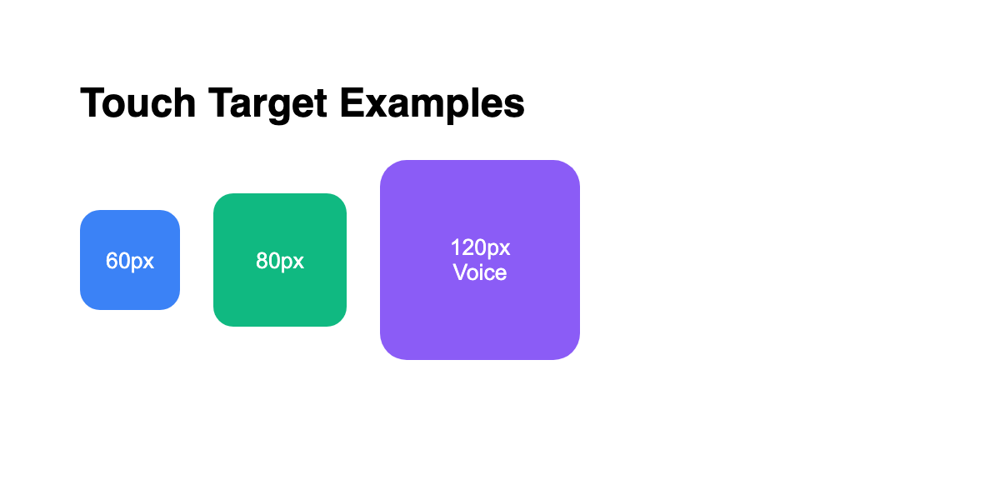

*Senior-friendly button sizes following accessibility guidelines*

---

### Typography

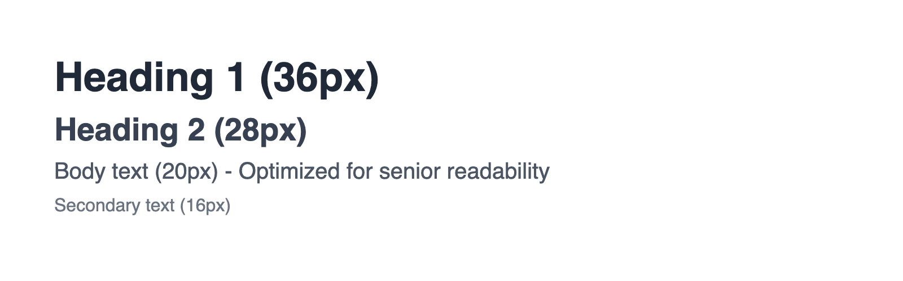

*Clear, readable typography scale for elderly users*

---

### Color System

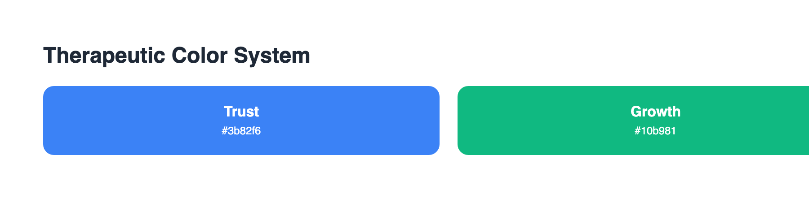

*Therapeutic color palette with high contrast ratios*

---

### Contrast

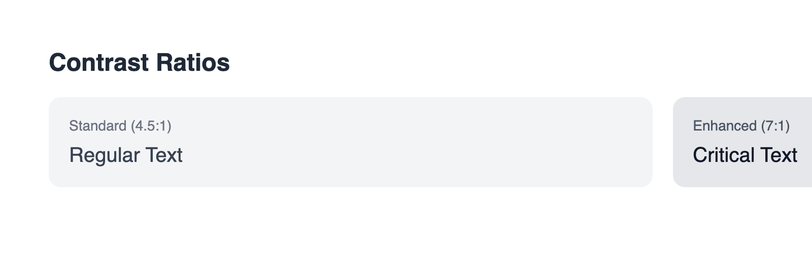

*WCAG AAA compliant contrast ratios*

---

## Performance Highlights

<table>
<tr>
<td align="center" width="25%">
<h3>&lt;1s</h3>

Crisis Detection

<small>30x faster than regulatory</small>
</td>
<td align="center" width="25%">
<h3>100%</h3>

Crisis Recall

<small>Zero missed crises</small>
</td>
<td align="center" width="25%">
<h3>17</h3>

Microservices

<small>Production-grade</small>
</td>
<td align="center" width="25%">
<h3>7</h3>

AI Agents

<small>Evidence-based</small>
</td>
</tr>
</table>

---

## Screenshot Summary

| Role | Screenshots | Features Shown |
|------|-------------|----------------|
| **Authentication** | 1 | Login screen |
| **Resident** | 9 | Dashboard, Schedule, Chat, Wellness, Contacts, Crisis |
| **Family** | 4 | Dashboard, Overview, Communication, Resources |
| **Care Staff** | 5 | Dashboard, Cards, Reports, Schedule, Alerts |
| **Care Provider** | 2 | Dashboard, Analytics |
| **Admin** | 4 | Dashboard, Users, Analytics, Overview |
| **Design System** | 5 | Architecture, Touch, Typography, Colors, Contrast |
| **Total** | **32** | Complete platform coverage |

---

## See More

| Resource | Description |
|----------|-------------|
| [Technical Portfolio](TECHNICAL_PORTFOLIO.md) | 12 engineering deep-dives |
| [Process Flow](PROCESS_FLOW.md) | Complete request processing |
| [Code Samples](CODE_SAMPLES.md) | Production code patterns |
| [Investor Overview](INVESTOR_OVERVIEW.md) | Business opportunity |

---

---

**© 2025 Aejaz Sheriff / PragmaticLogic AI**

