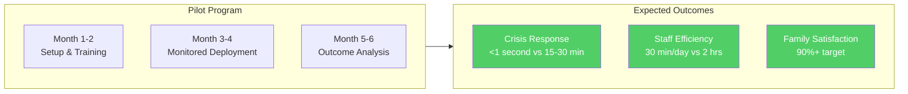
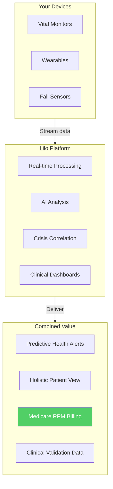
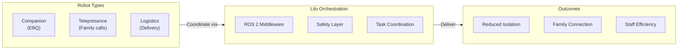
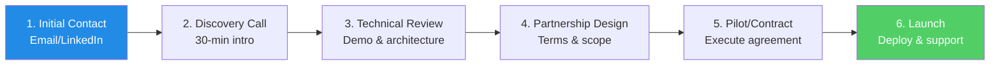

# 🤝 Partnership Opportunities

### Collaborate with Lilo Engine to Transform Elderly Mental Health Care

---

---

## Why Partner with Lilo Engine?

| Value Proposition | Details |
|-------------------|---------|
| **Production-Ready Platform** | 15 microservices (65K+ lines), HIPAA compliant, deployed and tested |
| **Proven Technology** | 100% crisis detection recall, <1s response time, 92-95% intent accuracy |
| **Growing Market** | $3T+ TAM, 24% CAGR in AI mental health |
| **First-Mover Advantage** | No integrated competitor in elderly therapeutic AI |
| **Accelerated Timeline** | 9 additional modules complete, FDA clearance path by Jun 2027 |
| **Flexible Integration** | API-first, on-premise or cloud, modular architecture |

---

## Partnership Categories

### 1. Senior Living Facilities & Healthcare Systems

**Ideal Partners:**
- Assisted living facility operators (single or multi-facility)
- Continuing care retirement communities (CCRCs)
- Memory care facilities
- Skilled nursing facilities
- Healthcare systems with senior care divisions

**Partnership Models:**

| Model | Description | Your Benefit |
|-------|-------------|--------------|
| **Pilot Program** | 3-6 month trial with 50-100 residents | Validate outcomes before commitment |
| **Enterprise License** | Facility-wide deployment | Volume pricing, dedicated support |
| **Outcomes-Based** | Pricing tied to measurable improvements | Reduced risk, aligned incentives |
| **White-Label** | Your branding on our platform | Differentiate your facilities |

**What We Provide:**
- Full platform deployment (cloud or on-premise)
- Staff training and onboarding
- 24/7 technical support
- Clinical outcome reporting
- Compliance documentation

**What We Need:**
- Access to resident population (with consent)
- Staff champions for adoption
- Outcome data for clinical validation
- Feedback for continuous improvement

---

### 2. Medical Device & RPM Manufacturers

**Ideal Partners:**
- Vital sign monitoring devices (BP, SpO2, glucose)
- Wearable health trackers
- Fall detection systems
- Sleep monitoring devices
- Medication dispensing systems

**Target Companies:**
- Withings
- Omron Healthcare
- iHealth
- Masimo
- Nonin Medical
- Dexcom
- Abbott (FreeStyle)
- Philips Healthcare

**Partnership Models:**

| Model | Description | Revenue Share |
|-------|-------------|---------------|
| **API Integration** | Connect your device to our platform | Per-device licensing |
| **OEM Partnership** | Embed Lilo AI in your ecosystem | Revenue share on subscriptions |
| **Co-Development** | Joint product development | Shared IP, market access |
| **Data Partnership** | Anonymized insights for R&D | Data licensing fees |

**Integration Benefits:**

**Revenue Opportunity:**
- Medicare RPM billing: **$1,560/patient/year**
- Per 1,000 integrated patients: **$1.56M ARR**
- CMS 2026 rule reduces requirements from 16 days to 2 days/month

---

### 3. Smart Home & Voice Platform Partners

**Ideal Partners:**
- Amazon (Alexa Smart Properties)
- Google (Nest/Assistant)
- Apple (HomeKit/Siri)
- Matter protocol ecosystem members
- Smart lighting (Philips Hue, LIFX)
- Smart thermostats (Ecobee, Honeywell)

**Why This Matters:**
- **75% of senior living facilities** choosing voice assistants select Alexa
- Ambient Assisted Living market: **$9.5B → $50B by 2032** (27% CAGR)
- **34% reduction in agitation** with emotion-responsive environments

**Partnership Models:**

| Model | Description | Opportunity |
|-------|-------------|-------------|
| **Certification Partner** | Alexa Smart Properties certification | Access to 75% of facilities |
| **Integration Partner** | Matter protocol ecosystem | Universal device compatibility |
| **Co-Marketing** | Joint go-to-market | Shared customer acquisition |

**Integration Capabilities:**

| Intervention | Trigger | Action |
|--------------|---------|--------|
| **Circadian Lighting** | Time of day + mood state | Adjust color temperature |
| **Comfort Control** | Anxiety detection | Optimize temperature |
| **Music Therapy** | Emotional state | Play calming/energizing music |
| **Family Connection** | Loneliness detection | Prompt video call |
| **Reminders** | Schedule + context | Medication, meals, activities |

---

### 4. Healthcare Robotics Partners

**Ideal Partners:**
- ElliQ (Intuition Robotics) — 10,000+ companion robots deployed
- Telepresence robot manufacturers
- Logistics/delivery robots
- Rehabilitation robotics
- ROS 2 ecosystem developers

**Why Now:**
- ROS 1 support ending 2025 → Healthcare leading ROS 2 migration
- Healthcare robotics: **17.6% CAGR** for companion robots
- **58% adoption increase** in telepresence post-2024

**Partnership Models:**

| Model | Description | Revenue |
|-------|-------------|---------|
| **ROS 2 Bridge** | Universal robot coordination | $5-15K/facility/year |
| **OEM Integration** | Embed Lilo AI in robots | Per-unit licensing |
| **Fleet Management** | Multi-robot orchestration | SaaS subscription |

---

### 5. EHR & Health IT Partners

**Ideal Partners:**
- Epic Systems
- Oracle Health (Cerner)
- MEDITECH
- PointClickCare (senior care focused)
- MatrixCare
- Health information exchanges (HIEs)
- Interoperability platforms (Redox, Particle)

**Integration Value:**

| Capability | Benefit |
|------------|---------|
| **FHIR R4 Gateway** | Standardized clinical data exchange |
| **Assessment Write-back** | PHQ-9, GAD-7 auto-documented |
| **Care Plan Integration** | AI insights in clinical workflow |
| **Alert Routing** | Crisis alerts to EHR-based care teams |

**Partnership Models:**

| Model | Description | Typical Terms |
|-------|-------------|---------------|
| **App Marketplace** | Listed in Epic App Orchard, Cerner Store | Revenue share (15-30%) |
| **Direct Integration** | Custom integration project | Implementation fee + subscription |
| **Aggregator** | Via Redox/Particle | Per-transaction or flat fee |

---

### 6. Clinical & Research Partners

**Ideal Partners:**
- Academic medical centers
- Geriatric psychiatry departments
- Clinical research organizations (CROs)
- Mental health research institutions
- Gerontology programs

**Partnership Types:**

| Type | Purpose | Deliverable |
|------|---------|-------------|
| **Clinical Validation** | Prove therapeutic efficacy | Peer-reviewed publication |
| **IRB Studies** | Formal clinical trials | FDA-ready evidence |
| **Advisory Board** | Clinical guidance | Credibility, expertise |
| **Research Data** | Anonymized insights | Academic publications |

**Current Needs:**
- IRB-approved clinical trial design
- Geriatric psychiatrist advisors
- Access to research cohorts
- Publication co-authorship opportunities

**Timeline:**
- **Feb 2026**: IRB submission for pilot study (n=20)
- **Apr 2026**: Pilot study completion
- **Aug 2026**: Prospective study launch (n=100)
- **Jan 2027**: Prospective study completion
- **2027+**: RCT (n=200) post-FDA clearance

---

### 7. Investment & Strategic Partners

**Seeking:**
- Seed/Pre-A investors with healthcare focus
- Strategic investors (senior care operators, health systems)
- Corporate venture arms (device manufacturers, pharma)
- Impact investors (mental health, aging)

**What We Offer:**

| Value | Details |
|-------|---------|
| **Proven Technology** | Production-ready, 15 services (65K+ lines), 100% crisis recall |
| **Capital Efficiency** | $875K-1.7M equivalent built with founder capital |
| **Complete Modules** | 9 additional modules (3,000+ lines) ready for integration |
| **Clear Market** | $3T+ TAM, 1.2M immediate US residents |
| **Regulatory Path** | HIPAA complete, FDA De Novo submission Oct 2026, clearance Jun 2027 |
| **Execution Proven** | Solo founder built complete platform in 4 months |

**Investment Use (Total $1.1-1.5M over 2 years):**
- Clinical validation studies (35%)
- FDA regulatory pathway (20%)
- Engineering/integration (25%)
- Sales & marketing (15%)
- Operations (5%)

---

## Partnership Process

### Timeline Expectations

| Stage | Duration | Activities |
|-------|----------|------------|
| **Discovery** | 1-2 weeks | Intro calls, NDA if needed |
| **Evaluation** | 2-4 weeks | Technical demo, reference checks |
| **Negotiation** | 2-4 weeks | Terms, legal review |
| **Pilot Setup** | 2-4 weeks | Integration, training |
| **Pilot Run** | 3-6 months | Monitored deployment |
| **Scale** | Ongoing | Full deployment |

### Key Partnership Milestones (Accelerated)

| Date | Milestone | Partnership Opportunity |
|------|-----------|------------------------|
| **Feb 2026** | 9 modules integrated, edge prototype | Early adopter facilities |
| **Apr 2026** | Pilot study (n=20) complete | Clinical research partners |
| **Jul 2026** | First 3 enterprise contracts | Senior living operators |
| **Oct 2026** | FDA De Novo submission | Strategic/regulatory partners |
| **Jun 2027** | FDA clearance (target) | Scale deployment partners |
| **Dec 2027** | 30 facilities, $1M ARR | Growth investors |

---

## Contact & Next Steps

### Ready to Explore Partnership?

| Action | Contact |
|--------|---------|
| **Schedule a Call** | [Email](mailto:aejaz.sheriff@gmail.com?subject=Lilo%20Partnership%20Inquiry) |
| **Connect on LinkedIn** | [linkedin.com/in/aejaz-sheriff](https://www.linkedin.com/in/aejaz-sheriff/) |
| **Technical Questions** | Include "Technical" in email subject |

---

**Typical Response Time:** 24-48 hours

**What to Include in Your Inquiry:**
- Your organization and role
- Partnership category of interest
- Specific goals or use case
- Preferred timeline

---

---

**© 2025 Aejaz Sheriff / PragmaticLogic AI**

