<div align="center">

# 🔄 End-to-End Process Flow

### How Lilo Engine Processes Therapeutic Conversations

</div>

---

## Overview

This document illustrates the complete request flow through the Lilo Engine platform, from user message to therapeutic response. The architecture prioritizes **safety-first processing** — crisis detection runs before any other AI processing.

---

## System Context (C4 Level 1)

```mermaid
flowchart TB
    resident["👤 Elderly Resident<br/>Seeks therapeutic support"]
    family["👨‍👩‍👧 Family Member<br/>Emergency contact"]
    staff["👨‍⚕️ Care Staff<br/>Receives crisis alerts"]

    lilo["🤖 Lilo Engine<br/>Multi-agent therapeutic AI"]

    ehr["🏥 EHR Systems<br/>Epic, Cerner"]
    emergency["🚨 Emergency Services<br/>911 auto-escalation"]

    resident -->|"Converses via<br/>WebSocket/Voice"| lilo
    family -->|"Views status<br/>HTTPS Portal"| lilo
    lilo -->|"Sends alerts<br/>SSE/Push (<30s)"| staff
    lilo -->|"Syncs assessments<br/>FHIR R4"| ehr
    lilo -->|"Escalates crises<br/>API"| emergency

    style lilo fill:#228be6,color:#fff
    style emergency fill:#ff6b6b,color:#fff
```



---

## Container Architecture (C4 Level 2)


---

## 11-Step Request Flow


---

## Crisis Detection Deep Dive


---

## RAG Pipeline Architecture

```mermaid
flowchart TD
    A["📥 User Query<br/>'I miss going to church with my husband'"]

    B["BGE Embedding<br/>768-dim vector"]

    subgraph Parallel["6 Parallel Retrieval Streams (45ms)"]
        C1["📚 Knowledge Base<br/>Clinical guidelines"]
        C2["👤 Life Story<br/>'Methodist church 45yrs'"]
        C3["💬 Chat History<br/>Last 7 turns"]
        C4["📊 Assessments<br/>PHQ-9: 12"]
        C5["📅 Schedule<br/>'Sunday 10am'"]
        C6["🧠 Semantic Memory<br/>Consolidated"]
    end

    D1["BM25<br/>Keyword matching"]
    D2["Semantic<br/>Vector similarity"]

    E["RRF Fusion<br/>Combine & rank results"]

    F["📤 Personalized RAG Context<br/>Ready for LLM generation"]

    A -->|"1. Generate embedding"| B
    B -->|"2a. Query"| C1
    B -->|"2b. Query"| C2
    B -->|"2c. Query"| C3
    B -->|"2d. Query"| C4
    B -->|"2e. Query"| C5
    B -->|"2f. Query"| C6
    C1 -->|"3a. BM25 score"| D1
    C2 -->|"3a. BM25 score"| D1
    C3 -->|"3a. BM25 score"| D1
    C4 -->|"3a. BM25 score"| D1
    C5 -->|"3a. BM25 score"| D1
    C6 -->|"3a. BM25 score"| D1
    C1 -->|"3b. Semantic score"| D2
    C2 -->|"3b. Semantic score"| D2
    C3 -->|"3b. Semantic score"| D2
    C4 -->|"3b. Semantic score"| D2
    C5 -->|"3b. Semantic score"| D2
    C6 -->|"3b. Semantic score"| D2
    D1 -->|"4. Combine scores"| E
    D2 -->|"4. Combine scores"| E
    E -->|"5. Output context"| F

    style C2 fill:#74c0fc,color:#000
    style C4 fill:#ffd43b,color:#000
    style F fill:#51cf66,color:#fff
```



---

## Multi-Agent Orchestration

```mermaid
flowchart TD
    A["📥 Classified Intent<br/>Primary: SOOTHE (0.85)<br/>Secondary: REMINISCE (0.72)"]

    B{"🚨 Crisis<br/>Detected?"}

    C["Safety Override<br/>Force safety agent"]

    D["Normal Selection<br/>Based on intent scores"]

    E1["🛡️ Safety Assessment<br/>C-SSRS Protocol"]
    E2["💬 Conversational<br/>General dialogue"]
    E3["🎯 Behavioral Activation<br/>Depression intervention"]
    E4["📖 Reminiscence<br/>Life review therapy"]
    E5["🧘 Grounding<br/>Anxiety management"]

    F1["CLINICAL_PRIORITY<br/>Safety runs exclusively"]
    F2["SEQUENTIAL<br/>Primary then secondary"]

    G["📤 Combined Response<br/>Synthesized from agents"]

    A -->|"1. Check safety"| B
    B -->|"Yes: Override"| C
    B -->|"No: Normal flow"| D
    C -->|"2. Force safety"| E1
    D -->|"2a. Primary agent"| E2
    D -->|"2b. Secondary agent"| E4
    E1 -->|"3. Clinical priority"| F1
    E2 -->|"3. Sequential strategy"| F2
    E4 -->|"Add to sequence"| F2
    F1 -->|"4. Generate"| G
    F2 -->|"4. Generate"| G

    style E1 fill:#ff6b6b,color:#fff
    style B fill:#ffd43b,color:#000
    style G fill:#51cf66,color:#fff
```



---

## Intent Classification Flow

```mermaid
flowchart TD
    A["📥 User Message<br/>'I've been feeling really down lately'"]

    B["BGE-base-en-v1.5<br/>768-dim embedding"]

    C["Cosine Similarity<br/>vs 303 prototypes"]

    D{"Confidence<br/>> 0.45?"}

    E["LLM-as-Judge<br/>Gemini fallback"]

    F1["🚨 CRISIS (0.65)"]
    F2["📋 ASSESS (0.55)"]
    F3["📖 REMINISCE (0.60)"]
    F4["💚 SOOTHE (0.82) ✓"]
    F5["🎯 ACTIVATE (0.60)"]
    F6["🧘 GROUND (0.60)"]
    F7["💬 GENERAL (0.40)"]

    G["📤 Result<br/>Primary: SOOTHE (0.82)<br/>Secondary: REFLECT (0.71)"]

    A -->|"1. Generate embedding"| B
    B -->|"2. Compare to prototypes"| C
    C -->|"3. Evaluate confidence"| D
    D -->|"High confidence"| F4
    D -->|"Low confidence"| E
    E -->|"LLM classification"| F4
    F4 -->|"4. Return result"| G

    style F4 fill:#51cf66,color:#fff
    style F1 fill:#ff6b6b,color:#fff
    style G fill:#228be6,color:#fff
```



---

## Performance Summary

| Step | Component | Latency | Cache Benefit |
|------|-----------|---------|---------------|
| 1 | Client Connection | ~50ms | - |
| 2 | API Gateway + HIPAA | ~5ms | - |
| 3 | Safety Service | <1s (regulatory: 30s) | Always runs |
| 3a | → Crisis Detection | 20-50ms | Parallel |
| 4 | Query Embedding | 15-30ms | **2-5ms (70% hit)** |
| 5 | Intent Classification | 10-50ms | **10-15ms (60-70% hit)** |
| 6 | Agent Orchestration | ~5ms | - |
| 7 | RAG Retrieval | 30-55ms | **5-15ms (life story cached)** |
| 8 | Prompt Construction | 5-15ms | - |
| 9 | LLM Generation | 300-500ms | N/A |
| 10 | Post-Processing | <5ms | - |
| 11 | Response Delivery | ~10ms | - |
| **Total** | **End-to-End** | **P50: ~200ms, P95: ~400ms** |

### Parallel Execution Strategy

```
Steps 3-5 run in parallel using asyncio.gather():
├── Crisis Detection (20-50ms)     ─┐
├── Intent Classification (10-50ms) ├─ Bottleneck: longest path
└── Embedding Generation (15-30ms)  ─┘

Steps 4-7 (RAG) run in parallel:
├── Knowledge documents (25-55ms)   ─┐
├── Life story context (5-15ms)      ├─ Bottleneck: knowledge search
├── Chat history (10-20ms)           │
├── Assessments (5-10ms)             │
└── Semantic memory (5-10ms)        ─┘

Result: 30-55ms parallel vs 50-110ms sequential = ~2x speedup
```

---

## Safety-First Architecture

```mermaid
flowchart TD
    A["🛡️ SAFETY RUNS FIRST<br/>Before any AI processing"]

    B1["Layer 1: Crisis Detection<br/>BGE semantic, 871 scenarios"]
    B2["Layer 2: Clinical Context<br/>PHQ-9, GAD-7 scores"]
    B3["Layer 3: Trajectory Analysis<br/>5-message deterioration"]
    B4["Layer 4: Response Validation<br/>Therapeutic appropriateness"]
    B5["Layer 5: PII Redaction<br/>HIPAA compliance"]

    C1["✅ 100% Recall<br/>Zero false negatives"]
    C2["✅ <1s Detection<br/>30x faster than required"]
    C3["✅ <5% FPR<br/>Minimal alert fatigue"]

    A -->|"First layer"| B1
    B1 -->|"Add context"| B2
    B2 -->|"Check trend"| B3
    B3 -->|"Validate output"| B4
    B4 -->|"Protect PHI"| B5

    B1 -->|"Guarantees"| C1
    B1 -->|"Guarantees"| C2
    B1 -->|"Guarantees"| C3

    style A fill:#ff6b6b,color:#fff
    style C1 fill:#51cf66,color:#fff
    style C2 fill:#51cf66,color:#fff
    style C3 fill:#51cf66,color:#fff
```



---

## Key Differentiators

| Feature | Traditional Chatbot | Lilo Engine |
|---------|--------------------| ------------|
| Crisis Detection | Keyword matching | BGE semantic + 5-level C-SSRS stratification |
| Response Time | Minutes | <1s (30x faster than Joint Commission requirement) |
| Personalization | Generic | Life story + clinical context + 6 RAG streams |
| Clinical Integration | None | PHQ-9, GAD-7, UCLA-3 + C-SSRS assessment |
| Intent Classification | Rule-based | 303 prototypes + 4-layer caching + FAISS ANN |
| Compliance | Basic | HIPAA §164.312 + audit logging + PII redaction |
| Caching | None | 60-70% hit rate, 10x speedup |
| Multi-Intent | Single intent | Up to 3 simultaneous intents (primary + 2 secondary) |

---

<div align="center">

**© 2025 Aejaz Sheriff / PragmaticLogic AI**

[Back to README](../README.md)

</div>
