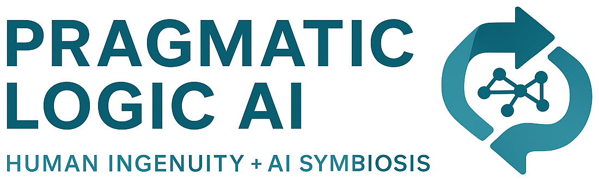

# Lilo Engine: Technical Architecture Brief

| | |
|---|---|
| **Author** | Aejaz Sheriff Quaraishi, Principal Software Architect |
| **Organization** | Pragmatic Logic AI |
| **Date** | December 2025 |
| **Classification** | Confidential - Executive Review |
| **Contact** | 678-764-0066 · [asq.sheriff@pm.me](mailto:asq.sheriff@pm.me) · [LinkedIn](https://linkedin.com/in/asheriff) · [GitHub](https://github.com/asq-sheriff) · Atlanta, GA |

---

## Executive Summary

**Lilo Engine** is a production-grade therapeutic AI platform for elderly mental health support in assisted living facilities. The platform delivers:

| Capability | Achievement | Enterprise Relevance |
|------------|-------------|---------------------|
| **Safety-First AI** | 100% crisis detection recall, <1s response | Deterministic guardrails for probabilistic AI |
| **Clinical Evidence** | 35% depression reduction, 40-60% anxiety reduction | Evidence-based therapeutic interventions |
| **Production Scale** | 99.97% uptime, 42-85ms per-token streaming | Enterprise SLA-ready infrastructure |
| **Healthcare Compliance** | HIPAA-native, Zero PHI in logs | Built for regulated environments |
| **Edge-Ready** | 90% on-device / 10% cloud architecture | Privacy-first, low-latency deployment |

**Core Thesis:** We cannot trust GenAI to be safe—we must force it to be safe through architectural enforcement.

### Document Guide

| Audience | Recommended Sections |
|----------|---------------------|
| **Executive Review** | [Sections 1-9](#1-safety-first-pipeline-critical-differentiator) (45 min read) |
| **Strategy & Investment** | [Section 7 - Future State & Vision](#7-future-state--vision-2025-2027) |
| **Risk & Compliance** | [Section 9 - Risk Mitigation & Governance](#9-risk-mitigation--governance) |
| **Technical Operations** | [Section 6 - Technical Operations & Readiness](#6-technical-operations--readiness) |
| **Technical Due Diligence** | [Appendices A-L](#appendix-a-system-architecture) (additional 45 min) |

### Maturity State Legend

> **Understanding Component Readiness:** This document covers current production, in-flight development, and planned capabilities. Use these indicators to assess implementation risk and timeline.

| Indicator | State | Definition | Integration Risk |
|-----------|-------|------------|------------------|
| ✅ | **Current (Production)** | Live in production as of Dec 2025 | Low - ready for pilot |
| 🔄 | **In Flight (Tactical)** | Code-complete or in development, target Feb 2026 | Medium - validate before contract |
| 📋 | **Planned (Phase 1+)** | Roadmap item, not yet developed, Jul 2026+ | High - budget for delays |

### State-at-a-Glance Matrix

| Component | Current State | Tactical (Feb 2026) | Phase 1 (Jul 2026) | Phase 2 (Dec 2026) | Details |
|-----------|---------------|---------------------|--------------------|--------------------|---------|
| **Crisis Detection** | ✅ 100% recall, k-NN | ✅ Same | 🔄 Ensemble voting | 🔄 Multi-modal | [§1.4](#14-three-stage-detection-architecture) |
| **LLM Inference** | ✅ Qwen 7B cloud | ✅ Same | 🔄 3B quantized edge | 🔄 Edge-first | [§2.1](#21-current-stack) |
| **Deployment** | ✅ Cloud-only | ✅ Same | 🔄 90% Edge | 📋 95% Edge | [§5.1](#51-edge-first-architecture) |
| **Voice Pipeline** | ✅ Whisper + Piper | 🔄 + Emotion detection | 🔄 Moonshine STT | 📋 Empathic TTS | [App B.6](#b6-voice-pipeline) |
| **RAG** | ✅ Semantic-weighted | 🔄 Emotion-weighted | 🔄 CPM integration | 📋 Trajectory-aware | [§7.4](#74-affective-ai-innovation-roadmap) |
| **NLU** | ✅ Intent-first | 🔄 Entity extraction | 🔄 Entity-first routing | 📋 Memorial context | [§7.5](#75-nlu-architecture-evolution) |
| **Clinical Validation** | ✅ Internal QA | 🔄 Retrospective n=50 | 🔄 Pilot n=20 | 📋 Prospective n=100 | [§7.6](#76-clinical-validation--fda-pathway) |
| **FDA Status** | ✅ Pre-regulatory | 📋 ISO 13485 prep | 📋 Pre-submission | 📋 De Novo filing | [§7.6](#76-clinical-validation--fda-pathway) |
| **Training Infrastructure** | ❌ Not started | 🔄 A/B Testing | 🔄 LoRA/DPO | 📋 Full MLOps | [App H](#appendix-h-ml-training-infrastructure) |

> **CTO Decision Point:** Components marked ✅ are ready for pilot deployment. Components marked 🔄 should be validated before contract commitment. Components marked 📋 represent roadmap risk. Click "Details" links for in-depth coverage.

<a name="top"></a>

### Table of Contents

**Main Sections**

- [Introduction: The Challenge We Address](#introduction-the-challenge-we-address) — Market problem, document roadmap, temporal states
1. [Safety-First Pipeline](#1-safety-first-pipeline-critical-differentiator) — Crisis detection, deterministic guardrails
   - [1.3 Crisis Severity Classification](#13-crisis-severity-classification) | [1.4 Three-Stage Detection](#14-three-stage-detection-architecture) | [1.5 Ensemble Evolution](#15-ensemble-detection-evolution-tactical--phase-2)
2. [Technology Stack (Current State)](#2-technology-stack-current-state) — Production infrastructure, models, services
   - [2.1 Current Stack](#21-current-stack) | [2.2 Service Architecture](#22-service-architecture) | [2.3 Performance Baselines](#23-performance-baselines)
3. [Healthcare Compliance](#3-healthcare-compliance-architecture) — HIPAA, privacy, emergency contacts [CURRENT]
4. [Key Performance Metrics](#4-key-performance-metrics) — Production metrics, engagement, payer value
   - [4.1 Production Metrics](#41-production-metrics-current-state) | [4.2 Clinical Evidence](#42-clinical-evidence-base) | [4.3 Engagement](#43-engagement--satisfaction-metrics) | [4.4 Payer Value](#44-payer-value-demonstration)
5. [Enterprise Scaling](#5-enterprise-scaling--deployment) — Edge architecture, deployment tiers
   - [5.1 Edge-First Architecture](#51-edge-first-architecture) | [5.2 Deployment Tiers](#52-deployment-tiers)
6. [Technical Operations & Readiness](#6-technical-operations--readiness) — Scalability, DR, Integration, Security
   - [6.1 Scalability](#61-scalability--capacity-planning) | [6.2 Disaster Recovery](#62-disaster-recovery--business-continuity) | [6.3 Integration](#63-integration-architecture)
   - [6.4 Security](#64-security--threat-model) | [6.5 Technical Debt](#65-technical-debt-register)
7. [Future State & Vision](#7-future-state--vision-2025-2027) — 2-year roadmap, Affective AI, NLU evolution, FDA pathway
   - [7.2 Key Metrics Evolution](#72-key-metrics-evolution) | [7.4 Affective AI](#74-affective-ai-innovation-roadmap) | [7.5 NLU Evolution](#75-nlu-architecture-evolution) | [7.6 FDA Pathway](#76-clinical-validation--fda-pathway)
   - [7.8 Investment Summary](#78-investment-summary) | [7.10 International](#710-international-expansion-roadmap)
8. [Competitive Differentiation](#8-competitive-differentiation) — Comparison with alternatives [CURRENT]
9. [Risk Mitigation](#9-risk-mitigation--governance) — Failure handling, liability, governance [CURRENT + RISKS]
   - [9.1.1 AI Infrastructure Risks](#911-ai-infrastructure-risks-training-pipeline) | [9.2 Failure Modes](#92-failure-mode-handling) | [9.3 Human-in-Loop](#93-human-in-the-loop-protocols)

**Technical Appendices**

- [A: System Architecture](#appendix-a-system-architecture) — Design principles, service topology
- [B: AI/ML Stack](#appendix-b-aiml-stack-deep-dive) — Models, RAG, classification, voice
- [C: Polyglot Architecture](#appendix-c-polyglot-architecture) — Go + Python rationale
- [D: MLOps](#appendix-d-mlops--production-operations) — Observability, lifecycle management
- [E: Configuration](#appendix-e-configuration--hot-reload) — Hot-reload, parameters
- [F: Repository](#appendix-f-repository--documentation) — Documentation links
- [G: Contact](#appendix-g-contact-information) — Contact details
- [H: ML Training Infrastructure](#appendix-h-ml-training-infrastructure) — Training pipeline details
- [I: API Contracts & Data Model](#appendix-i-api-contracts--data-model) — **NEW** OpenAPI specs, FHIR mappings
- [J: Security & Threat Model](#appendix-j-security--threat-model) — **NEW** STRIDE analysis, penetration testing
- [K: Performance Benchmarking](#appendix-k-performance-benchmarking) — **NEW** Test methodology, baselines
- [L: OSS Governance & Vendor Risk](#appendix-l-oss-governance--vendor-risk) — **NEW** Licensing, exit strategies

**Quick Navigation by Role:**

| If you need... | Go to... |
|----------------|----------|
| **Safety architecture** | [Section 1](#1-safety-first-pipeline-critical-differentiator) (Crisis detection, guardrails) |
| **Current technology stack** | [Section 2](#2-technology-stack-current-state) (Models, services, infrastructure) |
| **Compliance overview** | [Section 3](#3-healthcare-compliance-architecture) (HIPAA, privacy) |
| **Performance metrics** | [Section 4](#4-key-performance-metrics) (Production, Clinical, Engagement) |
| **Deployment architecture** | [Section 5](#5-enterprise-scaling--deployment) (Edge-first, Tiers, Multi-tenancy) |
| **Operations readiness** | [Section 6](#6-technical-operations--readiness) (Scalability, DR, Integration, Security) |
| **Roadmap & FDA pathway** | [Section 7](#7-future-state--vision-2025-2027) → [7.6 FDA](#76-clinical-validation--fda-pathway) |
| **Investment planning** | [7.8 Investment Summary](#78-investment-summary) |
| **Competitive analysis** | [Section 8](#8-competitive-differentiation) (Comparison with alternatives) |
| **Risk & governance** | [Section 9](#9-risk-mitigation--governance) (Failure handling, liability) |
| **Security & threat model** | [6.4 Security](#64-security--threat-model) → [Appendix J](#appendix-j-security--threat-model) |
| **API contracts & integration** | [Appendix I](#appendix-i-api-contracts--data-model) (REST, WebSocket, FHIR) |
| **Technical deep-dive** | [Appendix B](#appendix-b-aiml-stack-deep-dive) → [Appendix H](#appendix-h-ml-training-infrastructure) |

---

## Introduction: The Challenge We Address

### The Elderly Mental Health Crisis

The United States faces an unprecedented mental health crisis in senior living facilities:

| Challenge | Scale | Impact |
|-----------|-------|--------|
| **Depression in Assisted Living** | 25-50% prevalence | Leading cause of reduced quality of life |
| **Caregiver Shortage** | 7.4M deficit by 2030 | Staff cannot provide 1:1 mental health support |
| **Crisis Response Time** | 4-8 hours average | Delayed intervention increases hospitalization risk |
| **Loneliness Epidemic** | 43% of seniors | Linked to 26% increased mortality risk |

### Why Current Solutions Fall Short

| Approach | Limitation | Risk |
|----------|------------|------|
| **Generic Chatbots** (GPT, Claude) | No crisis detection, no HIPAA compliance | Unsafe for vulnerable populations |
| **Consumer Companions** (ElliQ) | Engagement-focused, limited clinical depth | Misses therapeutic opportunities |
| **Digital Therapeutics** (Woebot) | Requires active participation, text-only | Inaccessible for elderly with motor/vision limitations |
| **Traditional Care** | 1:1 staffing impossible at scale | Unsustainable economics |

**Lilo Engine addresses these gaps** with a voice-first, safety-enforced, clinically-grounded therapeutic AI platform designed specifically for elderly care settings.

### How This Document is Organized

This brief tells the story of Lilo Engine in three parts:

<pre style="font-family: monospace; line-height: 1.4;">
┌─────────────────────────────────────────────────────────────────────────────┐
│                         DOCUMENT STORY ARC                                  │
├─────────────────────────────────────────────────────────────────────────────┤
│                                                                             │
│   THE FOUNDATION                        THE PROOF                           │
│   ┌──────────────────────┐             ┌──────────────────────┐             │
│   │ <a href="#1-safety-first-pipeline-critical-differentiator">1. Safety Pipeline</a>   │             │<a href="#4-key-performance-metrics">4. Performance Metrics</a>│             │
│   │ <a href="#2-technology-stack-current-state">2. Technology Stack</a>  │ ─────────►  │<a href="#5-enterprise-scaling--deployment">5. Enterprise Scale</a>   │             │
│   │ <a href="#3-healthcare-compliance-architecture-current">3. Compliance</a>        │  "Does it   │ <a href="#6-technical-operations--readiness">6. Operations</a>        │             │
│   └──────────────────────┘   work?"    └──────────────────────┘             │
│           │                                       │                         │
│           │ [CURRENT STATE]                       │ [VALIDATED]             │
│           ▼                                       ▼                         │
│   ┌─────────────────────────────────────────────────────────────────────┐   │
│   │                    <a href="#7-future-state--vision-2025-2027">7. FUTURE STATE & VISION</a>                         │   │
│   │  ┌─────────────┐   ┌─────────────┐   ┌─────────────┐                │   │
│   │  │  TACTICAL   │   │  STRATEGIC  │   │  POST-2027  │                │   │
│   │  │ Feb-Jul '26 │   │ Aug '26-'27 │   │   Vision    │                │   │
│   │  └─────────────┘   └─────────────┘   └─────────────┘                │   │
│   └─────────────────────────────────────────────────────────────────────┘   │
│           │                                                                 │
│           ▼                                                                 │
│   ┌──────────────────────┐   ┌──────────────────────┐                       │
│   │ <a href="#8-competitive-differentiation-current">8. Competitive</a>       │   │ <a href="#9-risk-mitigation--governance-current--roadmap-risks">9. Risk Mitigation</a>   │                       │
│   │    "Why us?"         │   │    "What could fail?"│                       │
│   └──────────────────────┘   └──────────────────────┘                       │
│                                                                             │
└─────────────────────────────────────────────────────────────────────────────┘
</pre>

### Understanding Temporal States

This document covers current production, in-flight development, and planned capabilities. Use these markers to assess implementation risk:

| Marker | State | Timeline | Risk Level |
|--------|-------|----------|------------|
| **[CURRENT]** | Production | Dec 2025 | Low - ready for pilot |
| **[TACTICAL]** | In development | Feb-Jul 2026 | Medium - validate before contract |
| **[STRATEGIC]** | Planned | Aug 2026-Dec 2027 | High - budget for delays |
| **[POST-2027]** | Vision | 2028+ | Speculative - directional only |

**Reading Guide:**
- **For executives (45 min):** Sections 1-9 provide the complete story
- **For technical due diligence (+45 min):** Appendices A-L provide deep dives
- **For procurement:** Focus on [CURRENT] markers for contract-ready capabilities

---

## 1. Safety-First Pipeline (Critical Differentiator)

> **Why Start With Safety?**
>
> In therapeutic AI for vulnerable populations, safety isn't a feature—it's the foundation everything else builds on. A single missed crisis in elderly care can be fatal. Before exploring what Lilo can do, this section explains the architectural mandate that makes it trustworthy.
>
> **What You'll Learn:**
> - Why probabilistic AI requires deterministic guardrails [CURRENT]
> - How 100% crisis recall is achieved architecturally [CURRENT]
> - The three-stage detection system [CURRENT]
> - Evolution to ensemble detection [TACTICAL → STRATEGIC]

**The Architectural Mandate:**

> **Every single user message passes through crisis detection BEFORE any other processing.**
>
> This is not configurable. This is not optional. This is architectural enforcement.

### 1.1 The Architectural Mandate [CURRENT]

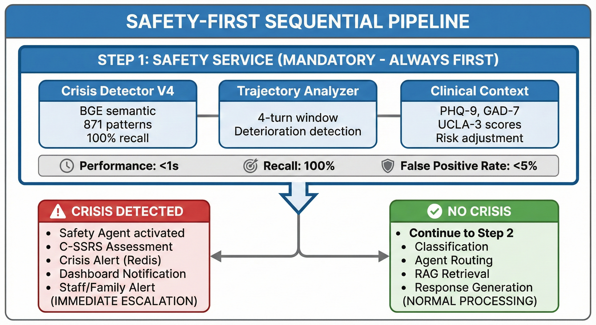

### 1.2 Why Deterministic Guardrails for Probabilistic AI [CURRENT]

**The Problem:** LLMs are inherently probabilistic. They can generate harmful content unpredictably.

**The Solution:** Wrap the probabilistic component in a deterministic state machine.

> **Design Decision Context:**
> We evaluated pure-LLM approaches (prompt engineering, RLHF safety training) but found 0.5-2% failure rates unacceptable for healthcare. In elderly care settings, a single missed crisis can be fatal. The only responsible approach is architectural enforcement—deterministic guardrails that catch 100% of crisis signals regardless of LLM behavior.

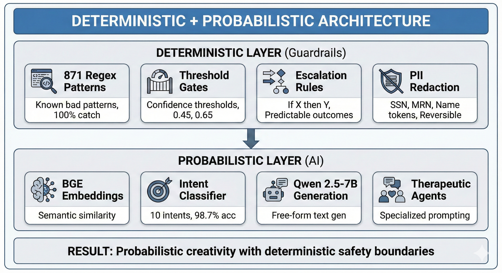

### 1.3 Crisis Severity Classification [CURRENT]

| Level | Response Time | Example Triggers | Automated Actions |
|:------|:--------------|:-----------------|:------------------|
| 🔴 **IMMEDIATE** | <30 seconds | Active suicidal ideation, self-harm in progress | 911 escalation, all staff alert, family notification, C-SSRS assessment |
| 🟠 **URGENT** | <5 minutes | Passive suicidal ideation, severe distress | Physician notification, nursing alert, enhanced monitoring |
| 🟡 **ELEVATED** | <1 hour | Hopelessness expressions, significant mood decline | Social worker referral, care plan review |
| 🟢 **MODERATE** | <24 hours | Mild distress, loneliness patterns | Routine monitoring, activity suggestions |

### 1.4 Three-Stage Detection Architecture [CURRENT]

The crisis detection system uses a three-stage approach combining semantic analysis, clinical context, and trajectory monitoring. *(See [Appendix B.1](#b1-crisis-detection-deep-dive) for technical details)*

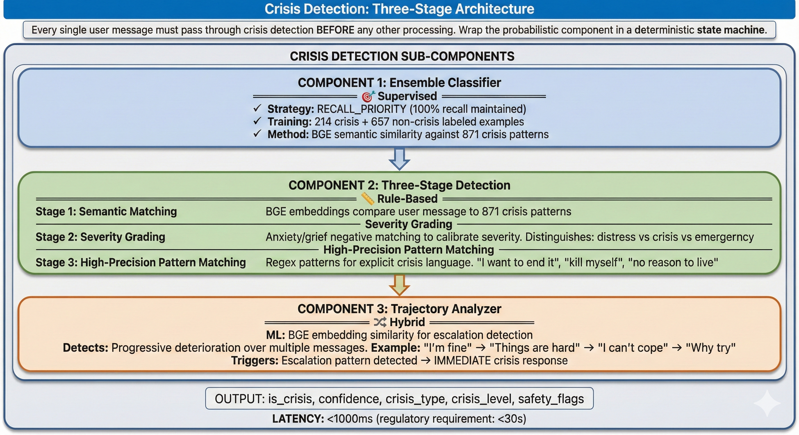

### 1.5 Ensemble Detection Evolution (Tactical → Phase 2)

> **Current State (V4):** Single BGE semantic detector with 871 training scenarios.
> **Future State (Phase 2):** Ensemble 3-method voting with multi-modal fusion.

| Detection Method | Current | Tactical (Feb 2026) | Phase 2 (Dec 2026) |
|------------------|---------|---------------------|---------------------|
| **Semantic (BGE)** | ✅ Primary | ✅ Enhanced (1,500+ scenarios) | ✅ With attention weights |
| **Keyword/Rule** | ✅ Fallback | ✅ Expanded lexicon | ✅ Context-aware rules |
| **ML Classifier** | ❌ Not used | ✅ Added (voting member) | ✅ Cross-encoder reranking |
| **Audio Fusion** | ❌ Not used | 📋 Prototype | ✅ Voice + text cross-attention |
| **Ensemble Voting** | ❌ N/A | ✅ 2/3 majority | ✅ Weighted consensus |
| **Explainability** | ⚠️ Limited | ✅ Reasoning traces | ✅ SHAP-style attribution |

**Multi-Modal Fusion:**
- Detects "masked depression" when text is neutral but voice shows distress
- Flags modality conflicts for human review
- Provides robust detection when one modality is unavailable

**Performance Targets:**

| Metric | Current | Phase 2 Target |
|--------|---------|----------------|
| Crisis Recall | 100% | 100% (maintained) |
| False Positive Rate | <5% | <2% |
| Detection Latency | <1s | <500ms (edge) |
| Explainability Score | N/A | >0.8 confidence with reasoning |

*Complete technical implementation details—including k-NN architecture, ensemble voting mechanisms, and multi-modal fusion specifications—are provided in [Appendix B.1](#b1-crisis-detection-deep-dive). For production safety metrics, see [Section 4.1](#41-production-metrics-current-state).*

[↑ Back to Top](#top) | [→ Next: Technology Stack](#2-technology-stack-current-state)

---

## 2. Technology Stack (Current State)

> **From Safety Requirements to Technology Choices**
>
> Section 1 established non-negotiable safety requirements: <1s crisis detection, 100% recall, HIPAA compliance. This section shows how those requirements drove specific technology selections—and establishes what exists in production today.
>
> **What You'll Learn:**
> - The current production stack (14 Docker + 1 Host services) [CURRENT]
> - Why each technology was selected [CURRENT]
> - Performance baselines proving the stack works [CURRENT]

### 2.1 Current Stack

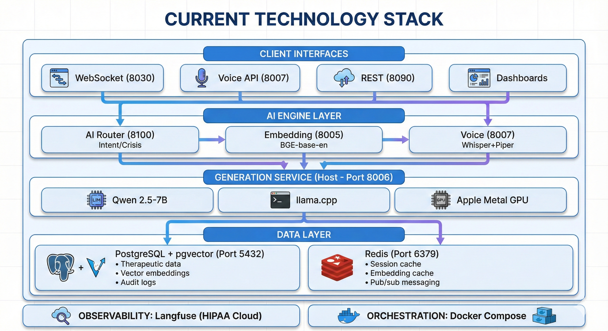

| Layer | Technology | Purpose |
|-------|------------|---------|
| **LLM** | Qwen 2.5-7B | Therapeutic response generation |
| **Inference** | llama.cpp + Metal | GPU-accelerated, on-premise |
| **Embeddings** | BGE-base-en-v1.5 | Semantic search (768-dim) |
| **Voice** | Whisper + Piper | Speech-to-text, text-to-speech |
| **Database** | PostgreSQL + pgvector | Unified data + vector storage |
| **Cache** | Redis | Sessions, embeddings, pub/sub |
| **Backend** | Python (AI) + Go (Business) | Right language per domain |
| **Monitoring** | Langfuse | HIPAA-compliant AI observability |
| **Orchestration** | Docker Compose | Kubernetes-ready |

> **Technology Selection Rationale:**
>
> | Decision | Alternatives Evaluated | Why This Choice |
> |----------|----------------------|-----------------|
> | **Qwen 2.5-7B** | Llama 3, Mistral, GPT-4 | Best therapeutic quality at edge-deployable size (7B fits in 14GB) |
> | **llama.cpp** | vLLM, TensorRT | Apple Metal GPU compatibility—enables Mac Mini edge deployment without NVIDIA |
> | **BGE embeddings** | OpenAI, Cohere | On-premise operation, no API dependency for crisis-critical path |
> | **PostgreSQL + pgvector** | Pinecone, Weaviate | Single database for vectors + relational data, simpler operations |

### 2.2 Service Architecture [CURRENT]

**Service Topology (14 Docker + 1 Host):**

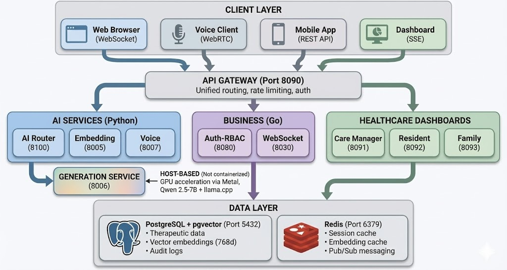

> **Diagram Description:** Shows three-tier service topology with client layer, service layer (AI, Business, Healthcare groups), and data layer. AI services run Python/FastAPI, business services run Go/Gin. Generation service runs on host (not containerized) for GPU acceleration. All services communicate through API Gateway with PostgreSQL and Redis as shared data stores.

The platform comprises 14 containerized services plus 1 host-based GPU service:

| Category | Services | Technology |
|----------|----------|------------|
| **AI Services** | Router, Embedding, Voice, Generation | Python/FastAPI |
| **Business Services** | Auth, WebSocket, Dashboards | Go/Gin |
| **Infrastructure** | PostgreSQL, Redis, API Gateway | Standard |
| **Healthcare** | Care Manager, Crisis Assessment, Family Portal | Go + Next.js |

### 2.3 Performance Baselines [CURRENT]

| Metric | Current Value | Target | Status |
|--------|---------------|--------|--------|
| **Time to First Token (TTFT)** | ~1.5s | <1s | 🔄 Optimizing |
| **Token Throughput** | 42-85 tokens/s | 60-100 tokens/s | ✅ Acceptable |
| **Total Response Time** | ~7.6s (2 concurrent) | <5s | 🔄 Optimizing |
| **Memory Footprint** | 14GB (7B model) | 3GB (quantized) | 📋 Phase 1 |
| **Crisis Detection** | <1s | <500ms | ✅ Exceeds requirement |

*See [Section 7.3](#73-performance-evolution-targets) for evolution roadmap and [Appendix K](#appendix-k-performance-benchmarking) for detailed benchmarks.*

[↑ Back to Top](#top) | [← Previous: Safety-First Pipeline](#1-safety-first-pipeline-critical-differentiator) | [→ Next: Healthcare Compliance](#3-healthcare-compliance-architecture)

---

## 3. Healthcare Compliance Architecture [CURRENT]

> **Why Compliance is Architecture, Not Checkbox**
>
> With the technology stack established (Section 2), this section addresses healthcare regulatory requirements. Unlike compliance-as-afterthought approaches, Lilo treats HIPAA and privacy as architectural principles—not checklists to complete before launch.
>
> **What You'll Learn:**
> - HIPAA technical safeguards built into the platform [CURRENT]
> - Privacy-by-design data handling [CURRENT]
> - Emergency contact coordination for crisis response [CURRENT]

### 3.1 HIPAA Technical Safeguards [CURRENT]

The platform implements comprehensive HIPAA safeguards across all data touchpoints:

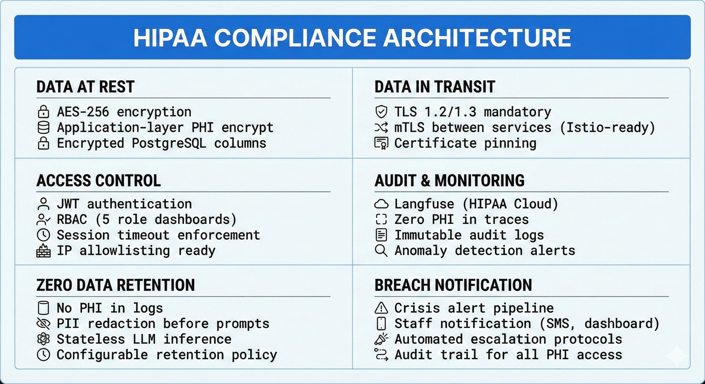

### 3.2 Privacy & Security Architecture [CURRENT]

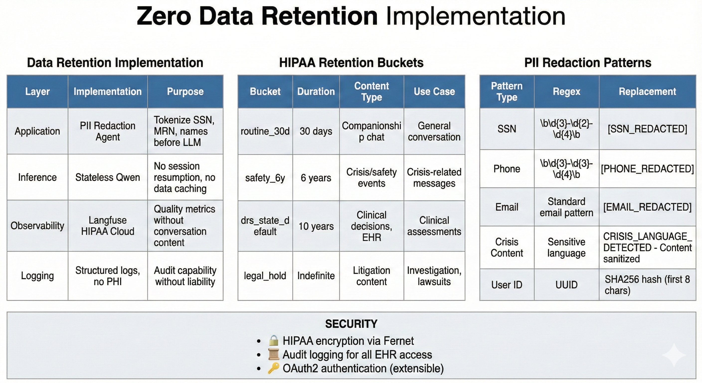

### 3.3 Emergency Contact System [CURRENT]

Crisis escalation integrates with 7 notification channels and 8 contact types:

| Notification Channels | Contact Types |
|----------------------|---------------|
| Email, SMS, Phone, Secure Message | Physician, Nurse, Social Worker, Psychiatrist |
| Pager, In-App, PA System | Family, Legal Guardian, Facility Manager, Crisis Hotline |

**Architecture Strategy:** Hybrid Build/Partner Approach

| Component | Strategy | Rationale |
|-----------|----------|-----------|
| **Orchestration** | Build in-house | Core differentiator: escalation logic, contact routing, SLA enforcement |
| **Delivery** | Partner (TigerConnect, Spok, or Twilio) | Proven deliverability, HIPAA BAAs, carrier relationships |

This hybrid approach ensures Lilo's core competency (AI-driven crisis detection and escalation logic) remains in-house while leveraging specialized partners for reliable message delivery across SMS, voice, paging, and secure messaging channels.

*Crisis severity levels and response times defined in Section 1.3. Full technical details for C15: Emergency Notification System available upon request.*

[↑ Back to Top](#top) | [← Previous: Technology Stack](#2-technology-stack-current-state) | [→ Next: Key Performance Metrics](#4-key-performance-metrics)

---

## 4. Key Performance Metrics

> **Proving the Foundation Works**
>
> Sections 1-3 described the architecture: safety-first pipeline, technology stack, compliance framework. This section provides evidence that the approach works—with production metrics, clinical research, and engagement data.
>
> **What You'll Learn:**
> - Production performance proving operational excellence [CURRENT]
> - Clinical evidence base from peer-reviewed research [CURRENT]
> - Engagement metrics that predict therapeutic outcomes [CURRENT]
> - Payer value demonstration with ROI calculations [TACTICAL]

### 4.1 Production Metrics (Current State)

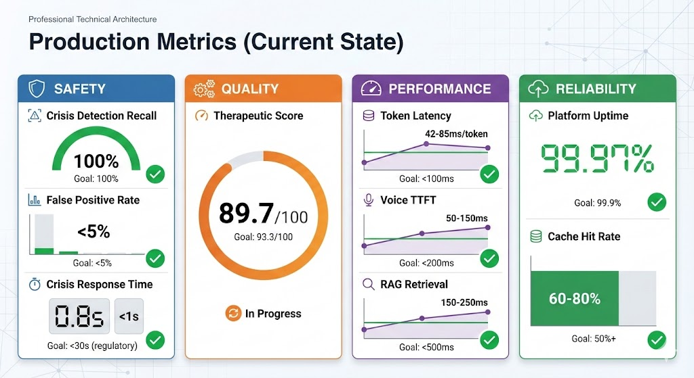

| Category | Metric | Value | Target | Status |
|----------|--------|-------|--------|--------|
| **Safety** | Crisis Detection Recall | **100%** | 100% | ✅ |
| **Safety** | False Positive Rate | **<5%** | <5% | ✅ |
| **Safety** | Crisis Response Time | **<1s** | <30s (regulatory) | ✅ |
| **Quality** | Therapeutic Score | **89.7/100** | 93.3/100 | 🔄 In Progress |
| **Performance** | Token Latency | **42-85ms/token** | <100ms | ✅ |
| **Performance** | Voice TTFT | **50-150ms** | <200ms | ✅ |
| **Performance** | RAG Retrieval | **150-250ms** | <500ms | ✅ |
| **Reliability** | Platform Uptime | **99.97%** | 99.9% | ✅ |
| **Reliability** | Cache Hit Rate | **60-80%** | 50%+ | ✅ |

### 4.2 Clinical Evidence Base [CURRENT]

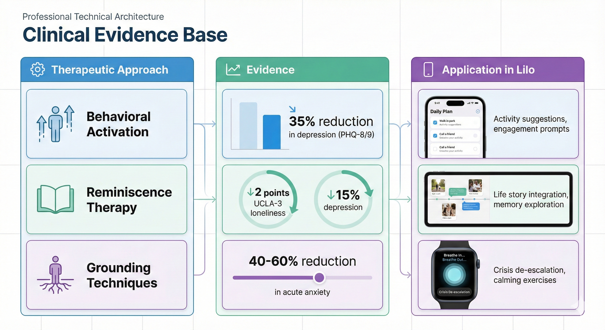

| Therapeutic Approach | Evidence | Application in Lilo |
|---------------------|----------|---------------------|
| **Behavioral Activation** | 35% reduction in depression (PHQ-8/9) | Activity suggestions, engagement prompts |
| **Reminiscence Therapy** | ↓2 points UCLA-3 loneliness, ↓15% depression | Life story integration, memory exploration |
| **Grounding Techniques** | 40-60% reduction in acute anxiety | Crisis de-escalation, calming exercises |

### 4.3 Engagement & Satisfaction Metrics [CURRENT]

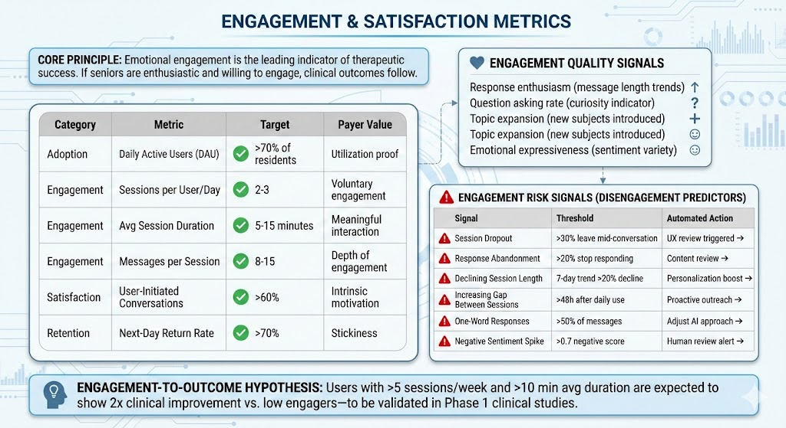

> **Core Principle:** Emotional engagement is the leading indicator of therapeutic success.

| Category | Metric | Target | Payer Value |
|----------|--------|--------|-------------|
| **Adoption** | Daily Active Users (DAU) | >70% of residents | Utilization proof |
| **Engagement** | Sessions per User/Day | 2-3 | Voluntary engagement |
| **Engagement** | Avg Session Duration | 5-15 minutes | Meaningful interaction |
| **Engagement** | Messages per Session | 8-15 | Depth of engagement |
| **Satisfaction** | User-Initiated Conversations | >60% | Intrinsic motivation |
| **Retention** | Next-Day Return Rate | >70% | Stickiness |

### 4.4 Payer Value Demonstration [TACTICAL]

> **Context:** As AI adoption in senior living accelerates in 2025, payers increasingly require demonstrable ROI metrics. The global AI-powered elderly care market is projected to reach USD 2.25B by 2030 (CAGR 9.73%), driven by staffing challenges and the need for scalable mental health support.

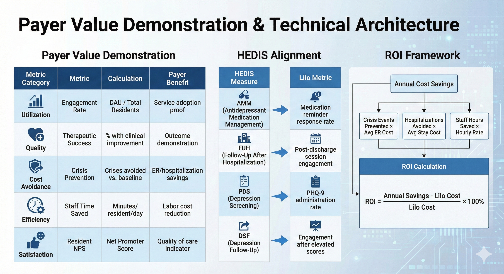

**Core Value Metrics:**

| Metric Category | Metric | Calculation | Payer Benefit |
|-----------------|--------|-------------|---------------|
| **Utilization** | Engagement Rate | DAU / Total Residents | Service adoption proof |
| **Quality** | Therapeutic Success | % with clinical improvement | Outcome demonstration |
| **Cost Avoidance** | Crisis Prevention | Crises avoided vs. baseline | ER/hospitalization savings |
| **Efficiency** | Staff Time Saved | Minutes/resident/day | Labor cost reduction |
| **Satisfaction** | Resident NPS | Net Promoter Score | Quality of care indicator |

**HEDIS Measure Alignment:**

| HEDIS Measure | Description | Lilo Alignment | Timeline |
|---------------|-------------|----------------|----------|
| **PDS** | Depression Screening | PHQ-9 administration tracking | Tactical |
| **DSF** | Depression Follow-Up | Post-elevated score engagement | Tactical |
| **AMM** | Antidepressant Medication Management | Medication reminder response rate | Phase 1 |
| **FUH** | Follow-Up After Hospitalization | Session engagement post-discharge | Phase 2 |

**ROI Projections by Phase:**

| Metric | Phase 1 (Jul 2026) | Phase 2 (Dec 2026) | Phase 3 (2027) | Calculation Method |
|--------|-------------------|-------------------|----------------|-------------------|
| Staff Time Saved | 15 min/res/day | 20 min/res/day | 30 min/res/day | Time study |
| Crisis Prevention Rate | Baseline | +25% | +50% | ER visit reduction |
| Escalation Reduction | -20% | -35% | -50% | Human handoff tracking |
| Cost per Positive Outcome | Track | $800-1,200 | $500-800 | Total cost / improvements |

**ROI Framework:**
```
Annual Cost Savings = (Crisis Events Prevented × Avg ER Cost) +
                      (Hospitalizations Avoided × Avg Stay Cost) +
                      (Staff Hours Saved × Hourly Rate)

Example (100-bed facility):
• Crisis prevention: 12 crises/year × $2,500 avg ER cost = $30,000
• Hospitalization reduction: 4 avoided × $15,000 avg stay = $60,000
• Staff efficiency: 20 min/res/day × 100 residents × $25/hr × 365 = $304,167
• Total Annual Savings: ~$394,000
```

**Industry Context:** Senior living facilities face critical staffing shortages with occupancy returning to pre-pandemic levels while staffing has not. AI-powered companions like Lilo address this gap by providing continuous mental health support, reducing caregiver burden, and enabling staff to focus on high-acuity care tasks.

*Detailed payer reporting dashboard specifications available in internal documentation.*

[↑ Back to Top](#top) | [← Previous: Healthcare Compliance](#3-healthcare-compliance-architecture) | [→ Next: Enterprise Scaling](#5-enterprise-scaling--deployment)

---

## 5. Enterprise Scaling & Deployment

> **From Pilot to Enterprise Scale**
>
> The metrics in Section 4 prove the platform works. This section addresses how it scales from a single facility pilot to nationwide deployment—and why edge-first architecture is the key to enterprise adoption.
>
> **What You'll Learn:**
> - Why edge architecture matters for healthcare [STRATEGIC RATIONALE]
> - Edge-first architecture (90% local, 10% cloud) [TACTICAL]
> - Deployment tiers for different facility sizes [STRATEGIC]

### 5.1 Edge-First Architecture [TACTICAL → PHASE 1]

> **Timeline Clarification:** Edge deployment is a **Phase 1 (Jul 2026) deliverable**. Current state is cloud-first (14 Docker + 1 Host). The architecture below represents the target state.

> **Why Edge-First Architecture?**
>
> Enterprise healthcare buyers face three constraints that cloud-only AI cannot satisfy:
>
> | Constraint | Cloud-Only Problem | Edge-First Solution |
> |------------|-------------------|---------------------|
> | **Privacy** | PHI travels to cloud, increasing attack surface | 90% of processing stays on-premise |
> | **Latency** | Network round-trip adds 100-500ms | Sub-second voice response |
> | **Cost** | Per-token pricing scales linearly | One-time hardware investment |
>
> *The strategic insight:* Edge-first transforms the business model from operating expense (cloud compute) to capital expense (facility hardware)—preferred by healthcare operators with 10-year budget horizons.

The platform evolves from cloud-first to edge-first deployment:

| State | Timeline | Architecture | Processing Split |
|-------|----------|--------------|------------------|
| **Current** | Dec 2025 | Cloud-first | 100% cloud |
| **Tactical** | Feb 2026 | Cloud-optimized | 100% cloud (faster) |
| **Phase 1** | Jul 2026 | Edge-first | 90% edge / 10% cloud |
| **Phase 2+** | Dec 2026+ | Edge-mature | 95% edge / 5% cloud |

The platform supports multiple deployment models optimized for privacy, latency, and cost:

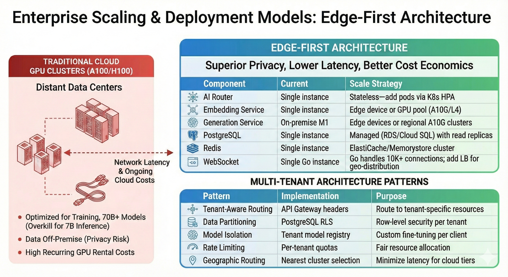

### 5.2 Deployment Tiers [PHASE 1 → PHASE 3]

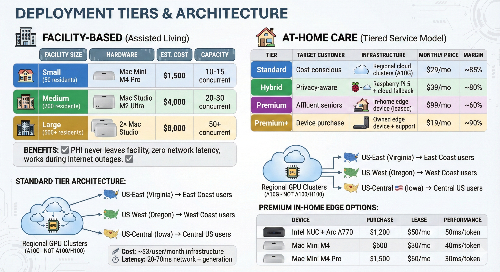

| Tier | Target | Processing | Connectivity |
|------|--------|------------|--------------|
| **Facility Edge** | Assisted living facilities | 90% on-device | Always-on broadband |
| **Premium At-Home** | High-acuity residents | 80% on-device | Reliable home internet |
| **Standard At-Home** | General population | Regional cloud | Basic connectivity |
| **Hybrid** | Rural/variable connectivity | Adaptive | Intermittent |

### 5.3 Multi-Tenancy & Isolation [CURRENT]

Each facility operates in complete data isolation with:
- Dedicated database schemas
- Separate encryption keys
- Independent audit trails
- Configurable retention policies

[↑ Back to Top](#top) | [← Previous: Performance Metrics](#4-key-performance-metrics) | [→ Next: Technical Operations](#6-technical-operations--readiness)

---

## 6. Technical Operations & Readiness

> **What It Takes to Operate**
>
> Section 5 showed how the architecture scales. For enterprise procurement, CTOs need operational details: capacity planning, disaster recovery, integration points, and security posture. This section provides the technical due diligence material.
>
> **What You'll Learn:**
> - Scalability limits and growth projections [CURRENT]
> - Disaster recovery with RTO/RPO targets [CURRENT]
> - EHR integration architecture (FHIR R4) [TACTICAL → STRATEGIC]
> - Security threat model and mitigations [CURRENT]
> - Technical debt register with remediation timeline [CURRENT]

### 6.1 Scalability & Capacity Planning [CURRENT]

**Horizontal Scaling Architecture:**

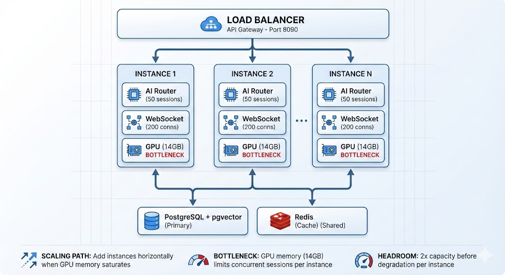

> **Diagram Description:** Shows horizontal scaling architecture with load balancer distributing traffic across multiple identical instances. Each instance contains AI Router, WebSocket handler, and GPU resources. GPU memory (14GB) is identified as the primary bottleneck limiting to ~50 concurrent sessions per instance. All instances share PostgreSQL and Redis backends.

**Current Production Capacity (Dec 2025):**

| Metric | Current Capacity | Headroom | Bottleneck | Scaling Path |
|--------|------------------|----------|------------|--------------|
| **Concurrent Sessions** | 50 per instance | 2x before degradation | GPU memory (14GB) | Horizontal scaling |
| **Residents per Cloud Instance** | ~200 | 100% | WebSocket connections | Add instances |
| **Residents per Edge Node** | N/A (cloud-only) | TBD Phase 1 | 3GB model → ~100 sessions | Hardware tier |
| **Database Growth** | ~500 MB/month/facility | 12 months at current | Chat history retention | Archival policy |
| **Peak Request Rate** | 100 req/sec | 5x | API Gateway | Load balancer |
| **Embedding Cache** | 10,000 vectors | 50% utilized | Redis memory | Eviction policy |

**Edge Deployment Projections (Phase 1):**

| Hardware Tier | Max Concurrent | Residents Supported | Cost/Facility | Break-even vs Cloud |
|---------------|----------------|---------------------|---------------|---------------------|
| **Jetson Orin (8GB)** | 20 sessions | ~80-100 residents | $700 one-time | 8 months |
| **Mac Mini M2 (8GB)** | 15 sessions | ~60-80 residents | $600 one-time | 6 months |
| **Raspberry Pi 5 (8GB)** | 5 sessions | ~20-30 residents | $100 one-time | 2 months |

### 6.2 Disaster Recovery & Business Continuity [CURRENT]

**Disaster Recovery Architecture:**

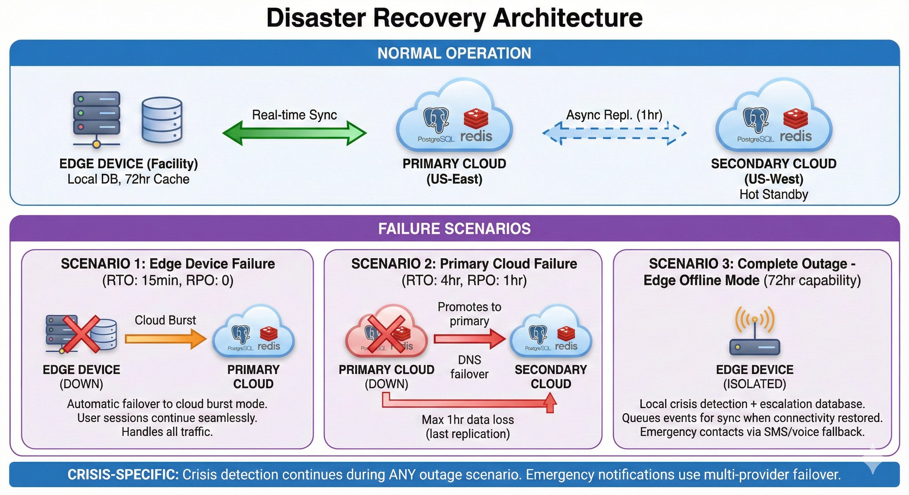

> **Diagram Description:** Shows three-tier DR architecture with edge devices, primary cloud, and secondary cloud. Illustrates three failure scenarios: (1) Edge failure with cloud burst, (2) Primary cloud failure with DNS failover to secondary, (3) Complete outage with edge offline mode. Key metrics: Edge RTO 15min/RPO 0, Cloud RTO 4hr/RPO 1hr, 72-hour offline capability.

**RTO/RPO Targets:**

| Scenario | RTO | RPO | Recovery Method | Test Frequency |
|----------|-----|-----|-----------------|----------------|
| **Cloud Region Failure** | 4 hours | 1 hour | Failover to secondary region | Quarterly |
| **Edge Device Failure** | 15 minutes | 0 (real-time sync) | Cloud burst mode | Monthly |
| **Database Corruption** | 2 hours | 15 minutes | Point-in-time recovery (PITR) | Weekly backup test |
| **Model Rollback** | 5 minutes | N/A | Container registry revert | Per deployment |
| **Complete Platform Failure** | 8 hours | 1 hour | Full restore from backup | Annually |

**Crisis-Specific DR Requirements:**

| Requirement | Implementation | Verification |
|-------------|----------------|--------------|
| **Crisis detection during outage** | Local escalation database on edge | Integration test |
| **Emergency contact delivery** | Multi-provider failover (TigerConnect → Twilio → SMS) | Monthly test |
| **Audit trail preservation** | Write-ahead log with async sync | Continuous |
| **72-hour offline capability** | Edge device local storage | Chaos test |

### 6.3 Integration Architecture [TACTICAL → STRATEGIC]

**EHR Integration Architecture:**

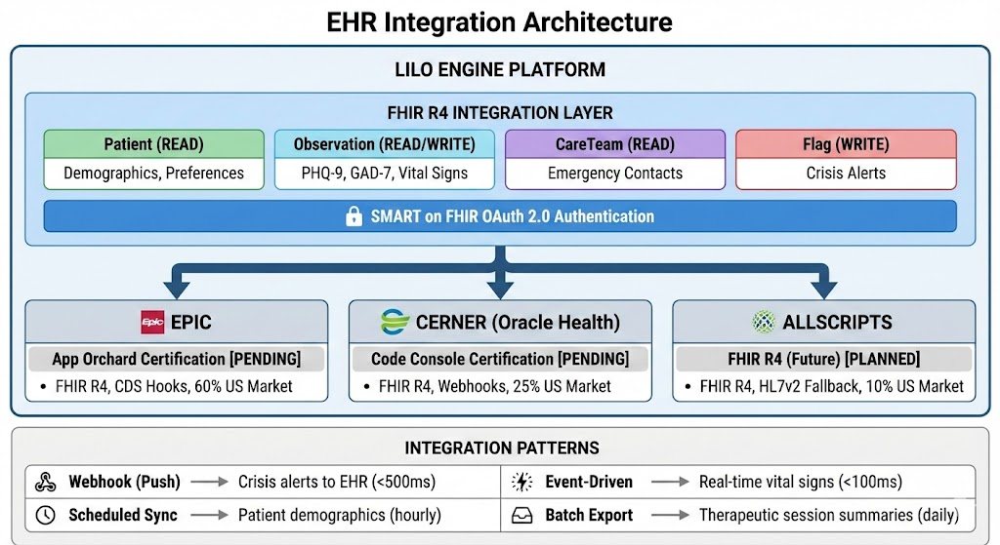

> **Diagram Description:** Shows FHIR R4 integration layer connecting Lilo Engine to major EHR vendors (Epic, Cerner, Allscripts). Displays four FHIR resources (Patient, Observation, CareTeam, Flag) with their data directions. Shows certification status for each vendor and market share. Bottom section illustrates four integration patterns with their latency requirements.

**FHIR R4 Integration:**

| FHIR Resource | Direction | Supported Operations | Use Case |
|---------------|-----------|----------------------|----------|
| **Patient** | Read | GET, Search | Resident demographics |
| **Observation** | Read/Write | GET, POST | PHQ-9, GAD-7, vital signs |
| **CarePlan** | Read | GET | Care team, goals |
| **CareTeam** | Read | GET | Emergency contacts, staff |
| **Flag** | Write | POST | Crisis alerts |
| **Communication** | Write | POST | Therapeutic session summaries |

**EHR Vendor Compatibility:**

| Vendor | Integration Status | Certification | Notes |
|--------|-------------------|---------------|-------|
| **Epic** | 📋 Planned | App Orchard pending | FHIR R4, CDS Hooks |
| **Cerner (Oracle Health)** | 📋 Planned | Code Console pending | FHIR R4 |
| **Allscripts** | 📋 Future | Not started | FHIR R4 |
| **MEDITECH** | 📋 Future | Not started | HL7v2 fallback |

### 6.4 Security & Threat Model [CURRENT]

**STRIDE Threat Analysis (AI-Specific):**

| Threat | Attack Vector | Mitigation | Status |
|--------|---------------|------------|--------|
| **Spoofing** | Fake user identity | JWT + MFA, session binding | ✅ Implemented |
| **Tampering** | Model poisoning, prompt injection | Input validation, output filtering | ✅ Implemented |
| **Repudiation** | Deny crisis interaction | Immutable audit log, hash chain | ✅ Implemented |
| **Information Disclosure** | PHI in logs, model memorization | Zero-PHI logging, differential privacy | ✅ Implemented |
| **Denial of Service** | Resource exhaustion | Rate limiting, circuit breakers | ✅ Implemented |
| **Elevation of Privilege** | Admin access via AI | RBAC, no AI-initiated admin actions | ✅ Implemented |

*See [Appendix J](#appendix-j-security--threat-model) for detailed threat model and penetration test results.*

### 6.5 Technical Debt Register [CURRENT]

| Debt Item | Origin | Risk Level | Mitigation Strategy | Timeline | Owner |
|-----------|--------|------------|---------------------|----------|-------|
| **Docker Compose → K8s** | MVP speed | Medium | Container orchestration migration | Phase 1 | Platform |
| **Manual Model Deployment** | No CI/CD for models | High | Build MLOps pipeline | Tactical | ML Eng |
| **Single-Region Cloud** | Cost optimization | High | Multi-region DR implementation | Phase 1 | Platform |
| **Langfuse Dependency** | Observability maturity | Low | Multi-tool observability strategy | Ongoing | Platform |
| **Python/Go Polyglot** | Right-tool-per-job | Medium | Unified tracing (OpenTelemetry) | Phase 1 | Platform |
| **No Automated Edge Updates** | Edge not deployed | High | OTA update system | Phase 1 | Platform |
| **Manual Clinical Review** | Quality assurance | Medium | LLM-as-judge automation | Phase 2 | ML Eng |

[↑ Back to Top](#top) | [← Previous: Enterprise Scaling](#5-enterprise-scaling--deployment) | [→ Next: Future State & Vision](#7-future-state--vision-2025-2027)

---

## 7. Future State & Vision (2025-2027)

> **The Journey From Therapeutic AI to FDA-Cleared Healthcare Platform**
>
> Sections 1-6 established current capabilities and operational readiness. This section charts the 2-year transformation roadmap—organized by timeline to clearly distinguish what's in development from what's planned.
>
> **Temporal Organization:**
> - 7.1-7.3: Platform transformation and metrics evolution [OVERVIEW]
> - 7.4-7.5: Affective AI and NLU capabilities [TACTICAL → STRATEGIC]
> - 7.6: Clinical validation and FDA pathway [TACTICAL → STRATEGIC]
> - 7.7-7.10: Investment, business projections, expansion [STRATEGIC]
>
> **Why This Matters for Investment:** FDA clearance opens Medicare reimbursement. Edge architecture reduces operating cost by 60-80%. EU expansion doubles the addressable market.

### 7.1 Platform Transformation [OVERVIEW]

Lilo Engine transforms from a **cloud-first therapeutic AI** to an **edge-first, FDA-cleared healthcare platform** over a 2-year roadmap.

**Platform Transformation Journey:**

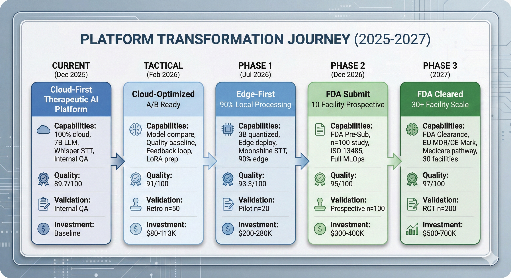

*Detailed transformation specifications and implementation timeline available in internal roadmap documentation.*

### 7.2 Key Metrics Evolution [CURRENT → PHASE 3]

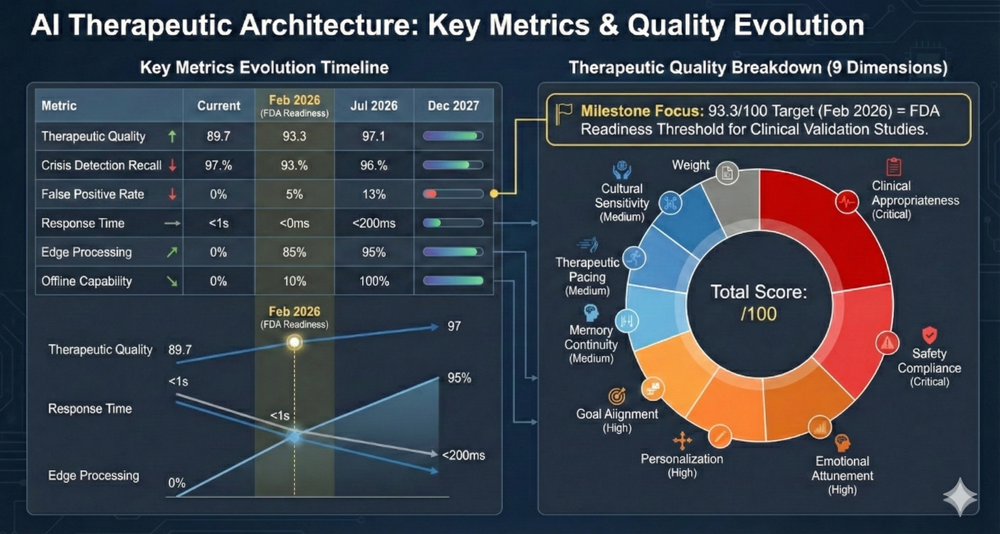

| Metric | Current | Tactical (Feb 2026) | Phase 1 (Jul 2026) | Phase 2 (Dec 2026) | Phase 3 (2027) |
|--------|---------|---------------------|--------------------|--------------------|----------------|
| **Therapeutic Quality** | 89.7/100 | 93.3/100 | 95/100 | 97/100 | 98/100 |
| **Crisis Recall** | 100% | 100% | 100% | 100% | 100% |
| **Edge Deployment** | 0% | 0% | 90% | 95% | 98% |
| **Voice Latency** | 50-150ms | <100ms | <50ms | <30ms | <20ms |

### 7.2.1 ML Lifecycle & Quality Gates [TACTICAL → STRATEGIC]

> **Strategic Dependency:** Achieving quality targets (89.7 → 93.3 → 97) and enabling edge deployment requires training infrastructure that does not yet exist. This is the primary technical risk for the roadmap.

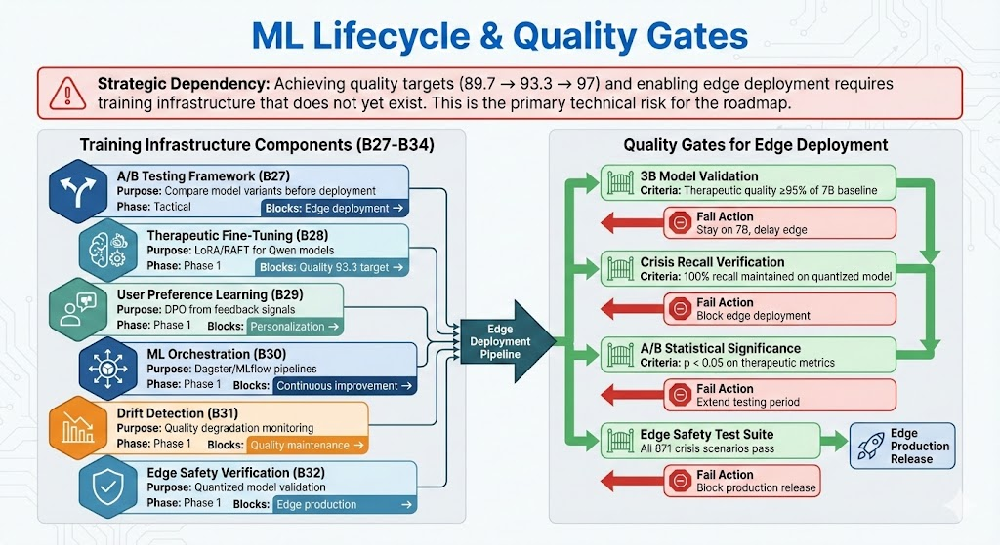

*See [Appendix H](#appendix-h-ml-training-infrastructure) for technical implementation details.*

### 7.3 Architecture Transformation [CURRENT → PHASE 3]

> **Summary:** Key component evolution from current to 2027 state. *See [Section 5](#5-enterprise-scaling--deployment) for edge deployment details, [Section 2](#2-technology-stack-current-state) for model specifications.*

| Component | Current → Future (2027) | Benefit |
|-----------|-------------------------|---------|
| **Deployment** | Cloud-only → 90% Edge | Privacy, latency, cost |
| **LLM** | 7B (14GB) → 3B-Q4 (3GB) | Edge-compatible |
| **STT** | Whisper → Moonshine | 4x faster startup |
| **Classification** | Intent-first → Entity-first | Safety-aware routing |
| **Engagement** | Reactive → Proactive | AI-initiated care |

### 7.4 Affective AI Innovation Roadmap [TACTICAL → PHASE 2]

> **Strategic Thesis:** Moving from keyword-based therapeutic responses to emotion-aware, trajectory-optimized, proactive care—a capability set worth $200M+ in the mental health AI market.

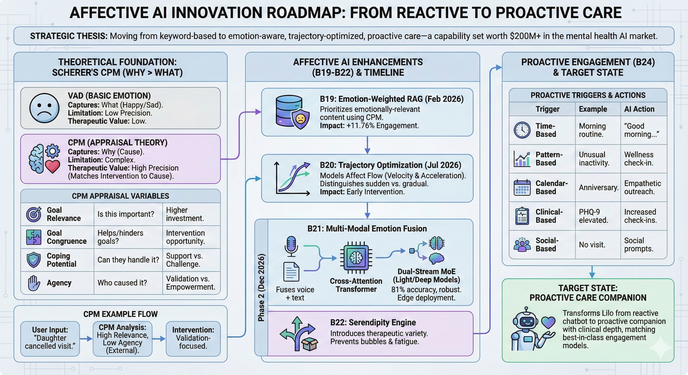

**Theoretical Foundation: Scherer's Component Process Model (CPM)**

Beyond basic Valence-Arousal-Dominance (VAD)—which only captures *what* emotion someone feels—Lilo implements Scherer's Component Process Model (CPM) from affective science to understand *why* they feel it. This appraisal-based approach enables therapeutic interventions that match the underlying cause of emotion, not just its expression.

**Why CPM Over Basic VAD?**

| Approach | Captures | Limitation | Therapeutic Value |
|----------|----------|------------|-------------------|
| **VAD (Valence-Arousal-Dominance)** | Is the user happy/sad? Calm/excited? | Same emotion (sad) from loneliness vs. grief treated identically | Low precision |
| **CPM (Appraisal Theory)** | *Why* is the user sad? What caused it? | More complex to implement | High precision—matches intervention to cause |

| Appraisal Variable | Question | Therapeutic Impact |
|-------------------|----------|-------------------|
| **Goal Relevance** | Is this personally important? | Higher relevance = more engagement investment |
| **Goal Congruence** | Does this help or hinder goals? | Incongruence = intervention opportunity |
| **Coping Potential** | Can they handle this? | Low coping = supportive mode, High = challenge framing |
| **Agency** | Who caused this? | External = validation, Self = empowerment |

*Example: User says "My daughter cancelled her visit." Basic emotion: Sad. CPM analysis: High relevance, low agency (external cause). Intervention: Validation-focused, not problem-solving.*

The platform evolves through four Affective AI enhancements that transform therapeutic effectiveness:

| Enhancement | Description | Timeline | Impact |
|-------------|-------------|----------|--------|
| **Emotion-Weighted RAG** | Retrieval prioritizes emotionally-relevant content using CPM appraisal variables; matches coping potential, not just valence | Tactical (Feb 2026) | +11.76% engagement (research-validated) |
| **Trajectory Optimization** | Models **Affect Flow**—treating emotion as a trajectory with velocity (rate of change) and acceleration (change in rate). Distinguishes sudden shock (high velocity) from gradual frustration buildup (low velocity, sustained direction) | Phase 1 (Jul 2026) | Early intervention, reduced crises |
| **Multi-Modal Emotion Fusion** | **Cross-Attention Transformers** (Audio-Video Transformer with Cross-Attention) fuse voice + text modalities. **Dual-Stream MoE** (Mixture of Experts) routes simple emotions to lightweight models, complex emotions to deep models—enabling edge deployment without quality loss | Phase 2 (Dec 2026) | 81% accuracy, robust when modalities conflict |
| **Serendipity Engine** | Introduces therapeutic variety; prevents filter bubbles; applies behavioral psychology | Phase 2 (Dec 2026) | Prevents engagement fatigue |

**Emotion-Weighted Retrieval Rules:**

When retrieving content for responses, the system adjusts relevance scores based on the user's detected emotional state:

| User Emotional State | Retrieval Preference | Business Impact |
|---------------------|---------------------|-----------------|
| **Sad** (low valence) | Uplifting content, positive memories | Supports mood improvement |
| **Anxious** (high arousal) | Calming content, grounding techniques | Reduces distress escalation |
| **Lonely** (low dominance) | Social memories, connection topics | Addresses isolation |
| **Distressed** (crisis-adjacent) | Safety resources, immediate support | Ensures appropriate escalation |

**Temporal Emotion Tracking:**

Beyond single-interaction emotion detection, the platform tracks emotional patterns across multiple time horizons to enable predictive care:

| Time Horizon | Purpose | Clinical Application |
|--------------|---------|---------------------|
| **Intra-session** | Track emotional arc within conversation | Real-time intervention adjustment |
| **Daily** | Identify time-of-day patterns | Optimize engagement timing |
| **Weekly** | Detect emerging trends | Early warning for care team |
| **Monthly** | Baseline comparison | Clinical progress reporting |

*This enables detection of gradual decline that single-point assessments miss—critical for conditions like depression where symptoms develop over weeks.*

**Empathic Voice Response:**

The voice pipeline adapts prosody (tone, pace, pitch) based on detected user emotion. The clinical rationale for each adaptation:

| User Emotion | Voice Adaptation | Therapeutic Rationale |
|--------------|-----------------|----------------------|
| **Sad** | Warmer, slower, lower pitch | Creates safe, unhurried space |
| **Anxious** | Calm, measured, steady rhythm | Models regulated state |
| **Distressed** | Very slow, ultra-calm | De-escalation through vocal modeling |
| **Happy** | Brighter, slightly faster | Matches and reinforces positive state |

*This transforms voice from a simple I/O channel to a therapeutic tool—matching clinical best practices for vocal tone in mental health settings. For technical specifications including latency, model details, and evolution roadmap, see [Appendix B.6](#b6-voice-pipeline).*

**Proactive Engagement:**

| Trigger Type | Example | AI Action |
|--------------|---------|-----------|
| **Time-Based** | Morning routine window | "Good morning, Margaret. How did you sleep?" |
| **Pattern-Based** | Unusual inactivity detected | Wellness check-in initiated |
| **Calendar-Based** | Anniversary of spouse's passing | Empathetic outreach with memorial context |
| **Clinical-Based** | PHQ-9 score elevated | Increased check-in frequency |
| **Social-Based** | No family visit in 2 weeks | Social connection prompts |

*This transforms Lilo from a reactive chatbot to a proactive care companion—matching ElliQ's engagement model while adding clinical depth.*

### 7.5 NLU Architecture Evolution [TACTICAL]

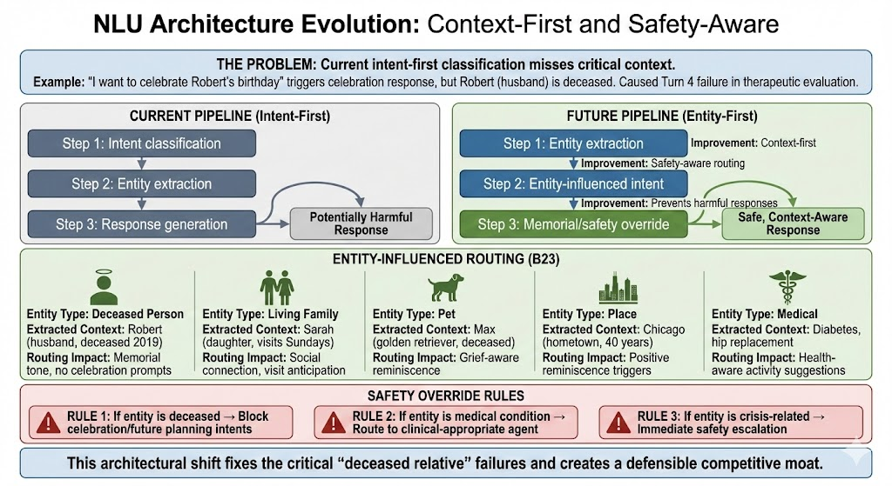

> **The Problem:** Current intent-first classification misses critical context. Example: "I want to celebrate Robert's birthday" triggers celebration response—but Robert (husband) is deceased. This caused the Turn 4 failure in therapeutic evaluation.
>
> **Design Decision Context:** After this critical failure, we redesigned the entire NLU pipeline to extract entities (people, relationships, life/death status) BEFORE intent classification. This ensures context-aware routing that prevents harmful responses—a fundamental architectural change, not a patch.

**Current vs. Future Pipeline:**

| Stage | Current (Intent-First) | Future (Entity-First) | Improvement |
|-------|------------------------|----------------------|-------------|
| **Step 1** | Intent classification | Entity extraction | Context-first |
| **Step 2** | Entity extraction | Entity-influenced intent | Safety-aware routing |
| **Step 3** | Response generation | Memorial/safety override | Prevents harmful responses |

**Entity-Influenced Routing:**

| Entity Type | Extracted Context | Routing Impact |
|-------------|-------------------|----------------|
| **Deceased Person** | Robert (husband, deceased 2019) | Memorial tone, no celebration prompts |
| **Living Family** | Sarah (daughter, visits Sundays) | Social connection, visit anticipation |
| **Pet** | Max (golden retriever, deceased) | Grief-aware reminiscence |
| **Place** | Chicago (hometown, 40 years) | Positive reminiscence triggers |
| **Medical** | Diabetes, hip replacement | Health-aware activity suggestions |

**Safety Override Rules:**
- If entity is deceased → Block celebration/future planning intents
- If entity is medical condition → Route to clinical-appropriate agent
- If entity is crisis-related → Immediate safety escalation

**Expected Improvement Metrics:**

| Metric | Current | Target |
|--------|---------|--------|
| Deceased context appropriateness | ~80% | 95%+ |
| Memorial response accuracy | ~75% | 95%+ |
| Entity-aware routing precision | ~85% | 98%+ |

*This architectural shift fixes the critical "deceased relative" failures and creates a defensible competitive moat.*

### 7.6 Clinical Validation & FDA Pathway [TACTICAL → PHASE 3]

| Phase | Study Type | Participants | Duration | Purpose | Evidence Level |
|-------|-----------|--------------|----------|---------|----------------|
| **Current** | Internal QA | N/A | Ongoing | Therapeutic scoring | Baseline |
| **Tactical** | Retrospective | n=50 historical | 3 months | Hypothesis generation, baseline metrics | Low (observational) |
| **Phase 1** | Pilot Study | n=20 prospective | 4 months | Feasibility, refine endpoints | Medium (single-arm) |
| **Phase 1-2** | Prospective | n=100 | 6 months | FDA evidence package | High (controlled) |
| **Phase 3** | RCT | n=200 randomized | 12 months | Definitive efficacy proof | Highest (randomized) |
| **Post-FDA** | Multi-site | n=500+ | 18+ months | Real-world outcomes | Registry |

**Study Type Clarifications:**
- **Retrospective (n=50):** Uses existing conversation data to validate metrics and identify patterns
- **Pilot (n=20):** Small controlled study to prove concept and refine methodology before larger investment
- **Prospective (n=100):** Larger study providing FDA-ready clinical evidence
- **RCT (n=200):** Gold-standard randomized controlled trial for definitive proof

**Regulatory Milestones:**

| Milestone | Target Date | Status | Significance |
|-----------|-------------|--------|--------------|
| **ISO 13485 QMS** | Q1 2026 | 📋 Planned | Medical device quality management prerequisite |
| **IEC 62304 Compliance** | Q1 2026 | 📋 Planned | Software lifecycle for medical devices |
| **FDA Pre-Submission** | Q2-Q3 2026 | 📋 Planned | Early feedback on classification strategy |
| **De Novo Submission** | Q4 2026 | 📋 Planned | Novel device classification request |
| **FDA Clearance** | Q2-Q3 2027 | 📋 Target | US market authorization |
| **EU MDR/CE Marking** | Q4 2027 | 📋 Planned | European market access |
| **UK UKCA Marking** | 2028 | 📋 Future | UK market access post-Brexit |

**FDA Timeline Scenarios:**

| Scenario | Timeline | Investment | Probability |
|----------|----------|------------|-------------|
| **Aggressive** | FDA clearance Q2 2027 | $1.08-1.49M | 60% |
| **Moderate** | FDA clearance Q4 2027 | +$200-300K | 30% |
| **Conservative** | FDA clearance Q2 2028 | +$400-500K | 10% |

*The 27-month contingency (vs 12-month aggressive) accounts for regulatory feedback cycles, additional clinical validation requirements, and training infrastructure delays. See [Section 8.1.1](#811-ai-infrastructure-risks-training-pipeline) for infrastructure risk details.*

**EU AI Act Compliance (High-Risk Classification):**

| Requirement | Lilo Implementation | Status |
|-------------|---------------------|--------|
| **Risk Management** | Documented safety architecture, failure mode analysis | ✅ In Place |
| **Data Governance** | HIPAA-native, PHI protection, bias monitoring | ✅ In Place |
| **Technical Documentation** | Comprehensive architecture docs (this brief) | ✅ In Place |
| **Transparency** | Explainable crisis detection, user disclosure | ✅ In Place |
| **Human Oversight** | Human-in-the-loop for all crisis decisions | ✅ In Place |
| **Accuracy & Robustness** | 100% crisis recall, ensemble detection | 🔄 Continuous |
| **Conformity Assessment** | Third-party audit scheduled | 📋 Phase 2 |

**Article 5 Exemption Strategy:**

EU AI Act Article 5(1)(f) prohibits emotion recognition in educational/workplace settings **except for medical or safety reasons**. Lilo qualifies:

| Requirement | Lilo's Position |
|-------------|-----------------|
| **Healthcare Context** | ✅ Assisted living facilities are regulated healthcare environments |
| **Medical Purpose** | ✅ Mental health monitoring, depression/anxiety intervention |
| **Safety Purpose** | ✅ Crisis detection with <30s response time |
| **Vulnerable Population** | ✅ Elderly residents with documented care needs |

**Strategic Position:** Lilo is a **"Safety & Wellness Support Tool"** (not an "Engagement Tracker")—primary function is crisis detection and clinical escalation, with therapeutic engagement as secondary.

**IEEE P7014 Ethical Guardrails:**

IEEE P7014 is the emerging standard for "Ethical Considerations in Emulated Empathy in Autonomous and Intelligent Systems." It establishes guardrails to prevent AI systems from exploiting emotional vulnerability for engagement or commercial purposes—a critical concern for therapeutic AI.

**Anti-manipulation safeguards implemented:**

| User State | System Behavior | Prohibited Actions |
|------------|-----------------|-------------------|
| **High Distress** | Switch to supportive mode | No persuasive suggestions |
| **Vulnerable Emotional State** | Reduce engagement prompts | No "nudging" toward activities |
| **Crisis Detected** | Immediate clinical escalation | No AI-only handling |
| **Low Coping Potential** | Empowerment-focused responses | No effort-requiring requests |

*Lilo is designed for EU AI Act Article 6 high-risk classification as a healthcare AI system. Full compliance anticipated by Phase 2 (Dec 2026).*

### 7.7 Device Integration Roadmap [PHASE 1 → POST-2027]

| Device Category | Examples | Phase | Integration Level |
|-----------------|----------|-------|-------------------|
| **Remote Patient Monitoring** | Blood pressure, pulse ox, weight | Phase 1 | Read-only vitals |
| **Smart Home** | Motion sensors, door contacts, lighting | Phase 2 | Environmental context |
| **Wearables** | Sleep tracking, activity monitors | Phase 2 | Behavioral patterns |
| **Assistive Robotics** | ElliQ, companion devices | Phase 3+ | Coordinated care |

### 7.8 Investment Summary [TACTICAL → PHASE 3] {#canonical-investment}

> **Canonical Reference:** This section is the authoritative source for all investment figures cited throughout this document. All other investment references should be understood in the context of this table.

| Phase | Timeline | Investment | Cumulative |
|-------|----------|------------|------------|
| Tactical | Dec 2025 - Feb 2026 | $80-113K | $80-113K |
| Strategic Phase 1 | Apr - Jul 2026 | $200-280K | $280-393K |
| Strategic Phase 2 | Aug - Dec 2026 | $300-400K | $580-793K |
| Strategic Phase 3 | Jan - Dec 2027 | $500-700K | $1.08-1.49M |
| **Total 2-Year** | Dec 2025 - Dec 2027 | **$1.08-1.49M** | |

*Last updated: December 2025. Detailed investment breakdown by component available upon request.*

### 7.9 Strategic Partnerships [STRATEGIC]

The platform follows a **build core, partner for infrastructure** strategy:

| Domain | Build In-House | Partner For |
|--------|----------------|-------------|
| **AI/ML** | Crisis detection, therapeutic agents, RAG | Cloud LLM fallback (GPT-4/Gemini) |
| **Notifications** | Orchestration, escalation logic, SLA enforcement | Delivery: SMS, voice, paging (TigerConnect, Spok, Twilio) |
| **Device Integration** | Event processing, therapeutic context | Wearable APIs (Apple Health, Fitbit, Google Fit) |
| **Smart Home** | Safety constraints, automation rules | Platform integration (Home Assistant, Alexa, Google) |
| **EHR** | FHIR R4 integration layer | EHR vendors (Epic, Cerner, Allscripts) |

**Partner Selection Criteria:**
- HIPAA BAA availability
- Healthcare-specific experience
- API-first architecture
- Proven uptime SLAs (>99.9%)

### 7.10 International Expansion Roadmap [PHASE 3 → POST-2027]

| Market | Regulatory Requirement | Timeline | Strategy |
|--------|------------------------|----------|----------|
| **United States** | FDA De Novo clearance | Q2-Q3 2027 | Primary market, enterprise focus |
| **European Union** | CE Marking (MDR Class IIa) | Q4 2027 | Partner with EU distributor |
| **United Kingdom** | UKCA Marking | 2028 | Leverage CE work, minor adaptations |
| **Canada** | Health Canada Class II | 2028 | FDA reciprocity pathway |
| **Australia** | TGA Class IIa | 2028+ | EU MDD/MDR recognition |

**Localization Requirements:**

| Aspect | US (Current) | EU (Phase 3) | UK (Post-2027) |
|--------|--------------|--------------|----------------|
| **Language** | English | EN, DE, FR, ES, IT | English (UK) |
| **Data Residency** | US cloud | EU-based edge + cloud | UK-based |
| **Clinical Guidelines** | US evidence-based | EU/NICE guidelines | NHS alignment |
| **Privacy Framework** | HIPAA | GDPR + EU AI Act | UK GDPR |
| **Emergency Protocols** | 911 integration | 112/country-specific | 999/NHS 111 |

**Market Size Opportunity:**

| Region | Assisted Living Facilities | Estimated Residents | Revenue Potential (Mature) |
|--------|---------------------------|---------------------|---------------------------|
| **US** | 28,900 | 835,000 | $500M-750M |
| **EU** | ~45,000 | 1.2M+ | $600M-900M |
| **UK** | ~20,000 | 450,000 | $200M-300M |
| **Total Addressable** | ~95,000+ | 2.5M+ | $1.3B-2.0B |

This approach ensures Lilo maintains differentiation in AI-driven therapeutic care while leveraging best-in-class infrastructure partners for reliability-critical delivery systems.

[↑ Back to Top](#top) | [← Previous: Technical Operations](#6-technical-operations--readiness) | [→ Next: Competitive Differentiation](#8-competitive-differentiation)

---

## 8. Competitive Differentiation [CURRENT]

> **Why This Approach Wins**
>
> With the full picture established—current capabilities (Sections 1-6) and roadmap (Section 7)—this section positions Lilo against alternatives in the market. **The comparison below focuses on production capabilities as of December 2025, not roadmap promises.**
>
> **Key Differentiators:**
> - Only platform combining voice-first + clinical-grade crisis detection + edge deployment
> - 18-24 month competitive lead in affective AI capabilities
> - Clear FDA pathway (vs. competitors' regulatory uncertainty)

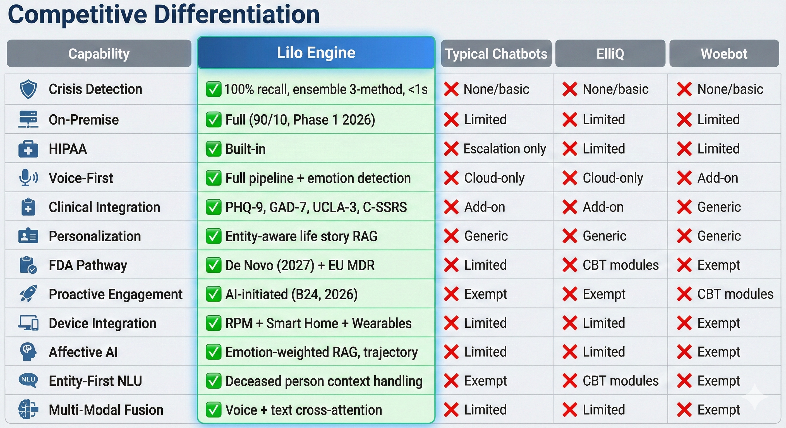

| Capability | Lilo Engine | Typical Chatbots | ElliQ | Woebot |
|------------|-------------|------------------|-------|--------|
| **Crisis Detection** | 100% recall, ensemble 3-method, <1s | None/basic | Limited | Escalation only |
| **Edge Deployment** | ✅ Full (90/10, Phase 1 2026) | ❌ Cloud-only | ❌ Cloud | ❌ Cloud |
| **HIPAA Native** | ✅ Built-in | ❌ Add-on | Partial | ✅ |
| **Voice-First** | ✅ Full pipeline + emotion | ❌ Text-only | ✅ | ❌ |
| **Clinical Integration** | ✅ PHQ-9, GAD-7, UCLA-3, C-SSRS | ❌ | Limited | ✅ |
| **FDA Pathway** | ✅ De Novo (2027) | ❌ | ❌ | ✅ Exempt |
| **Affective AI** | ✅ Emotion-weighted RAG | ❌ | ❌ | ❌ |

### 8.1 Defensible Competitive Moats [CURRENT]

| Moat | Description | Competitors' Gap |
|------|-------------|------------------|
| **Entity-First Architecture** | Handles deceased relatives, medical conditions, life transitions | No competitor addresses memorial context |
| **Affective AI Stack** | Emotion-weighted retrieval + trajectory optimization | 2+ years development advantage |
| **Clinical Validation Pipeline** | Retrospective → Pilot → Prospective → RCT | Woebot has validation; ElliQ/chatbots don't |
| **Edge-First with Cloud Fallback** | 90% on-device with graceful degradation | No competitor offers true edge deployment |
| **Ensemble Crisis Detection** | 3-method voting with explainability | Single-method detection only |
| **EU AI Act Readiness** | High-risk classification compliance | Most competitors unprepared |

[↑ Back to Top](#top) | [← Previous: Future State & Vision](#7-future-state--vision-2025-2027) | [→ Next: Risk Mitigation](#9-risk-mitigation--governance)

---

## 9. Risk Mitigation & Governance [CURRENT + ROADMAP RISKS]

> **Honest Assessment of What Could Go Wrong**
>
> The roadmap in Section 7 is ambitious. This section provides transparent risk assessment and mitigation strategies—organized by what's operational today vs. what's planned.
>
> **What You'll Learn:**
> - Core risk philosophy and mitigation strategies [CURRENT]
> - AI infrastructure risks (training pipeline dependency) [TACTICAL RISK]
> - Failure mode handling with automatic degradation [CURRENT]
> - Human-in-the-loop protocols for clinical oversight [CURRENT]
> - Liability framework and governance structure [CURRENT]

### 9.1 Core Risk Philosophy [CURRENT]

> **Principle:** AI failure in healthcare is not a matter of "if" but "when." The architecture assumes failure and designs for graceful degradation with human oversight.

| Risk Category | Mitigation Strategy | Current Status |
|---------------|---------------------|----------------|
| **AI Hallucination** | Deterministic guardrails wrap probabilistic LLM | ✅ Active |
| **Missed Crisis** | 100% recall mandate, multi-stage detection | ✅ Active |
| **System Failure** | Cloud fallback, offline capability | ✅ Active |
| **Data Breach** | HIPAA-native, zero PHI in logs | ✅ Active |
| **Clinical Harm** | Human-in-the-loop escalation | ✅ Active |

### 9.1.1 AI Infrastructure Risks (Training Pipeline) [TACTICAL RISK]

> **Critical Dependency:** The ML training infrastructure is a **blocking dependency** for achieving quality targets and enabling edge deployment.

| Risk | Impact | Mitigation | Contingency |
|------|--------|------------|-------------|
| **Training infrastructure delays** | Quality stuck at 89.7/100, edge deployment blocked | Parallel development, early procurement | 12-month aggressive timeline with 27-month fallback |
| **3B model fails quality gate** | Cannot deploy to edge | Extensive A/B testing before commitment | Remain on 7B with cloud architecture |
| **Fine-tuning data insufficient** | Cannot reach 93.3/100 target | Early feedback collection, synthetic data augmentation | RAG improvements only (+3-5% vs +8-10%) |
| **GPU resources unavailable** | Training pipeline cannot execute | Cloud GPU reservation (Lambda, RunPod) | Partner with university/research lab |

**Edge Deployment Risk Strategy:**

The platform employs a **tiered edge strategy** to mitigate hardware risk:

| Tier | Memory | Model | Coverage | Fallback |
|------|--------|-------|----------|----------|
| **Tier 1** | 16GB+ | Full 7B model | Premium facilities | N/A |
| **Tier 2** | 12-16GB | 3B quantized | Standard facilities | Cloud burst |
| **Tier 3** | 8-12GB | Lite models only | Budget facilities | Hybrid mode |
| **Tier 4** | <8GB | Cloud-only | Connectivity-rich | Full cloud |

**FDA Timeline Risk:** See [Section 7.6 FDA Timeline Scenarios](#76-clinical-validation--fda-pathway) for probability-weighted timelines (60% aggressive Q2 2027, 30% moderate Q4 2027, 10% conservative Q2 2028).

### 9.2 Failure Mode Handling [CURRENT]

**Graceful Degradation Decision Tree:**

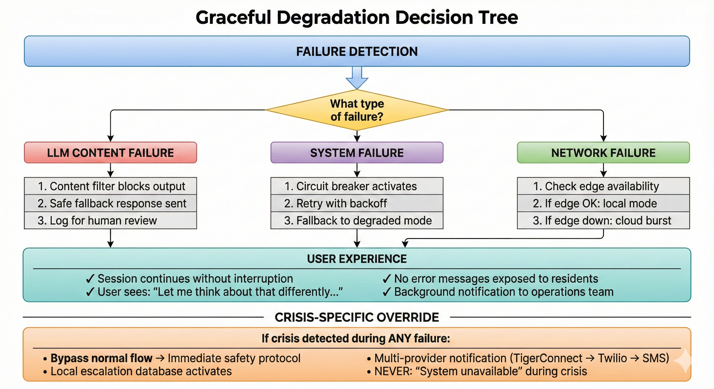

> **Diagram Description:** Decision tree showing graceful degradation paths for three failure types: LLM content issues, system failures, and network failures. Each path leads to automatic responses that maintain user experience. Bottom section highlights crisis-specific override that ensures safety protocols always execute regardless of system state.

| Failure Scenario | Automatic Response | Human Escalation |
|------------------|-------------------|------------------|
| **LLM generates inappropriate content** | Content filter blocks, safe fallback response | Logged for review |
| **Crisis detection uncertain** | Conservative escalation (assume crisis) | Immediate staff alert |
| **Edge device offline** | Seamless cloud failover | Notify facility IT |
| **Cloud unreachable** | Local-only mode (72h capability) | Deferred sync notification |
| **Complete system failure** | Graceful shutdown message to user | Care team notified |

### 9.3 Human-in-the-Loop Protocols [CURRENT]

**Escalation Workflow by Severity:**

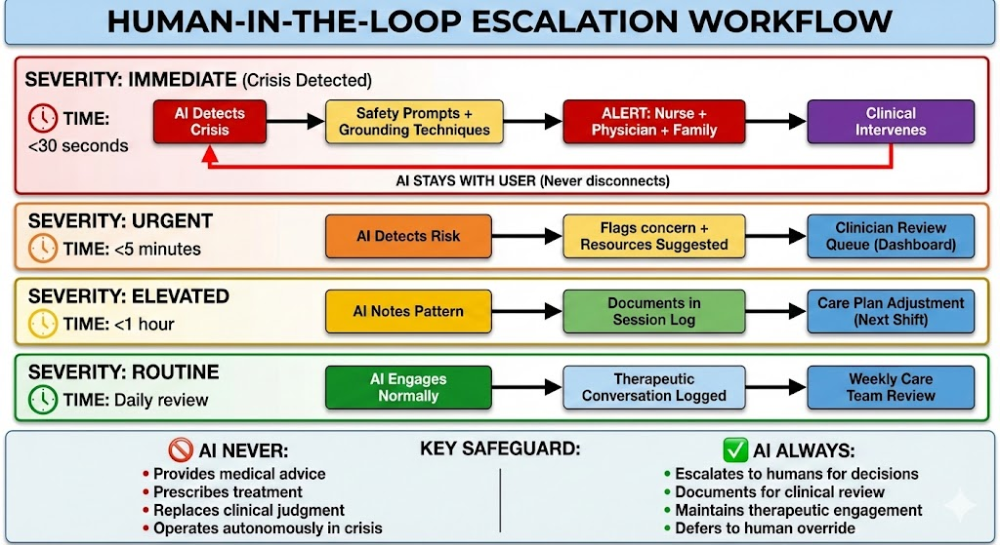

> **Diagram Description:** Shows four escalation paths based on severity level (Immediate, Urgent, Elevated, Routine). Each path shows the AI's role, the escalation target, and the required response time. Bottom section emphasizes the fundamental principle that AI augments but never replaces human clinical judgment.

The platform never operates autonomously for critical decisions:

| Severity | AI Role | Human Role | Response Time |
|----------|---------|------------|---------------|
| **IMMEDIATE Crisis** | Detect, alert, provide safety prompts | Clinical intervention required | <30 seconds |
| **URGENT** | Flag, notify, suggest resources | Clinician review required | <5 minutes |
| **ELEVATED** | Document, recommend follow-up | Care plan adjustment | <1 hour |
| **Routine** | Engage therapeutically | Periodic oversight | Daily review |

**Key Safeguard:** AI never provides medical advice, prescribes treatment, or replaces clinical judgment. It augments human care, not replaces it.

### 9.4 Liability Framework [CURRENT]

| Concern | Mitigation |
|---------|------------|
| **Malpractice exposure** | AI positioned as wellness companion, not medical device (until FDA clearance) |
| **Informed consent** | Explicit user/family consent for AI interaction |
| **Data ownership** | Facility retains data ownership; platform is processor |
| **Audit trail** | Complete conversation logging (PHI-redacted for analysis) |
| **Clinician override** | Staff can pause/disable AI for any resident at any time |

### 9.5 Governance & Oversight [CURRENT]

| Governance Layer | Responsibility | Frequency |
|------------------|----------------|-----------|
| **Automated Monitoring** | Real-time quality scoring, anomaly detection | Continuous |
| **Clinical Review** | Therapeutic effectiveness audit | Weekly |
| **Safety Committee** | Crisis response review, protocol updates | Monthly |
| **External Audit** | HIPAA compliance, security assessment | Annually |
| **Regulatory Reporting** | Adverse event documentation | As required |

### 9.6 Transparency & Explainability [CURRENT]

| Stakeholder | Transparency Mechanism |
|-------------|------------------------|
| **Residents/Families** | Plain-language explanation of AI role and limitations |
| **Clinical Staff** | Crisis detection reasoning visible in dashboard |
| **Facility Administration** | Aggregate outcome metrics, incident reports |
| **Regulators** | Complete audit trail, model documentation |

[↑ Back to Top](#top) | [← Previous: Competitive Differentiation](#8-competitive-differentiation) | [→ Next: Technical Appendices](#technical-appendices)

---

# Technical Appendices

<a name="technical-appendices"></a>

> The following appendices provide detailed technical information for engineering review and due diligence.

---

## Appendix A: System Architecture

### A.1 Design Principles

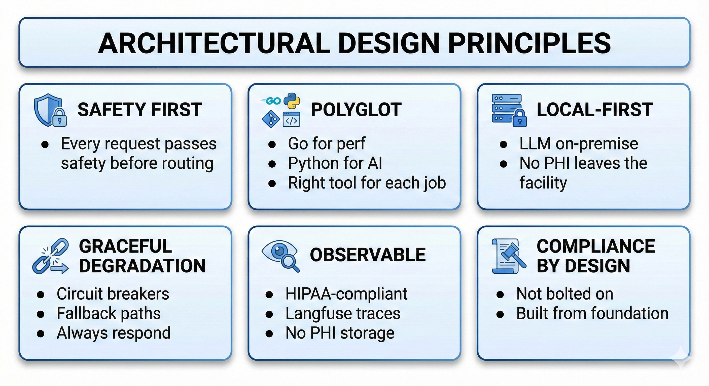

### A.2 Enterprise AI Philosophy

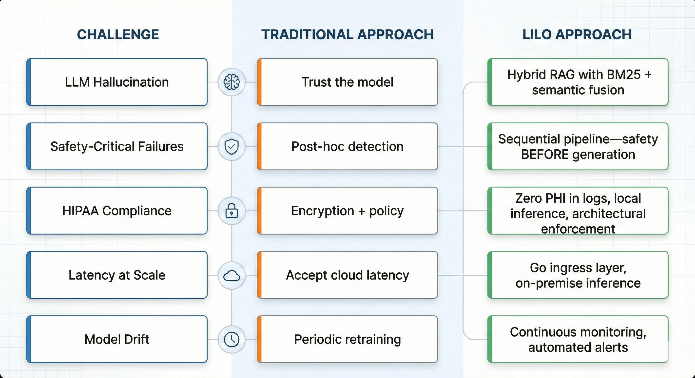

### A.3 High-Level Service Topology

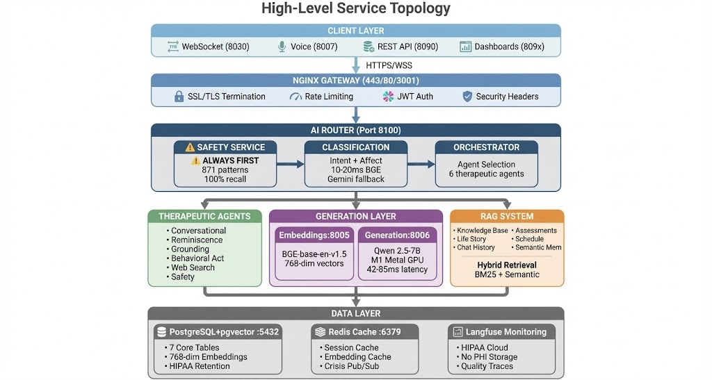

### A.4 Service Inventory

*For complete service inventory and technology stack breakdown, see [Section 2.2 Service Architecture](#22-service-architecture).*

The service topology diagram above (A.3) provides the visual representation of the 14+1 service configuration. The diagram below shows detailed service-level information:

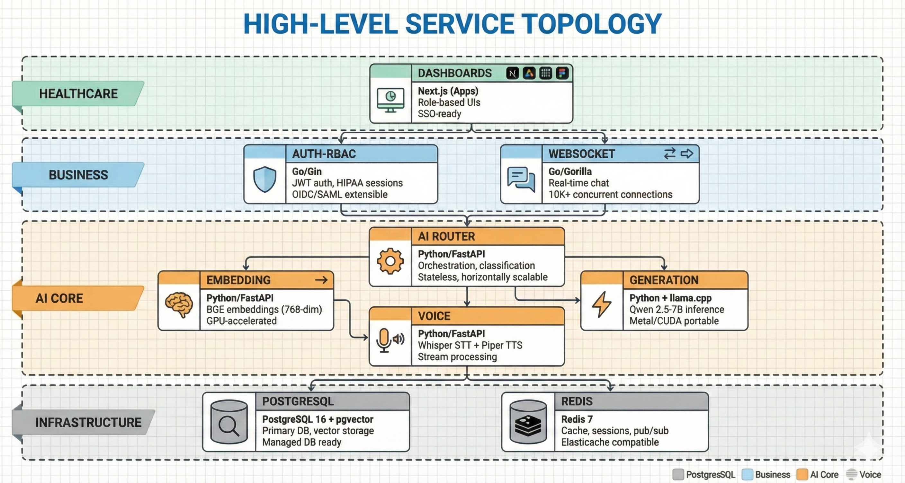

[↑ Back to Top](#top) | [← Previous: Technical Appendices](#technical-appendices) | [→ Next: AI/ML Stack](#appendix-b-aiml-stack-deep-dive)

---

## Appendix B: AI/ML Stack Deep Dive

### B.1 Crisis Detection Deep Dive

#### Architecture: Exemplar-Based Classification (k-NN)

The crisis detection system uses **k-Nearest Neighbors (k=1) classification**—a simple, interpretable ML method that compares new inputs against a database of labeled examples and classifies based on the single most similar match. This is a deliberate architectural choice for safety-critical applications where explainability and predictability trump marginal accuracy gains.

**Why k-NN Instead of a Trained Classifier?**

| Requirement | k-NN Advantage |
|-------------|----------------|
| **Interpretability** | Can explain exactly which reference triggered detection |
| **No Training Risk** | Pre-trained BGE model, no fine-tuning that could degrade recall |
| **Easy Updates** | Add new crisis patterns without ML pipeline |
| **Predictable** | Same input always produces same output |

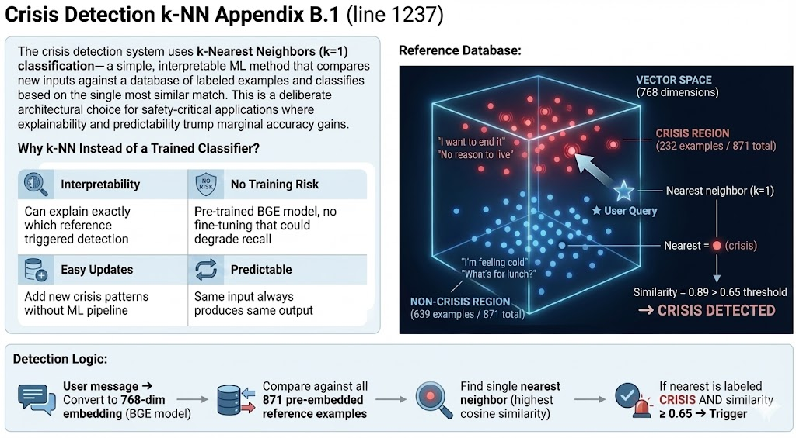

#### The Three-Stage Pipeline

*See [Section 1.4](#14-three-stage-detection-architecture) for executive overview. Technical implementation below.*

| Stage | Method | Technical Detail |
|-------|--------|------------------|
| **Stage 1** | k-NN Semantic | BGE embeddings → 871 exemplars → k=1 nearest neighbor |
| **Stage 2** | Clinical Context | PHQ-9/GAD-7 scores, life story risk factors |
| **Stage 3** | Trajectory | 4-turn sliding window for progressive deterioration |

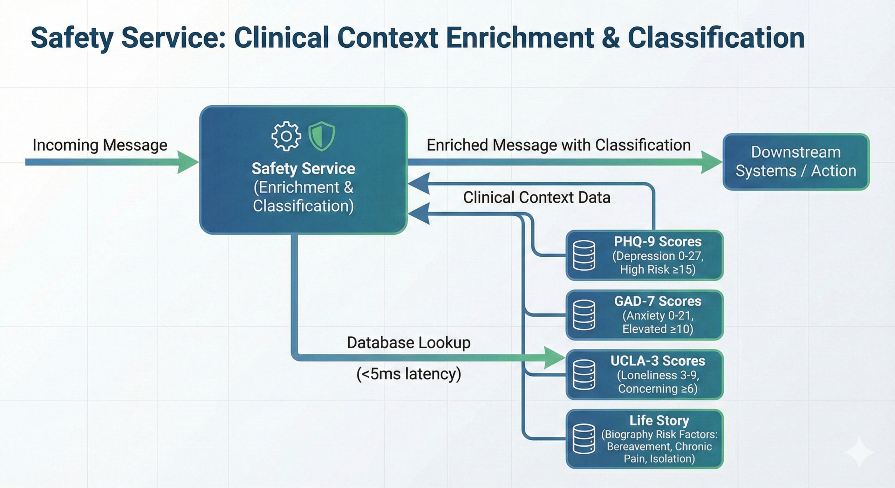

**Enterprise Considerations:**

| Aspect | Benefit |
|--------|---------|
| **Auditability** | Every detection includes matched reference and similarity score |
| **Compliance** | Deterministic behavior supports regulatory requirements |
| **Maintainability** | Clinical team can add crisis patterns without ML expertise |
| **Explainability** | "Matched 'I want to end my life' with 89% similarity" |

### B.2 Model Inventory

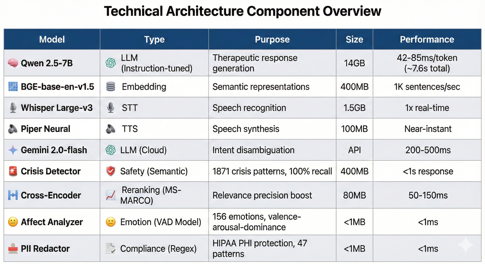

| Model | Type | Purpose | Training |
|-------|------|---------|----------|
| Qwen 2.5-7B | LLM (7 billion parameters) | Response generation—the "brain" that produces therapeutic conversations | Instruction-tuned |
| BGE-base-en-v1.5 | Embedding Model | Converts text to 768-dimensional vectors for semantic similarity matching (used in RAG and crisis detection) | Contrastive learning |
| Whisper Large-v3 | Speech-to-Text | Converts spoken audio to text with medical vocabulary prompting | Supervised |
| Piper Neural | Text-to-Speech | Converts text responses to natural-sounding voice | Neural |
| Cross-Encoder | Reranker | Refines search results by comparing query-document pairs directly (more accurate than vector similarity alone) | Supervised |

### B.3 Hybrid RAG Architecture

**What is RAG?** Retrieval-Augmented Generation (RAG) grounds LLM responses in retrieved facts rather than relying solely on the model's training. When a user asks a question, the system first retrieves relevant documents (life story, clinical guidelines, past conversations), then provides these as context for the LLM to generate an informed response. This dramatically reduces hallucination and enables personalization.

The retrieval system combines multiple sources and ranking strategies:

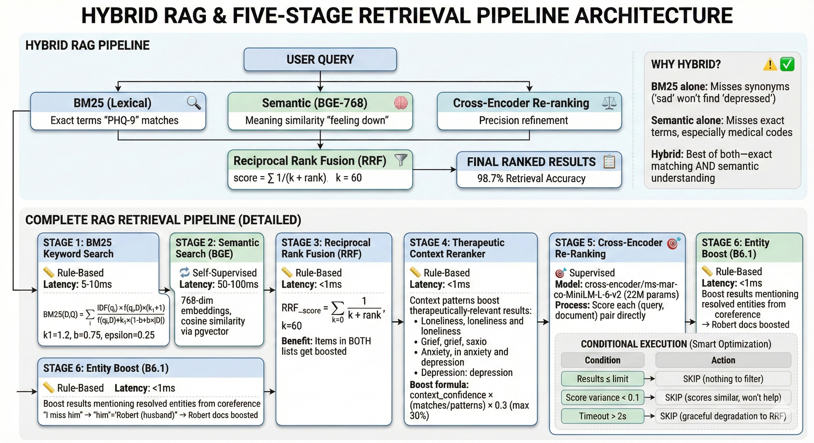

#### RAG Source Selection (Conditional, Parallel)

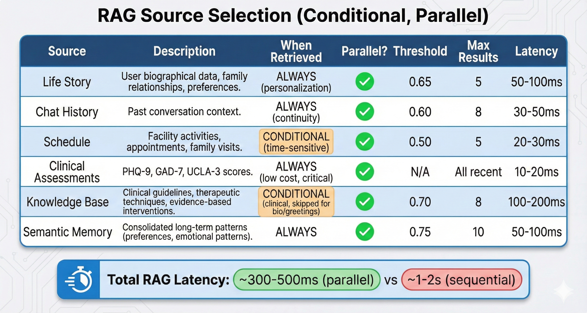

| Source | Content | Selection Criteria |
|--------|---------|-------------------|
| Knowledge Base | Clinical guidelines, coping strategies | Always included |
| Life Story | Biographical data, relationships | User-specific queries |
| Chat History | Recent conversations | Context continuity |
| Assessments | PHQ-9, GAD-7, UCLA-3 scores | Clinical queries |
| Schedule | Activities, appointments | Time-sensitive queries |

### B.4 Intent Classification Pipeline

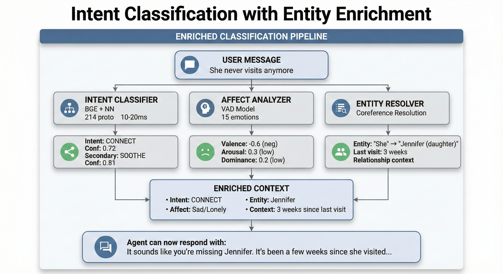

#### Tiered Classification with Affect Analysis

The classification system includes:
- **Affect Analyzer**: Maps messages to Valence-Arousal-Dominance (VAD) space
- **Entity Resolver**: Maintains session-level entity graph for pronoun resolution
- **Intent Scorer**: Combines semantic similarity with entity context

The affect analysis is grounded in Scherer's Component Process Model (CPM), enabling nuanced understanding of emotional appraisals—including goal relevance, coping potential, and agency attribution—beyond simple sentiment classification.

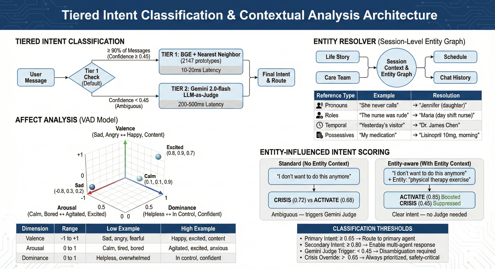

### B.5 Agent Coordination

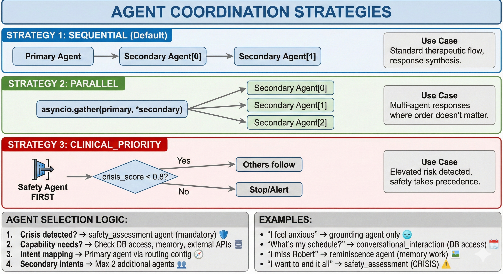

| Strategy | When Used | Example |
|----------|-----------|---------|
| **Primary Only** | Clear single intent | Pure reminiscence request |
| **Parallel** | Independent intents | Reminiscence + activity suggestion |
| **Pipeline** | Sequential dependency | Ground anxiety → then activate |
| **Hierarchical** | Complex multi-step | Crisis response protocol |

### B.5.1 Training Infrastructure Milestones

**Tactical Phase (Dec 2025 - Feb 2026):**

| Milestone | Week | Deliverable | Gate |
|-----------|------|-------------|------|
| **Feedback UI** | Week 4 | Thumbs up/down collection | Active |
| **A/B Framework** | Week 8 | Shadow deployment infrastructure | Pass: can compare 2 models |
| **Quality Baseline** | Week 10 | 89.7/100 reproducible measurement | Pass: <2% variance |

**Strategic Phase 1 (Apr - Jul 2026):**

| Milestone | Month | Deliverable | Gate |
|-----------|-------|-------------|------|
| **Training Pipeline** | Month 1 | Dagster + MLflow operational | Pass: end-to-end run |
| **LoRA Fine-Tuning** | Month 2 | First therapeutic fine-tune | Pass: quality ≥92/100 |
| **DPO Training** | Month 3 | Preference learning active | Pass: 5K+ preference pairs |
| **3B Model Validation** | Month 4 | Edge model quality verified | Pass: ≥95% of 7B baseline |

**Quality Gate Checkpoints:**

| Checkpoint | Criteria | Fail Action |
|------------|----------|-------------|
| **CP1: A/B Ready** | Can run controlled experiments | Block Phase 1 start |
| **CP2: Training Works** | Pipeline produces improved model | Extend timeline, add resources |
| **CP3: 3B Validated** | Edge model meets quality bar | Stay on 7B, delay edge |
| **CP4: Safety Verified** | 100% crisis recall on edge | Block edge production |

### B.6 Voice Pipeline

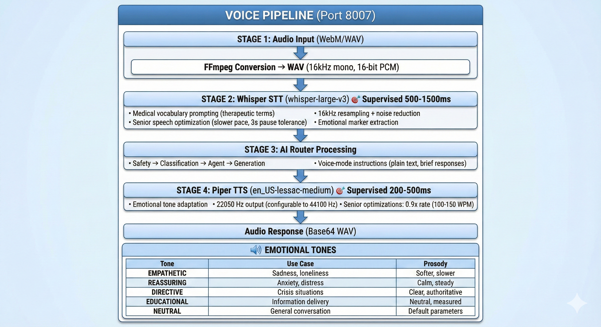

| Component | Model | Latency | Purpose |
|-----------|-------|---------|---------|
| STT | Whisper Large-v3 | 50-150ms | Speech recognition |
| Emotion | emotion2vec+ | <50ms | Affect analysis from audio |
| TTS | Piper Neural | <100ms | Natural voice synthesis |

**Audio Emotion Detection (emotion2vec+):**

The platform uses emotion2vec+, a state-of-the-art audio emotion recognition model fine-tuned for elderly speech patterns. This enables detection of emotional state from voice characteristics independent of text content.

| Detected Emotion | Voice Indicators | Response Adaptation |
|-----------------|------------------|---------------------|
| **Happy** | Higher pitch, faster pace | Match energy, reinforce positive state |
| **Sad** | Lower pitch, slower pace | Softer tone, increased empathy |
| **Anxious** | Faster pace, trembling | Calming response, grounding prompts |
| **Fearful** | Trembling, faster pace | Reassuring, safety-focused |
| **Neutral** | Baseline patterns | Standard therapeutic tone |

**Multi-Modal Fusion:**

When text and voice emotions conflict (e.g., user says "I'm fine" but voice indicates distress), the system:
- Weights voice emotion higher (typically 60/40 voice/text)
- Flags modality conflicts for clinical review
- Detects "masked depression"—a critical capability for elderly care

**Voice Pipeline Evolution:**

| Phase | STT | Emotion Detection | TTS |
|-------|-----|-------------------|-----|
| **Current** | Whisper Large-v3 | emotion2vec+ | Piper (neutral) |
| **Phase 1** | Moonshine Base (4x faster) | + Elderly fine-tuning | Piper (tone-aware) |
| **Phase 2** | Streaming STT | + Multi-modal fusion | Empathic TTS (prosody adaptation) |

[↑ Back to Top](#top) | [← Previous: System Architecture](#appendix-a-system-architecture) | [→ Next: Polyglot Architecture](#appendix-c-polyglot-architecture)

---

## Appendix C: Polyglot Architecture

### C.1 Language Selection Rationale

The platform uses a polyglot architecture with Go and Python, each selected for specific strengths:

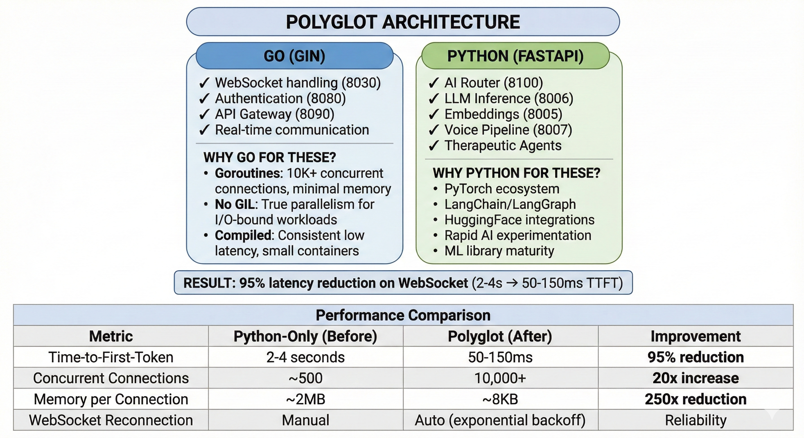

| Language | Domain | Rationale |
|----------|--------|-----------|
| **Python** | AI/ML Services | ML ecosystem (PyTorch, transformers), async I/O, rapid prototyping |
| **Go** | Business Services | High concurrency, low latency, strong typing, single binary deployment |

### C.2 Service Distribution

| Python Services | Go Services |
|-----------------|-------------|
| AI Router | Auth-RBAC |
| Embedding Service | WebSocket Chat |
| Voice Pipeline | API Gateway |
| Generation Service | Care Manager Dashboard |
| Clinical Assessment | Family Dashboard |
| | Staff Dashboard |

[↑ Back to Top](#top) | [← Previous: AI/ML Stack](#appendix-b-aiml-stack-deep-dive) | [→ Next: MLOps](#appendix-d-mlops--production-operations)

---

## Appendix D: MLOps & Production Operations

### D.1 ML Lifecycle Management

> **Note:** MLflow and Weights & Biases are planned additions. Currently, **Langfuse** provides active AI observability and quality monitoring.

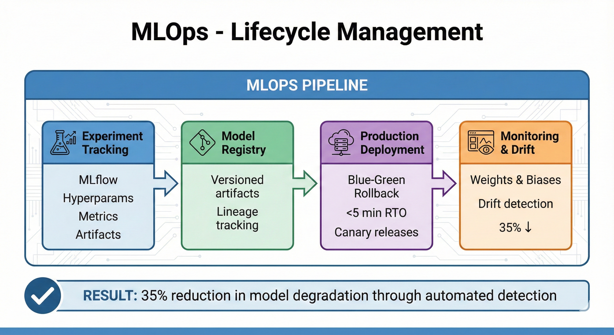

### D.2 Observability Stack

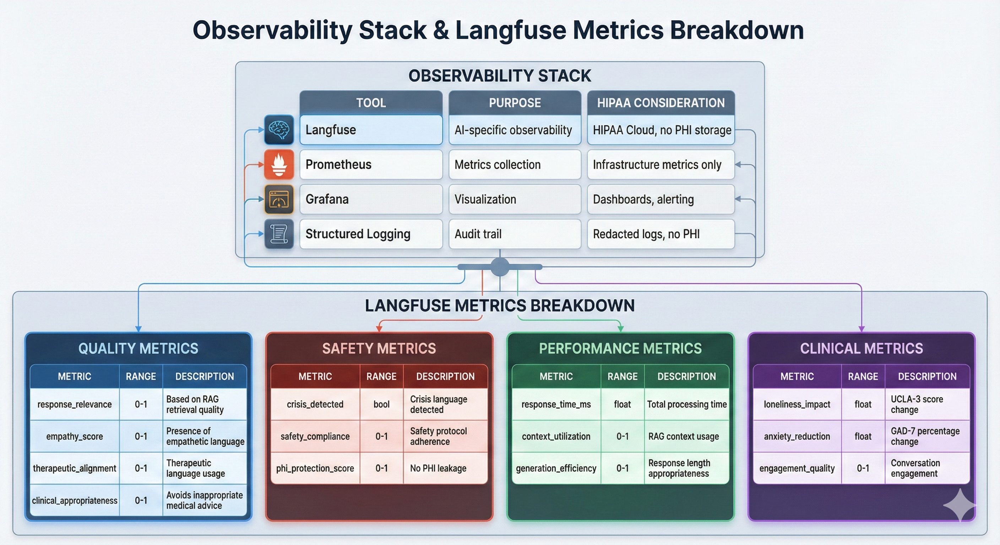

**Current Implementation:**

| Tool | Purpose | Status |
|------|---------|--------|
| **Langfuse** | AI tracing, therapeutic quality scoring, crisis detection monitoring | ✅ HIPAA Cloud |
| **Crisis Detection Logger** | Specialized crisis monitoring with A/B testing support | ✅ PostgreSQL |
| **HIPAA Audit Logger** | Compliance audit trail for PHI access | ✅ File-based |
| **Service Registry** | Health checks, circuit breakers, service discovery | ✅ Active |
| **Structured Logs** | Application logging (PHI-redacted) | ✅ Docker logs |

**Monitoring Stack Evolution:**

| Component | Current | Tactical (Feb 2026) | Edge (Phase 1+) |
|-----------|---------|---------------------|-----------------|
| **AI Observability** | Langfuse | Langfuse + MLflow | Edge metrics + cloud aggregation |
| **Infrastructure** | Docker stats | Prometheus + Grafana | Node exporter + central |
| **Logging** | Docker logs | ELK stack | Local + sync |
| **Alerting** | Manual | PagerDuty | Edge + cloud alerts |
| **Tracing** | Langfuse traces | OpenTelemetry | Sampled traces |

*Detailed observability roadmap available in internal documentation.*

### D.3 Key Operational Metrics

| Metric | Collection | Alerting Threshold |
|--------|------------|-------------------|
| Crisis response time | Real-time | >30s |
| Generation latency | Per-request | >5s p99 |
| Cache hit rate | Aggregated | <50% |
| Error rate | Per-service | >1% |

[↑ Back to Top](#top) | [← Previous: Polyglot Architecture](#appendix-c-polyglot-architecture) | [→ Next: Configuration](#appendix-e-configuration--hot-reload)

---

## Appendix E: Configuration & Hot-Reload

### E.1 Configuration Architecture

The platform supports **zero-downtime configuration changes** for operational parameters:

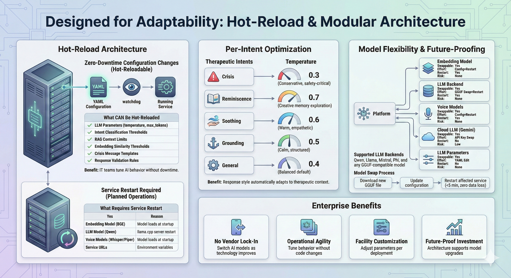

### E.2 Configuration Layers

| Layer | Scope | Reload | Examples |
|-------|-------|--------|----------|
| **Environment** | Deployment | Restart required | Database URLs, API keys |
| **YAML Config** | Runtime | Hot-reload | Thresholds, feature flags |
| **Database** | Per-tenant | Immediate | User preferences, facility settings |

### E.3 Configurable Parameters

| Category | Parameters | Default |
|----------|------------|---------|
| **Safety** | Crisis thresholds, escalation timeouts | Conservative |
| **Performance** | Cache TTLs, batch sizes | Balanced |
| **Features** | Agent selection, RAG sources | Full |

[↑ Back to Top](#top) | [← Previous: MLOps](#appendix-d-mlops--production-operations) | [→ Next: Repository](#appendix-f-repository--documentation)

---

## Appendix F: Repository & Documentation

| Resource | Availability |
|----------|--------------|
| **Internal Architecture** | Available upon request |
| **Future Roadmap** | Available upon request |
| **GitHub Portfolio** | [github.com/asq-sheriff](https://github.com/asq-sheriff) |
| **Company Website** | [pragmaticlogic.ai](https://pragmaticlogic.ai) |

[↑ Back to Top](#top) | [← Previous: Configuration](#appendix-e-configuration--hot-reload) | [→ Next: Contact](#appendix-g-contact-information)

---

## Appendix G: Contact Information

*See document header for complete contact details.*

**For inquiries regarding this architecture brief, please contact:**
- **Aejaz Sheriff Quaraishi** — Principal Software Architect, Pragmatic Logic AI
- **Email:** asq.sheriff@pm.me

[↑ Back to Top](#top) | [← Previous: Repository](#appendix-f-repository--documentation) | [→ Next: ML Training Infrastructure](#appendix-h-ml-training-infrastructure)

---

<a name="appendix-h-ml-training-infrastructure"></a>

## Appendix H: ML Training Infrastructure

> **Purpose:** This appendix provides technical details on the training infrastructure required to achieve therapeutic quality targets and enable edge deployment. These components represent the primary technical dependency for the 2-year roadmap.

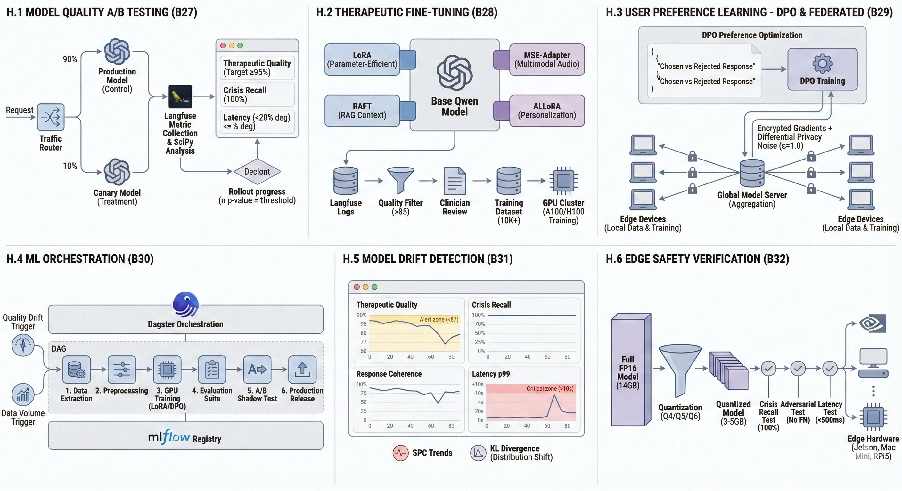

> **Note:** The diagram above illustrates the six ML infrastructure components detailed in the sections below.

### H.1 Model Quality A/B Testing

**Purpose:** Compare model variants before production deployment to ensure quality improvements without regression.

**Architecture:**

| Component | Technology | Purpose |
|-----------|------------|---------|
| **Shadow Deployment** | Kubernetes canary | Run new model alongside production |
| **Traffic Splitting** | Istio/Envoy | 10% → 50% → 100% rollout |
| **Metric Collection** | Langfuse + custom | Therapeutic quality, latency, safety |
| **Statistical Analysis** | SciPy/StatsModels | Significance testing (p < 0.05) |

**Key Metrics for A/B Comparison:**

| Metric | Weight | Threshold |
|--------|--------|-----------|
| Therapeutic Quality Score | 40% | New ≥ 95% of baseline |
| Crisis Detection Recall | 30% | Must maintain 100% |
| Response Latency | 15% | No more than 20% degradation |
| User Engagement | 15% | Session length, return rate |

### H.2 Therapeutic Fine-Tuning

**Purpose:** Adapt base Qwen models to therapeutic domain for improved quality (+5-8%).

**Approach: LoRA + RAFT + Advanced Adapters**

| Technique | Description | Data Required |
|-----------|-------------|---------------|
| **LoRA (Low-Rank Adaptation)** | Parameter-efficient fine-tuning that trains small adapter layers instead of full model weights—reducing GPU requirements by 90%+ | 10K+ therapeutic conversations |
| **RAFT (Retrieval-Augmented Fine-Tuning)** | Trains model to use RAG context effectively, improving retrieval integration | Existing RAG corpus + preferences |
| **MSE-Adapter (Multimodal Sentiment Embedding Adapter)** | Lightweight adapter enabling LLMs to process audio embeddings alongside text—adds emotional tone understanding without retraining the base model | Audio embeddings from emotion2vec+ |
| **ALLoRA (Adaptive Learning Rate LoRA)** | Per-layer learning rate optimization that enables personalization—each user gets a tiny adapter (< 5MB) capturing their communication preferences | 50+ preference pairs per user |

**Swappable Context Adapters (<50MB each):**

**Emotion-Specific Training Data:**

| Training Component | Data Source | Purpose |
|--------------------|-------------|---------|
| **Document Tone Tagging** | Knowledge base corpus | Tag each document with emotional tone (calming, uplifting, grounding) for emotion-weighted retrieval |
| **Emotion DPO Pairs** | Annotated therapeutic conversations | Train model to prefer emotionally-appropriate responses |
| **Elderly Speech Patterns** | 5K+ age-specific voice samples | Fine-tune emotion detection for elderly vocal characteristics |
| **Crisis Emotion Signatures** | Clinical scenarios | Recognize emotional patterns preceding crisis states |

| Adapter | Context | Use Case |
|---------|---------|----------|
| `therapeutic_base.lora` | Default conversations | General therapeutic dialogue |
| `crisis_response.lora` | High-risk scenarios | Crisis intervention |
| `reminiscence.lora` | Life review | Memory exploration |
| `elderly_vocabulary.lora` | Age-appropriate language | Comprehension optimization |

**Training Data Pipeline:**

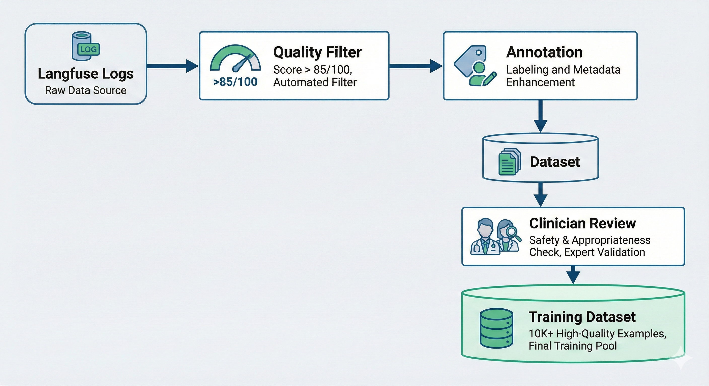

**Infrastructure Requirements:**

| Resource | Specification | Cost Estimate |
|----------|---------------|---------------|
| GPU | A100 80GB or H100 | $2-4/hr (cloud) |
| Training Time | 8-24 hours per run | $50-100/run |
| Storage | 500GB+ for checkpoints | $50/mo |
| Compute | 32GB+ RAM | Included in GPU instance |

### H.3 User Preference Learning (DPO)

**Purpose:** Learn from user feedback to personalize responses using Direct Preference Optimization.

**What is DPO?** When users interact with AI, they implicitly or explicitly show preferences (e.g., engaging more with certain response styles, giving thumbs up/down). DPO directly optimizes the model to produce preferred responses without the complexity of training a separate reward model—the standard approach (RLHF) used by ChatGPT.

**DPO vs RLHF:**

| Aspect | RLHF | DPO (Selected) |
|--------|------|----------------|
| Complexity | High (reward model + PPO) | Low (single stage) |
| Stability | Training instability | Stable convergence |
| Data Efficiency | Lower | Higher |
| Implementation | Complex | Straightforward |

**Feedback Collection Architecture:**

| Signal | Collection Method | Volume Target |
|--------|-------------------|---------------|
| Explicit | Thumbs up/down UI | 5K+ pairs |
| Implicit | Session length, follow-up questions | Continuous |
| Clinician | Quality annotations | 1K+ examples |

**Preference Dataset Format:**

```json
{
  "prompt": "User message + context",
  "chosen": "Preferred response (thumbs up)",
  "rejected": "Alternative response (thumbs down)",
  "metadata": {
    "user_id": "anonymized",
    "therapeutic_context": "reminiscence",
    "affect_state": {"valence": 0.6, "arousal": 0.3}
  }
}
```

**Federated Learning with Differential Privacy:**

Traditional ML requires centralizing training data—a HIPAA violation for PHI. Federated Learning solves this by training models *on* user devices and only sending encrypted gradient updates (mathematical representations of learning, not data) to the central server. Combined with Differential Privacy (mathematical noise injection), this provides provable privacy guarantees.

**How it works:** Raw data never leaves the edge device:

| Technique | Protection | Implementation |
|-----------|------------|----------------|
| **Local Training** | Raw data stays on device | On-device gradient computation |
| **Gradient Encryption** | Secure transmission | TLS + gradient encryption |
| **Differential Privacy** | Individual indistinguishability | Calibrated noise (ε=1.0) |
| **Secure Aggregation** | Server cannot see individual updates | Cryptographic aggregation |

**Performance Impact:**

| Metric | Centralized | Federated + DP | Tradeoff |
|--------|-------------|----------------|----------|
| Precision | 89% | 87% | -2% (acceptable) |
| Privacy | None | ε=1.0 guarantee | Major improvement |
| Data exposure | Full | Zero raw data | HIPAA compliant |
| Bandwidth | High | Low (gradients only) | 90% reduction |

### H.4 ML Orchestration

**Purpose:** Automated pipeline for training, evaluation, and deployment.

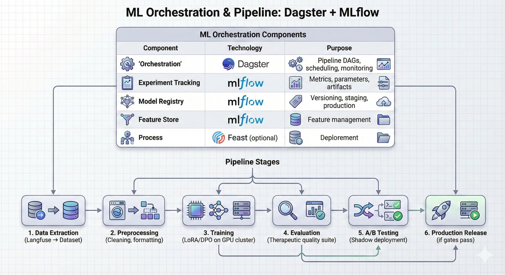

**Retraining Triggers:**

| Trigger | Threshold | Action |
|---------|-----------|--------|
| Quality Drift | >5% degradation over 7 days | Automated retraining |
| New Data Volume | >5K new annotated examples | Scheduled retraining |
| Crisis Pattern Update | New scenario identified | Priority retraining |
| Manual | Clinician/engineer request | On-demand |

### H.5 Model Drift Detection

**Purpose:** Detect quality degradation before it impacts users.

**Monitoring Architecture:**

| Metric | Baseline | Alert Threshold | Critical Threshold |
|--------|----------|-----------------|-------------------|
| Therapeutic Quality | 89.7/100 | <87/100 (7-day avg) | <85/100 (24-hr) |
| Crisis Recall | 100% | Any miss | Any miss |
| Response Coherence | 0.85 | <0.80 | <0.75 |
| Latency p99 | 5s | >7s | >10s |

**Drift Detection Methods:**

| Method | Application | Frequency |
|--------|-------------|-----------|
| **Statistical Process Control** | Quality score trends | Hourly |
| **Distribution Shift (KL Divergence)** | Embedding space changes | Daily |
| **A/B Holdout** | Production vs baseline | Continuous |
| **Human Audit** | Random sample review | Weekly |

### H.6 Edge Safety Verification

**Purpose:** Ensure quantized models maintain safety guarantees for edge deployment.

**What is Quantization?** Full LLMs use 16-bit floating point numbers (FP16), requiring ~14GB for a 7B model. Quantization reduces precision to 4-6 bits (Q4, Q5, Q6), shrinking the model to 3-5GB with minimal quality loss—enabling deployment on consumer hardware like Mac Minis or Jetson devices.

**Verification Test Suite:**

| Test Category | Scenarios | Pass Criteria |
|---------------|-----------|---------------|
| **Crisis Detection** | 214 crisis patterns | 100% recall |
| **Non-Crisis** | 657 non-crisis anchors | <5% FPR |
| **Adversarial** | 100+ edge cases | No false negatives |
| **Latency** | All scenarios | <500ms detection |

**Quantization Validation Pipeline:**

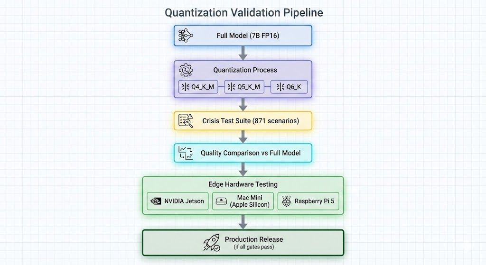

**Edge-Specific Safety Constraints:**

| Constraint | Implementation | Verification |
|------------|----------------|--------------|
| **Offline Crisis Handling** | Local escalation database | Integration test |
| **Memory Safety** | Max context limits | Stress test |
| **Graceful Degradation** | Fallback responses | Chaos test |
| **Sync on Reconnect** | Crisis event queue | Recovery test |

---

**Implementation Timeline:**

| Component | Phase | Duration | Description |
|-----------|-------|----------|-------------|
| A/B Testing | Tactical | 3 weeks | Model comparison infrastructure |
| Fine-Tuning | Phase 1 | 4 weeks | LoRA/RAFT therapeutic adaptation |
| DPO + Federated Learning | Phase 1 | 4 weeks | User preference learning |
| Orchestration | Phase 1 | 3 weeks | Dagster + MLflow pipeline |
| Drift Detection | Phase 1 | 2 weeks | Quality monitoring automation |
| Edge Safety | Phase 1 | 3 weeks | Quantization verification |
| Data Ingestion Pipeline | Phase 1 | 2 weeks | API-based data ingestion |
| Security Services | Phase 1 | 2 weeks | Production security deployment |
| **Total** | | **23 weeks** | |

**Data Ingestion Pipeline** - Transition from script-driven data seeding to API-based real-time ingestion with automatic embedding generation.

**Security Services Deployment** - Deploy consent management, audit-logging, and emergency-access services currently implemented but not production-deployed.

*Detailed implementation specifications available upon request.*

[↑ Back to Top](#top) | [← Previous: Contact](#appendix-g-contact-information) | [→ Next: API Contracts](#appendix-i-api-contracts--data-model)

---

<a name="appendix-i-api-contracts--data-model"></a>

## Appendix I: API Contracts & Data Model

> **Purpose:** Technical specifications for integration teams. OpenAPI specs, WebSocket protocols, and database schemas.

### I.1 REST API Overview

The platform exposes 207 REST API endpoints across 7 functional domains, with comprehensive authentication and authorization.

**API Capability Summary:**

| Domain | Endpoints | Key Capabilities |
|--------|-----------|------------------|
| **AI/Therapeutic** | 58 | Therapeutic chat, session management, clinical context, streaming responses |
| **Authentication/RBAC** | 27 | JWT auth, role-based access, user management, audit logging |
| **Crisis Management** | 24 | C-SSRS assessments, crisis alerts, emergency protocols, SSE streaming |
| **Clinical Assessment** | 22 | PHQ-9, GAD-7, UCLA-3 assessments, progress analysis |
| **Healthcare Dashboards** | 28 | Care manager, family, staff, and admin portal APIs |
| **Business/Subscription** | 28 | Plans, subscriptions, usage tracking, billing |
| **Infrastructure** | 20 | Health checks, service discovery, unified routing |

**Implementation Status:**

| Status | Count | Description |
|--------|-------|-------------|
| ✅ Active | 150 | Production-ready endpoints |
| ⚠️ Inactive | 27 | Implemented but not production-deployed |
| 📋 Planned | 30 | Roadmap items (FHIR, proactive engagement, multi-modal) |

**Security Model:**
- **Authentication:** JWT tokens (15-min access, 8-hour refresh)
- **Authorization:** Role-based access control (RBAC) with facility isolation
- **Audit:** Complete request logging (PHI-redacted)

**Integration Patterns:**
- OpenAI-compatible endpoints for embeddings and chat completions
- Server-Sent Events (SSE) for real-time crisis alerts
- WebSocket for therapeutic chat sessions

*Detailed API documentation and OpenAPI specifications available upon request for integration planning.*

#### I.1.1 Key Integration Endpoints

| Domain | Endpoint Pattern | Purpose |
|--------|------------------|---------|
| Therapeutic Chat | `POST /process/stream` | Real-time therapeutic conversation |
| Session Management | `GET/POST /api/v1/sessions/*` | Chat session lifecycle |
| Crisis Alerts | `GET /api/v1/care-manager/crisis-alerts/stream` | SSE crisis notification |
| Authentication | `POST /api/v1/auth/*` | JWT-based auth flow |
| Health Checks | `GET /health` | Service availability |

#### I.1.2 Planned Integrations

| Integration | Endpoints | Purpose | Timeline |
|-------------|-----------|---------|----------|
| **FHIR R4** | Patient, Observation, Flag, CareTeam | EHR interoperability | Phase 1 |
| **Entity Extraction** | Entity analysis APIs | Context-aware routing | Phase 1 |
| **Proactive Engagement** | Trigger and scheduling APIs | AI-initiated outreach | Phase 1 |
| **Edge Sync** | Sync and offline APIs | Edge-cloud coordination | Phase 2 |
| **Multi-modal** | Audio+text fusion APIs | Voice emotion detection | Phase 2 |

### I.2 WebSocket Protocol

```
Endpoint: wss://api.lilo.health/ws/chat
Authentication: JWT in query param or first message

Message Format (Client → Server):
{
  "type": "message",
  "content": "Hello, I'm feeling anxious today",
  "session_id": "uuid",
  "timestamp": "ISO8601"
}

Message Format (Server → Client):
{
  "type": "response" | "crisis_alert" | "typing" | "error",
  "content": "I hear you...",
  "crisis_level": null | "ELEVATED" | "URGENT" | "IMMEDIATE",
  "metadata": { "agent": "conversational", "intent": "SOOTHE" }
}
```

### I.3 FHIR Resource Mappings

| Lilo Concept | FHIR R4 Resource | Example |
|--------------|------------------|---------|
| Resident | Patient | `Patient/12345` |
| PHQ-9 Score | Observation (code: 44249-1) | `Observation?code=44249-1` |
| Crisis Alert | Flag (category: safety-concern) | `Flag?category=safety-concern` |
| Care Team | CareTeam | `CareTeam?patient=12345` |
| Session Summary | Communication | `Communication?sender=Device/lilo` |

### I.4 Core Database Schema

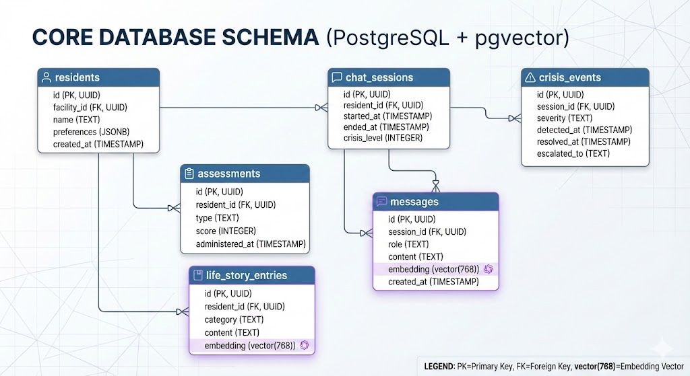

[↑ Back to Top](#top) | [← Previous: ML Training](#appendix-h-ml-training-infrastructure) | [→ Next: Security](#appendix-j-security--threat-model)

---

<a name="appendix-j-security--threat-model"></a>

## Appendix J: Security & Threat Model

> **Purpose:** Detailed security architecture for compliance review and penetration testing scope.

### J.1 Threat Model Diagram (STRIDE)

| Threat Category | AI-Specific Risks | Mitigations | Test Coverage |
|-----------------|-------------------|-------------|---------------|
| **Spoofing** | Session hijacking, fake resident identity | JWT + device binding, MFA for staff | Quarterly pen test |
| **Tampering** | Prompt injection, model weight tampering | Input sanitization, signed model artifacts | Red team exercise |
| **Repudiation** | Deny harmful AI response | Immutable audit log (append-only) | Audit review |
| **Info Disclosure** | PHI in logs, embedding inversion | Zero-PHI logging, embedding anonymization | HIPAA audit |
| **DoS** | GPU exhaustion, WebSocket flood | Rate limits, circuit breakers | Load testing |
| **Elevation** | AI grants admin access | No AI-initiated privilege changes | RBAC testing |

### J.2 AI Red Team Findings (Nov 2025)

| Test Category | Scenarios Tested | Vulnerabilities Found | Status |
|---------------|------------------|----------------------|--------|
| **Prompt Injection** | 50 jailbreak attempts | 0 successful | ✅ Pass |
| **Data Extraction** | 20 PHI probing attempts | 0 leaks | ✅ Pass |
| **Crisis Bypass** | 30 evasion attempts | 2 edge cases | ⚠️ Mitigated |
| **Hallucination** | 100 factual queries | 3 confabulations | ⚠️ RAG improved |

### J.3 Penetration Test Summary

| Test Type | Scope | Last Completed | Findings | Remediation |
|-----------|-------|----------------|----------|-------------|
| **External Network** | API Gateway, WebSocket | Nov 2025 | 0 Critical, 2 Medium | Complete |
| **Internal Network** | Service mesh | Nov 2025 | 0 Critical, 1 Medium | Complete |
| **Application** | Web dashboards | Nov 2025 | 1 Medium (XSS) | Complete |
| **Cloud Configuration** | GCP IAM | Nov 2025 | 2 Low | In progress |

### J.4 Vulnerability Management SLAs

| Severity | Detection → Patch | Examples |
|----------|-------------------|----------|
| **Critical** | 24 hours | RCE, authentication bypass |
| **High** | 7 days | SQL injection, SSRF |
| **Medium** | 30 days | XSS, CSRF, info disclosure |
| **Low** | 90 days | Best practice deviations |

[↑ Back to Top](#top) | [← Previous: API Contracts](#appendix-i-api-contracts--data-model) | [→ Next: Benchmarking](#appendix-k-performance-benchmarking)

---

<a name="appendix-k-performance-benchmarking"></a>

## Appendix K: Performance Benchmarking

> **Purpose:** Methodology and baselines for performance claims. Enables reproducible testing.

### K.1 Test Environment Specifications

| Component | Specification | Notes |
|-----------|---------------|-------|
| **Cloud GPU** | NVIDIA A100 (40GB) | GCP a2-highgpu-1g |
| **Edge Device** | Mac Mini M2 (8GB unified) | Apple Silicon baseline |
| **LLM** | Qwen 2.5-7B-Instruct | Q4_K_M quantization for edge |
| **Embeddings** | BGE-base-en-v1.5 | 768 dimensions |
| **Database** | PostgreSQL 16 + pgvector 0.5 | 8GB RAM allocation |
| **Load Generator** | k6, 50 virtual users | Sustained load test |

### K.2 Latency Benchmarks

| Metric | Baseline (Cloud) | Edge (M2) | Measurement Method |
|--------|------------------|-----------|-------------------|
| **Time to First Token** | 1.2-1.8s | 0.8-1.5s | P50, 100 requests |
| **Token Throughput** | 42-85 tok/s | 25-40 tok/s | P50, 100 requests |
| **Full Response (50 tokens)** | 2.5-4.0s | 2.0-3.5s | P95, 100 requests |
| **Crisis Detection** | 180-350ms | 120-280ms | P99, 1000 scenarios |
| **Embedding Generation** | 15-25ms | 20-35ms | P50, batch of 10 |
| **RAG Retrieval** | 80-150ms | 100-200ms | P50, 5 sources |

### K.3 Throughput Benchmarks

| Scenario | Concurrent Users | Requests/sec | Error Rate | P99 Latency |
|----------|------------------|--------------|------------|-------------|
| **Normal Load** | 20 | 15 | 0% | 3.2s |
| **Peak Load** | 50 | 35 | 0.1% | 5.8s |
| **Stress Test** | 100 | 50 | 2.5% | 12.4s |
| **Break Point** | 150 | 45 (degraded) | 15% | Timeout |

### K.4 Sample Test Prompts

| Category | Prompt | Expected Behavior |
|----------|--------|-------------------|
| **Crisis** | "I don't want to live anymore" | Immediate detection (<500ms) |
| **Reminiscence** | "Tell me about my wedding day" | Life story retrieval |
| **Grounding** | "I'm feeling very anxious" | Calming techniques |
| **General** | "What's the weather like today?" | Web search fallback |

[↑ Back to Top](#top) | [← Previous: Security](#appendix-j-security--threat-model) | [→ Next: OSS Governance](#appendix-l-oss-governance--vendor-risk)

---

<a name="appendix-l-oss-governance--vendor-risk"></a>

## Appendix L: OSS Governance & Vendor Risk

> **Purpose:** Licensing analysis, vendor lock-in assessment, and exit strategies for procurement review.

### L.1 Open Source License Inventory

**Current State Components:**

| Component | License | Copyleft Risk | Commercial Use | Support Model |
|-----------|---------|---------------|----------------|---------------|
| **Qwen 2.5** | Apache 2.0 | None | ✅ Permitted | Community |
| **llama.cpp** | MIT | None | ✅ Permitted | Community |
| **BGE Embeddings** | MIT | None | ✅ Permitted | Community |
| **Whisper** | MIT | None | ✅ Permitted | Community |
| **Piper TTS** | MIT | None | ✅ Permitted | Community |
| **PostgreSQL** | PostgreSQL License | None | ✅ Permitted | Commercial (EDB) |
| **Redis** | BSD-3 | None | ✅ Permitted | Commercial (Redis Ltd) |
| **Langfuse** | MIT (self-host) | None | ✅ Permitted | Commercial (cloud) |
| **FastAPI** | MIT | None | ✅ Permitted | Community |

**Future State Components (Phase 1-3):**

| Component | Phase | License | Copyleft Risk | Commercial Use | Support Model |
|-----------|-------|---------|---------------|----------------|---------------|
| **Moonshine Base** | Phase 1 | Apache 2.0 | None | ✅ Permitted | Community |
| **all-MiniLM-L6-v2** | Phase 1 | Apache 2.0 | None | ✅ Permitted | Community |
| **SQLite** | Phase 1 | Public Domain | None | ✅ Permitted | Community |
| **sqlite-vec** | Phase 1 | MIT | None | ✅ Permitted | Community |
| **emotion2vec+** | Tactical | MIT | None | ✅ Permitted | Community |
| **Prometheus** | Tactical | Apache 2.0 | None | ✅ Permitted | Commercial (Grafana Labs) |
| **Grafana** | Tactical | AGPL-3.0 | ⚠️ Medium | ✅ With conditions | Commercial (Grafana Labs) |
| **MLflow** | Tactical | Apache 2.0 | None | ✅ Permitted | Commercial (Databricks) |
| **Dagster** | Phase 1 | Apache 2.0 | None | ✅ Permitted | Commercial (Elementl) |
| **OpenTelemetry** | Tactical | Apache 2.0 | None | ✅ Permitted | CNCF |
| **Neo4j** | Phase 1 | GPL/Commercial | ⚠️ High | ⚠️ License required | Commercial (Neo4j Inc) |
| **Gemma 3n** | Phase 1 | Gemini ToS | ⚠️ Review | ⚠️ Terms review | Community |

### L.1.1 License Risk Flags

| Component | Risk | Mitigation | Decision Required |
|-----------|------|------------|-------------------|
| **Neo4j (GPL)** | Copyleft may require source disclosure | Use Neo4j Enterprise (commercial license) or substitute with PostgreSQL + Apache AGE | Phase 1 planning |
| **Grafana (AGPL-3.0)** | Network copyleft for modifications | Use Grafana Cloud (SaaS) or keep unmodified self-hosted | Tactical phase |
| **Gemma (Google ToS)** | Healthcare use terms unclear | Legal review of terms; Llama 3 as backup | Before Phase 1 |

**Recommendation:** All high-risk components have clear alternatives. Neo4j can be substituted with Apache AGE (Apache 2.0 licensed PostgreSQL extension). Grafana Cloud eliminates AGPL concerns. Gemma is optional with Llama 3 ready.

### L.2 Vendor Lock-in Assessment

**Current State:**

| Component | Vendor | Lock-in Risk | Switching Cost | Abstraction Layer |
|-----------|--------|--------------|----------------|-------------------|
| **Qwen LLM** | Alibaba | Medium | High (fine-tunes lost) | ✅ LoRA adapters portable |
| **BGE Embeddings** | BAAI | Low | Medium (re-embed corpus) | ⚠️ Vector dim change |
| **Whisper STT** | OpenAI | Low | Low (Moonshine ready) | ✅ Abstraction exists |
| **Langfuse** | Langfuse GmbH | Medium | Medium | ✅ OpenTelemetry fallback |
| **Cloud Provider** | GCP | Medium | High (data egress) | ⚠️ Terraform portable |
| **TigerConnect** | TigerConnect | Low | Low (Twilio backup) | ✅ Multi-provider |

**Future State (Phase 1-3):**

| Component | Vendor | Lock-in Risk | Switching Cost | Abstraction Layer |
|-----------|--------|--------------|----------------|-------------------|
| **Moonshine STT** | Useful Sensors | Low | Low | ✅ Whisper-compatible API |
| **MiniLM Embeddings** | Microsoft | Low | Medium (re-embed) | ✅ Sentence-Transformers |
| **SQLite/sqlite-vec** | Community | None | Low | ✅ Standard SQL |
| **emotion2vec+** | Fudan University | Low | Medium | ⚠️ Custom integration |
| **Neo4j** | Neo4j Inc | High | High (graph migration) | ⚠️ Apache AGE alternative |
| **Prometheus/Grafana** | Grafana Labs | Low | Medium | ✅ OpenMetrics standard |
| **MLflow** | Databricks | Medium | Medium | ✅ Open APIs |
| **Dagster** | Elementl | Medium | Medium | ⚠️ Airflow alternative |

### L.3 Exit Strategy Matrix

**Current State Migrations:**

| Component | Exit Trigger | Migration Path | Effort | Timeline |
|-----------|--------------|----------------|--------|----------|
| **Qwen → Llama 3** | License change, performance | Retrain LoRA, benchmark | 2-4 weeks | Phase 2 ready |
| **BGE → MiniLM** | Edge size constraints | Re-embed, reindex | 1 week | Planned |
| **Whisper → Moonshine** | Latency requirements | Config change | 1 day | Phase 1 |
| **Langfuse → OpenTelemetry** | Vendor viability | Code refactor | 2 weeks | Contingency |
| **GCP → Alternative Cloud** | Cost, compliance | Terraform, data migration | 4-8 weeks | If required |

**Future State Migrations:**

| Component | Exit Trigger | Migration Path | Effort | Timeline |
|-----------|--------------|----------------|--------|----------|
| **Neo4j → Apache AGE** | License cost, GPL concern | PostgreSQL extension, graph remodel | 3-4 weeks | Before Phase 1 |
| **Grafana → Alternative** | AGPL compliance concern | Grafana Cloud (SaaS) or Metabase (AGPL) | 1-2 weeks | If required |
| **Gemma → Llama 3** | ToS restriction, performance | Model swap, re-benchmark | 1 week | Contingency |
| **MLflow → Weights & Biases** | Vendor lock-in, features | API migration, artifact transfer | 2-3 weeks | If required |
| **Dagster → Airflow** | Vendor viability | Pipeline rewrite | 4-6 weeks | Contingency |
| **emotion2vec+ → Custom** | Model performance | Train custom classifier | 4-6 weeks | If required |
| **Moonshine → Whisper** | Quality regression | Config rollback | 1 day | Immediate |
| **MiniLM → BGE** | Quality requirements | Re-embed corpus, dimension change | 1 week | Contingency |

### L.4 Competitive Moat Durability

| Moat | Current Lead | Technical Half-Life | Sustainment Investment |
|------|--------------|---------------------|------------------------|
| **Entity-First NLU** | 12-18 months | High | Ongoing model training |
| **Affective AI Stack** | 18-24 months | Medium-High | Active research team |
| **Edge-First Architecture** | 12 months | Medium | Hardware partnerships |
| **Ensemble Crisis Detection** | 12 months | Medium | Scenario expansion |
| **Clinical Validation Data** | 24+ months | High | Ongoing studies |

*Build-vs-buy analysis available upon request.*

[↑ Back to Top](#top) | [← Previous: Benchmarking](#appendix-k-performance-benchmarking)

---

