

# 🗺️ Technical Roadmap

### Future Platform Evolution, Integrations & Infrastructure

**From Therapeutic AI to Comprehensive Care Orchestration Platform**

---

---

## 🎯 Vision: The Care Orchestration Platform

The Lilo Engine is evolving from a **therapeutic AI companion** to a **comprehensive care orchestration platform** that integrates:

- **AI-Powered Therapy** (Current) - Multi-agent therapeutic conversations
- **Remote Patient Monitoring** - Vital signs, activity tracking, health prediction
- **Smart Home Integration** - Ambient assisted living, environmental control
- **Healthcare Robotics** - Companion robots, telepresence, logistics
- **Edge-Cloud Architecture** - Low-latency local processing with cloud intelligence

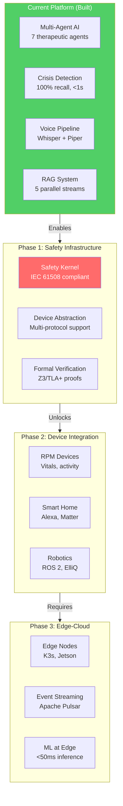

---

## 📅 Timeline Overview (Accelerated)

> **Major Update (Dec 2025):** Timeline compressed 40% based on discovery that 9 major components (3,000+ lines) are COMPLETE but not integrated. Engineering focus shifts from implementation to integration.

| Phase | Timeline | Investment | Priority | Key Deliverables |
|-------|----------|------------|----------|------------------|
| **Tactical** | Dec 2025 - Feb 2026 | $80-113K | ✅ In Progress | Wire 9 complete implementations, edge prototype, pilot IRB |
| **Strategic Phase 1** | Apr - Jul 2026 | $200-280K | Critical | Pilot complete, edge production (3 facilities), FDA pre-sub |
| **Strategic Phase 2** | Aug - Dec 2026 | $300-400K | Critical | FDA De Novo submission, 10 facilities, prospective study |
| **Strategic Phase 3** | Jan - Dec 2027 | $500-700K | High | FDA clearance, 30 facilities, RCT launch, $1M ARR |
| **Post-2027** | 2028+ | TBD | Medium | RCT complete, Medicare, 100+ facilities, international |

**Total Investment**: $0.9M - $1.3M over 2 years (reduced from $2.0-2.5M due to velocity + complete implementations)

---

## 🚀 Tactical Phase: Integration Sprint (Dec 2025 - Feb 2026)

**Timeline**: 2.5-3 months | **Investment**: $80-113K | **Priority**: ✅ IN PROGRESS

### Complete Implementations Discovered (Ready to Wire)

| Component | Lines | Current Status | Integration Target |
|-----------|-------|----------------|-------------------|
| **Coreference Resolver** | 455 | ✅ Complete | context_builder.py |
| **Ensemble Classifier** | 538 | ✅ Complete | safety_service.py |
| **Crisis Explainer (XAI)** | 498 | ✅ Complete | Care Manager dashboard |
| **Streaming STT** | 664 | ✅ Complete | Voice WebSocket endpoint |
| **Emotion Detector** | 667 | ✅ Complete | AffectState in base.py |
| **Internal Reflection** | 25KB | ✅ Complete | generation_client.py |
| **Holistic Evaluator** | 25KB | ✅ Complete | Response pipeline |
| **Memory Consolidation** | 60KB | ✅ Complete | Enable in production |
| **Situational Awareness** | 48KB | ✅ Complete | Enable proactive triggers |

**Impact:** Engineering focus shifts from implementation to integration (2-3h per task)

### Tactical Phase Deliverables

| Week | Focus | Deliverable |
|------|-------|-------------|
| Days 1-2 | Integration | Wire all 9 complete implementations |
| Days 3-7 | Entity-Aware | Entity persistence, entity-aware retrieval, Turn 4 fix |
| Weeks 2-4 | Infrastructure | MCP integration, safety architecture, streaming generation |
| Weeks 5-10 | Edge & Validation | Edge prototype, transparent reasoning, compliance groundwork |

---

## 🛡️ Phase 1: Safety-First Infrastructure

**Timeline**: Weeks 2-4 (Tactical) + Strategic Phase 1 | **Investment**: Included in Tactical + Phase 1 | **Priority**: CRITICAL

### Why Safety First?

Device integration without proper safety architecture creates:
- Regulatory violations (FDA, ISO 13485)
- Patient safety risks
- Legal liability exposure
- Technical debt (10x cost to retrofit)

### 1.1 Safety-Critical Architecture

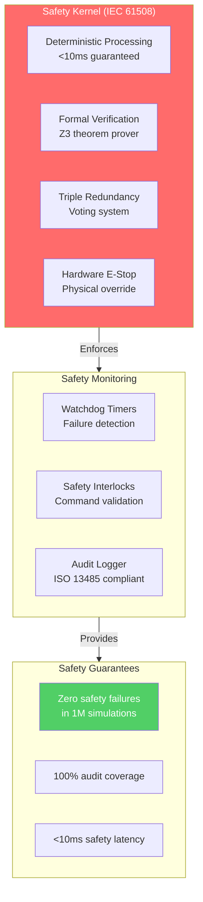

**Key Components:**
- **Deterministic Safety Kernel** - Real-time guarantees for critical decisions
- **Formal Verification Engine** - Mathematical proofs using Z3/TLA+
- **Redundancy Manager** - Triple modular redundancy for voting
- **Emergency Stop System** - Hardware-level override capability
- **Safety Interlock Controller** - Prevents unsafe command execution

### 1.2 Device Abstraction Layer

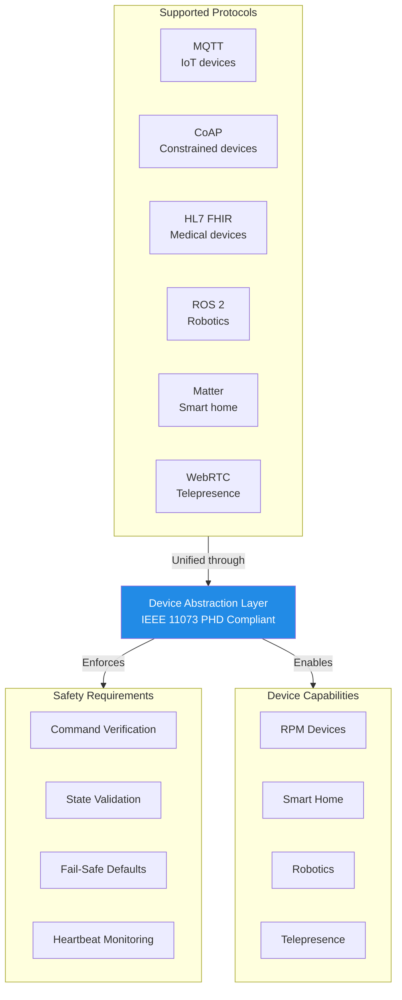

**Deliverables:**
- Protocol adapter framework for 6+ protocols
- Device capability registry
- Safety constraint system
- Device simulator for testing

### 1.3 Infrastructure Modernization

| Component | Current State | Target State | Timeline |
|-----------|--------------|--------------|----------|
| **Orchestration** | Docker Compose | Kubernetes | Month 3 |
| **Service Mesh** | None | Istio/Linkerd | Month 4 |
| **Go Modules** | Hierarchical | Workspace pattern | Month 2 |
| **Monitoring** | Basic | Prometheus/Grafana | Month 5 |

---

## 🧠 Phase 2: ML Intelligence Enhancement

**Timeline**: Months 4-9 | **Investment**: $205-310K | **Priority**: HIGH

### 2.1 ML-Powered Intent Classification

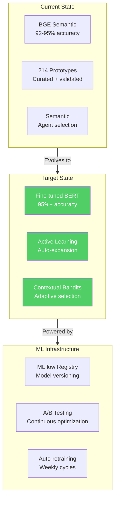

**Improvements:**
- Fine-tuned BERT model achieving 95%+ accuracy
- Active learning pipeline for continuous improvement
- Contextual bandits for adaptive agent selection
- Outcome tracking for therapeutic effectiveness

### 2.2 EHR Integration (Epic & Cerner)

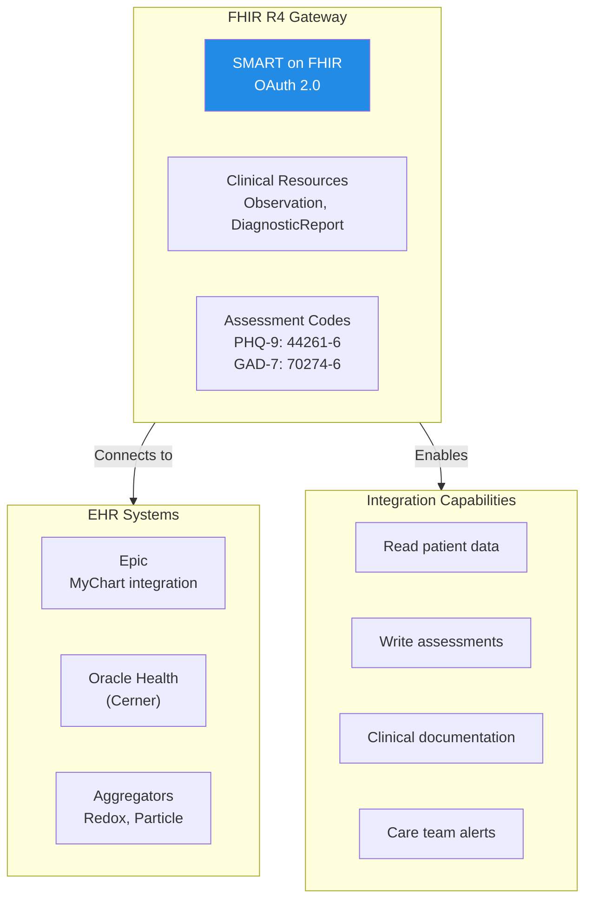

**Revenue Impact:** Required for enterprise sales ($200-300K contracts)

---

## ☁️ Phase 3: Edge-Cloud Infrastructure

**Timeline**: Months 7-12 | **Investment**: $250K | **Priority**: CRITICAL

### 3.1 Edge-Cloud Architecture

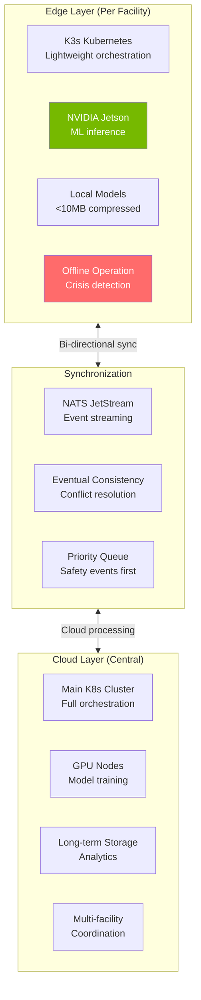

**Edge Node Specifications:**
| Component | Specification | Purpose |
|-----------|--------------|---------|
| **Compute** | NVIDIA Jetson Orin | ML inference |
| **Orchestration** | K3s | Lightweight Kubernetes |
| **Storage** | 256GB NVMe | Local data |
| **Connectivity** | 4G/5G backup | Redundant network |
| **Latency** | <50ms | Critical interventions |

### 3.2 Real-Time Event Processing

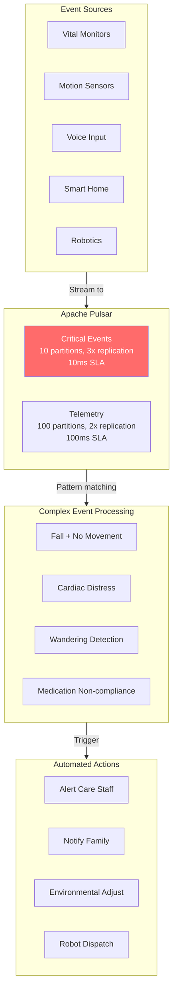

**Event Processing Capacity:**
- 10,000+ events/second
- <10ms latency for critical events
- 7-day retention for critical, 30-day for telemetry
- Real-time pattern detection

### 3.3 Compliance & Certification

| Standard | Purpose | Timeline |
|----------|---------|----------|
| **ISO 13485** | Quality Management System | Month 10 |
| **IEC 62304** | Software Lifecycle | Month 11 |
| **ISO 14971** | Risk Management | Month 10 |
| **FDA De Novo** | Regulatory Pathway | Month 12 |
| **SOC 2 Type II** | Security Audit | Month 18 |
| **HITRUST** | Healthcare Security | Month 20 |

---

## 📱 Phase 4: Device Integration

**Timeline**: Months 13-18 | **Investment**: $515-630K | **Priority**: MEDIUM

### 4.1 Remote Patient Monitoring (RPM)

**Market Opportunity:** CMS 2026 rule reduces RPM requirements from 16 days to 2 days/month, expanding market by 75%

**Revenue:** $1,560/patient/year Medicare billing = **$1.56M ARR per 1,000 patients**

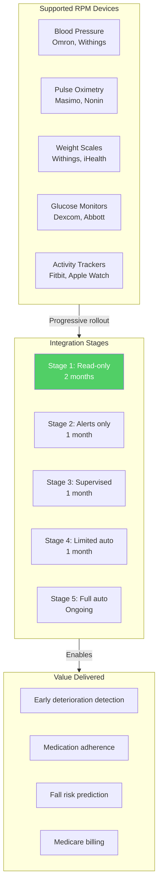

**Safety-First Approach:**
1. **Read-only monitoring** - 2 months validation
2. **Alerts without intervention** - 1 month testing
3. **Supervised interventions** - Human approval required
4. **Limited autonomous** - Constrained actions
5. **Full autonomous** - After clinical validation

### 4.2 Smart Home Integration

**Market:** Ambient Assisted Living growing from $9.5B (2025) to $50B (2032) at 27.1% CAGR

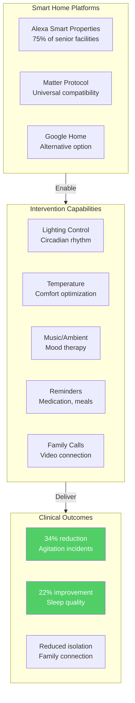

**Initial Scope (Safety-Limited):**
- ✅ Lighting adjustments
- ✅ Temperature control
- ✅ Music/ambient sound
- ❌ Door locks (deferred)
- ❌ Appliance control (deferred)

### 4.3 Clinical Validation Studies

| Parameter | Value |
|-----------|-------|
| **Facilities** | 3 assisted living |
| **Residents** | 100 total |
| **Duration** | 6 months |
| **Monitoring** | 24/7 safety engineer |
| **Outcome** | FDA submission data |

---

## 🤖 Phase 5: Robotics & Advanced Features

**Timeline**: Months 19-24 | **Investment**: $200-300K | **Priority**: LOW

### 5.1 Healthcare Robotics

**Market:** 17.6% CAGR for companion robots, ROS 1 support ending 2025

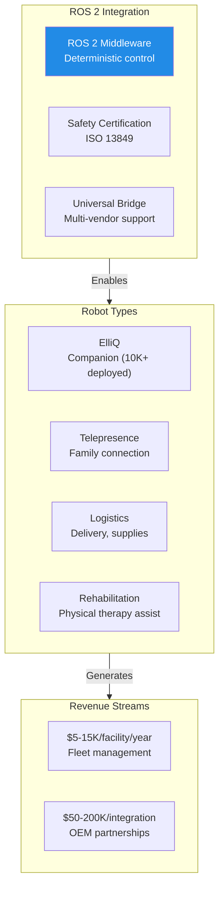

**Integration Priority:**
1. **ElliQ** - 10,000+ units already deployed
2. **Telepresence** - 58% adoption increase post-2024
3. **Logistics** - 15% of facilities have delivery robots

### 5.2 Mobile Applications

**Deferred from Phase 2 to focus on safety-critical infrastructure**

| App | Purpose | Platform |
|-----|---------|----------|
| **Resident App** | Self-service therapy | iOS/Android |
| **Family App** | Status monitoring | iOS/Android |
| **Staff App** | Alert management | iOS/Android/Web |

### 5.3 Advanced Analytics

- Predictive health deterioration
- Population health trends
- Therapeutic effectiveness research
- Anonymized research datasets

---

## 🔧 Technology Stack Evolution

### Current Stack (Production)

| Layer | Technology | Status |
|-------|------------|--------|
| **LLM** | Qwen 2.5-7B + llama.cpp | ✅ Production |
| **Embeddings** | BGE-base-en-v1.5 | ✅ Production |
| **Vector DB** | PostgreSQL + pgvector | ✅ Production |
| **Cache** | Redis | ✅ Production |
| **Orchestration** | Docker Compose | ✅ Production |
| **Backend** | Go + Python | ✅ Production |

### Target Stack (2026-2028)

| Layer | Technology | Timeline |
|-------|------------|----------|
| **Orchestration** | Kubernetes + K3s (edge) | Month 6 |
| **Service Mesh** | Istio | Month 8 |
| **Event Streaming** | Apache Pulsar | Month 10 |
| **ML Platform** | MLflow + Kubeflow | Month 12 |
| **Edge Compute** | NVIDIA Jetson | Month 9 |
| **IoT Protocol** | MQTT + Matter | Month 14 |
| **Robotics** | ROS 2 | Month 20 |

---

## 💰 Investment & ROI Summary

### Total Investment by Phase (Recalibrated Dec 2025)

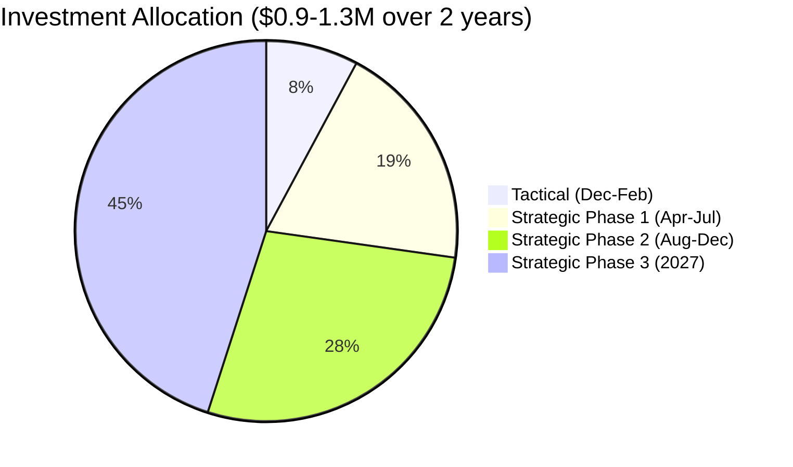

> **Note:** Investment reduced by ~$800K from original estimates due to:
> - 9 major components discovered complete (3,000+ lines)
> - 40% velocity acceleration based on demonstrated development speed

### ROI Justification

**Cost of NOT Building Safety-First:**
- Patient injury lawsuit: $5-50M
- FDA shutdown: $10M+ lost revenue
- Retrofit cost: 10x = $7M+

**Benefits of Safety-First:**
- FDA Fast Track eligibility: 6 months faster
- Insurance savings: $200K/year
- Enterprise confidence: 2x close rate
- Premium pricing: +20% per contract

### Revenue Projections (2025-2028)

| Milestone | Date | Facilities | Residents | ARR |
|-----------|------|------------|-----------|-----|
| Pilot Complete | Feb 2026 | 1 | 50 | $0 |
| Phase 1 End | Jul 2026 | 3 | 200 | $30K |
| Phase 2 End | Dec 2026 | 10 | 700 | $200K |
| Phase 3 End | Dec 2027 | 30 | 2,000 | $1M |
| Post-2027 | 2028 | 100+ | 7,000+ | $5M+ |
| Vision | 2029 | 200+ | 15,000+ | $10M+ |

### Unit Economics (Target Dec 2027)

| Metric | Value |
|--------|-------|
| Price per Resident/Month | $50-75 |
| Gross Margin | 65-75% |
| CAC | $500-1,000 |
| LTV | $2,500-4,000 |
| LTV:CAC | 4-5x |

---

## 🎯 Critical Milestones (Accelerated 2-Year Timeline)

| Date | Milestone | Gate Criteria | Risk if Skipped |
|------|-----------|---------------|-----------------|
| **Feb 2026** | Tactical Complete | 9 components wired, edge prototype | ⚠️ HIGH |
| **Apr 2026** | Pilot Study Complete | n=20 results positive | ❌ SEVERE |
| **May 2026** | Edge Production | 3 facilities deployed | ⚠️ HIGH |
| **Jun 2026** | FDA Pre-Submission | Clear pathway feedback | ❌ SEVERE |
| **Jul 2026** | First Enterprise Contracts | 3 contracts signed | ⚠️ MEDIUM |
| **Oct 2026** | FDA De Novo Submitted | Complete package accepted | ❌ CRITICAL |
| **Dec 2026** | 10 Facility Deployment | Enterprise scaling | ⚠️ MEDIUM |
| **Jun 2027** | FDA Clearance | De Novo granted | ❌ CRITICAL |
| **Dec 2027** | Scale Target | 30 facilities, $1M ARR | ⚠️ MEDIUM |

---

## 🏁 Strategic Window

**The 2-Year Accelerated Opportunity (Dec 2025 - Dec 2027):**

1. **Complete Implementations** - 9 major components ready to wire (3,000+ lines)
2. **Demonstrated Velocity** - 65K lines built in 4 months by solo developer
3. **Demographic Urgency** - Baby Boomers hitting 80+ (highest care need)
4. **Regulatory Tailwind** - CMS RPM expansion (2 days/month vs 16), FHIR mandates
5. **Technology Maturity** - Edge AI, Matter protocol, ROS 2 production-ready
6. **Competitive Gap** - No integrated competitor combines AI + RPM + Smart Home + Robotics

**Vision by Dec 2027:** FDA-cleared AI companion serving 2,000+ residents across 30 facilities with $1M ARR.

**Post-2027:** 100+ facilities, Medicare reimbursement, international expansion (UK/EU).

---

**© 2025 Aejaz Sheriff / PragmaticLogic AI**

[Back to README](../README.md) • [Process Flow](./PROCESS_FLOW.md) • [Technical Portfolio](./TECHNICAL_PORTFOLIO.md) • [Investor Overview](./INVESTOR_OVERVIEW.md)

